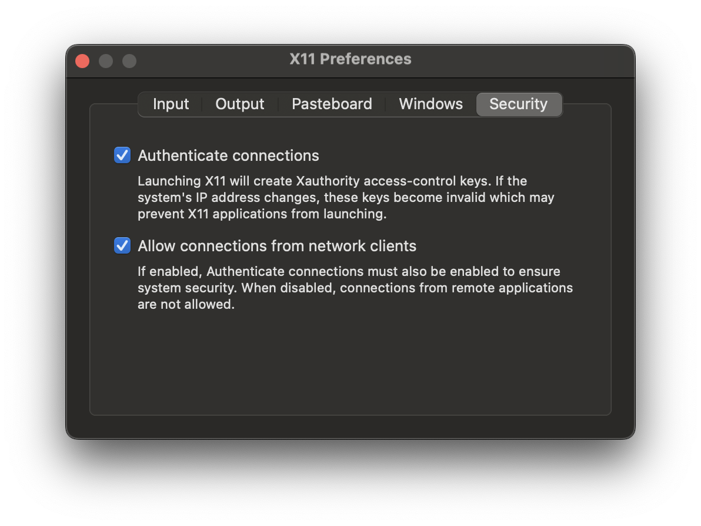

# Requirements

## Docker
Download docker desktop
[https://www.docker.com/products/docker-desktop/](https://www.docker.com/products/docker-desktop/)

## X Server
### On Windows
Download X server, install and start.
[https://sourceforge.net/projects/vcxsrv/](https://github.com/marchaesen/vcxsrv/releases)

### On Mac
Enter on the terminal 
```
$ xhost +localhost
```
XQuartz will be open. 
Open XQuartz settings. 


Make sure "Allow connections from network clients" is checked. If not, make the change and quit XQuartz. Restart XQuartz by entering on the terminal `$ xhost +localhost`

