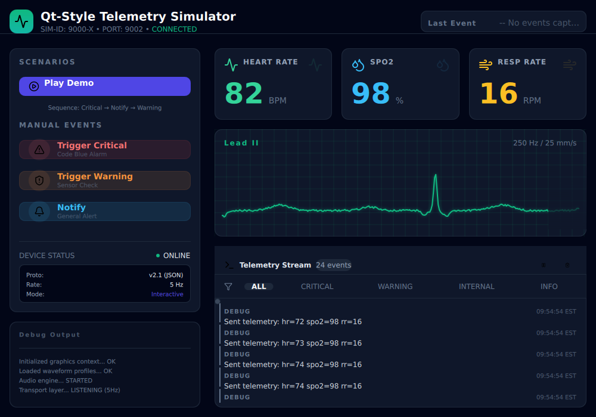

# Qt Learning Course 🚀

Learning Qt doesn't have to be that hard! Skip the hassle of registration, lengthy installations, and wrestling with outdated Qt Creator tools that can take hours to configure. Instead, develop Qt applications right in your cozy VS Code environment—the editor you already know and love—with the power of Docker handling all the setup. Just run two commands and focus on what matters: **learning Qt**.

This comprehensive course takes you from zero to Qt hero through **28 carefully crafted lessons**, each designed to teach you practical Qt 6 development skills. Whether you're building desktop applications, exploring QML/Qt Quick, or diving into advanced topics like OpenGL and internationalization, this course has you covered.

## Why This Course? 💡

✨ **Learn by Doing** - Every lesson includes working code examples you can build and run immediately  
🐳 **Zero Setup Friction** - Docker-based environment means consistent development experience across all platforms  
📚 **Complete Coverage** - From basic widgets to advanced topics (performance, accessibility, deployment)  
🎓 **Self-Paced** - Each lesson is self-contained with theory, quizzes, and interactive demos  
🔧 **Modern Qt 6** - Learn the latest Qt framework with C++17 best practices  

Perfect for C++ developers new to Qt, or anyone wanting to build cross-platform desktop applications with a professional framework.

## Real-World Project Example 🏥

Beyond the structured lessons, this course includes a **complete real-world project** in the [`project-dashboard`](project-dashboard/README.md) directory: a **Medical Device Dashboard** with a sensor simulator. This production-quality example demonstrates:

- **Complex QML UI** - Modern, responsive interface with custom components, theming, and real-time data visualization
- **WebSocket Communication** - Real-time telemetry streaming between simulator and dashboard
- **Advanced Qt Features** - Custom drawing with Canvas, state management, event handling, and more
- **Professional Architecture** - Component-based design, singleton patterns, resource management
- **Docker-Based Development** - Full containerized build and deployment setup

This project showcases how capable Qt and QML are for building sophisticated, production-ready applications. Explore the codebase to see real-world patterns, best practices, and how all the concepts from the lessons come together in a complete application.

## Getting Started 🏁

Ready to start learning? Navigate to the **01-qt-setup** folder and follow the instructions in its `README.md`. 

Each lesson follows the same structure, so once you complete lesson 1, you'll know exactly how to work through all 28 lessons!

### What's Inside Each Lesson

Every lesson folder contains:
- **lesson.md** - Core concepts and examples
- **quiz.md** - Test your understanding  
- **answers.md** - Detailed explanations
- **Working code** - Build and run immediately
- **README.md** - Lesson-specific instructions

Check out the [table_of_contents.md](table_of_contents.md) to explore all lessons from beginner to advanced topics!

