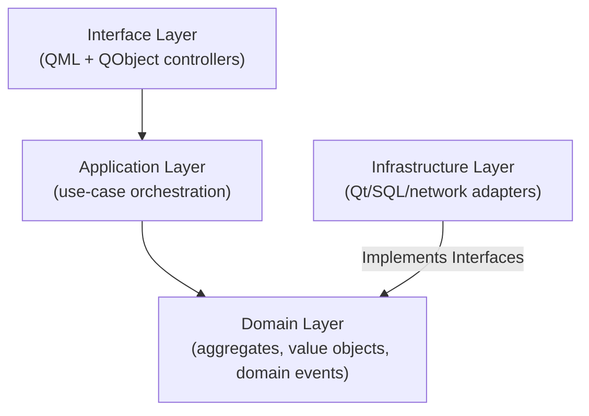

# Software Architecture - DDD Layers and Components

## Document Purpose

This document details the software architecture of the Z Monitor, which is based on Domain-Driven Design (DDD) principles with a clean separation between the C++ backend and the QML frontend. It describes all major components, their responsibilities, and data flow paths.

---

## 1. High-Level Architecture Diagram

The architecture diagram `02_ARCHITECTURE.mmd` provides a comprehensive overview of all major software components and their relationships. Use a Mermaid-compatible viewer to zoom and pan.

> **📋 Complete Component Reference:** For an authoritative list of ALL system components (120+ total) including domain aggregates, application services, infrastructure adapters, controllers, and QML components, see **29_SYSTEM_COMPONENTS.md** (to be migrated as DOC-ARCH-016).

---

## 2. Layered Architecture Overview

### 2.1. Layer Structure

The system follows a strict layered architecture with dependency rules enforced at compile time:



### 2.2. Layer Dependency Rules

**Allowed Dependencies:**
- **Interface Layer** → Application Layer (controllers depend on services)
- **Application Layer** → Domain Layer (services use aggregates and domain events)
- **Infrastructure Layer** → Domain Layer (repositories implement domain interfaces)
- **Application Layer** → Infrastructure Layer (services use repository interfaces)

**Forbidden Dependencies:**
- Domain Layer **cannot depend on** any other layer (pure business logic)
- Infrastructure Layer **cannot depend on** Application or Interface layers
- QML **cannot directly access** Domain or Infrastructure layers (only via controllers)

See **DOC-GUIDE-001** (Code Organization) for detailed layer rules and file structure.

---

## 3. Domain Layer (Core Business Logic)

The domain layer contains pure business logic with no framework dependencies. All classes are immutable where possible and use value semantics.

### 3.1. Domain Aggregates

Aggregates are consistency boundaries that encapsulate business rules:

#### PatientAggregate

**Responsibility:** Manages patient admission state, vitals history, and bed assignment.

**Key Members:**
- `PatientIdentity identity` - Patient demographics (MRN, name, DOB)
- `BedLocation bedLocation` - Current bed assignment
- `std::vector<VitalRecord> vitalsHistory` - Historical vital signs
- `AdmissionState state` - Current admission state (ADMITTED, DISCHARGED, TRANSFERRED)

**Domain Events:**
- `PatientAdmitted` - Raised when patient is admitted to a bed
- `PatientDischarged` - Raised when patient is discharged
- `PatientTransferred` - Raised when patient moves to a different bed

**Invariants:**
- Patient must have valid MRN before admission
- Cannot discharge a patient that is not currently admitted
- Bed location must be valid for current facility

#### DeviceAggregate

**Responsibility:** Manages device provisioning state, credentials, and firmware metadata.

**Key Members:**
- `DeviceIdentity identity` - Device serial number and model
- `ProvisioningState state` - Current provisioning state
- `Certificate certificate` - Device certificate for mTLS
- `FirmwareMetadata firmware` - Current firmware version

**Domain Events:**
- `ProvisioningCompleted` - Raised when device is successfully provisioned
- `CertificateRenewed` - Raised when device certificate is renewed
- `FirmwareUpdated` - Raised when firmware is updated

**Invariants:**
- Device must be provisioned before accepting patient data
- Certificate must be valid (not expired) for telemetry transmission
- Firmware version must meet minimum requirements

#### TelemetryBatch

**Responsibility:** Holds collections of `VitalRecord` and `AlarmSnapshot`, enforces signing and timestamping rules.

**Key Members:**
- `std::vector<VitalRecord> vitals` - Batch of vital sign measurements
- `std::vector<AlarmSnapshot> alarms` - Batch of alarm events
- `QDateTime timestamp` - Batch creation timestamp
- `QString signature` - HMAC signature for data integrity

**Domain Events:**
- `TelemetryQueued` - Raised when batch is queued for transmission
- `TelemetryTransmitted` - Raised when batch is successfully sent to server

**Invariants:**
- All vitals in batch must have same patient MRN
- Timestamps must be monotonically increasing
- Signature must be valid before transmission

### 3.2. Value Objects

Immutable data structures that encapsulate business rules:

#### PatientIdentity

**Purpose:** Patient demographics and identification.

```cpp
struct PatientIdentity {
    const QString mrn;           // Medical Record Number (unique)
    const QString firstName;
    const QString lastName;
    const QDate dateOfBirth;
    const QString gender;        // M, F, O, U (Unknown)
    
    // Validated factory method
    static Result<PatientIdentity, Error> create(
        const QString& mrn,
        const QString& firstName,
        const QString& lastName,
        const QDate& dob,
        const QString& gender
    );
};
```

**Validation Rules:**
- MRN must be non-empty and match pattern `^[A-Z0-9]{6,12}$`
- First and last names must be non-empty
- Date of birth must be in the past
- Gender must be one of: M, F, O, U

#### DeviceSnapshot

**Purpose:** Complete snapshot of all vital signs at a specific timestamp.

```cpp
struct DeviceSnapshot {
    const QDateTime timestamp;
    const int heartRate;         // BPM (beats per minute)
    const int spo2;              // % (oxygen saturation)
    const int respirationRate;   // breaths/min
    const double temperature;    // °C
    const int systolicBP;        // mmHg
    const int diastolicBP;       // mmHg
    const double ecgWaveform;    // mV (latest sample)
    
    static Result<DeviceSnapshot, Error> create(/* params */);
};
```

**Invariants:**
- Timestamp must be valid and not in the future
- All vital signs must be within physiologically plausible ranges (see `MeasurementUnit`)

#### MeasurementUnit

**Purpose:** Encapsulates a vital sign value with its unit and valid range.

```cpp
struct MeasurementUnit {
    const double value;
    const QString unit;          // e.g., "BPM", "%", "°C"
    const double minRange;       // Minimum valid value
    const double maxRange;       // Maximum valid value
    
    bool isInRange() const;
    static Result<MeasurementUnit, Error> create(/* params */);
};
```

#### AlarmThreshold

**Purpose:** Defines threshold values for alarm triggering.

```cpp
struct AlarmThreshold {
    const QString parameter;     // e.g., "HeartRate", "SpO2"
    const double lowCritical;
    const double lowWarning;
    const double highWarning;
    const double highCritical;
    const AlarmPriority priority; // CRITICAL, HIGH, MEDIUM, LOW
    
    AlarmPriority evaluate(double value) const;
};
```

See **DOC-REF-003** (Alarm Codes) for complete alarm thresholds and priorities.

#### BedLocation

**Purpose:** Represents a physical bed location in the facility.

```cpp
struct BedLocation {
    const QString facility;      // e.g., "General Hospital"
    const QString unit;          // e.g., "ICU-3"
    const QString room;          // e.g., "301"
    const QString bed;           // e.g., "A"
    
    QString toDisplayString() const;  // "ICU-3 Room 301 Bed A"
    static Result<BedLocation, Error> create(/* params */);
};
```

### 3.3. Domain Events

Events that represent significant state changes in the domain:

| Event                   | Triggered When                             | Subscribers                         |
| ----------------------- | ------------------------------------------ | ----------------------------------- |
| `PatientAdmitted`       | Patient is admitted to a bed               | `MonitoringService`, `AuditService` |
| `PatientDischarged`     | Patient is discharged                      | `MonitoringService`, `AuditService` |
| `PatientTransferred`    | Patient moves to a different bed           | `MonitoringService`                 |
| `TelemetryQueued`       | Telemetry batch is queued for transmission | `NetworkManager`                    |
| `AlarmRaised`           | Alarm threshold is violated                | `AlarmController`, `AuditService`   |
| `ProvisioningCompleted` | Device provisioning is complete            | `SystemController`                  |

**Event Bus:** Domain events are published via an event bus (observer pattern) to decouple publishers and subscribers.

---

## 4. Application Layer (Use Case Orchestration)

The application layer contains services that orchestrate business workflows. Services depend on domain aggregates and repository interfaces but do not contain business logic.

### 4.1. Application Services

#### MonitoringService

**Responsibility:** Coordinates real-time data acquisition, persists telemetry, queues batches for transmission.

**Key Methods:**
- `void startMonitoring(const PatientIdentity& patient)` - Begin monitoring for a patient
- `void stopMonitoring()` - Stop monitoring and persist final data
- `void processTelemetry(const DeviceSnapshot& snapshot)` - Process incoming telemetry data
- `Result<TelemetryBatch, Error> createBatch()` - Create telemetry batch for transmission

**Dependencies:**
- `IPatientRepository` - Patient data persistence
- `ITelemetryRepository` - Telemetry data persistence
- `ISensorDataSource` - Sensor data acquisition
- `VitalsCache` - In-memory caching for critical path

**Workflow:**
1. Receive `DeviceSnapshot` from `ISensorDataSource`
2. Validate snapshot against patient's alarm thresholds
3. Store in `VitalsCache` (critical path, < 50ms)
4. Raise `AlarmRaised` event if threshold violated
5. Queue for periodic persistence to database

#### AdmissionService

**Responsibility:** Executes patient admit/discharge/transfer use cases, logs admission events.

**Key Methods:**
- `Result<void, Error> admitPatient(const PatientIdentity& patient, const BedLocation& bed)` - Admit patient to bed
- `Result<void, Error> dischargePatient(const QString& mrn)` - Discharge patient
- `Result<void, Error> transferPatient(const QString& mrn, const BedLocation& newBed)` - Transfer patient to new bed

**Dependencies:**
- `IPatientRepository` - Patient data persistence
- `IPatientLookupService` - External patient lookup (HIS/EHR)
- `SecurityService` - User authorization check

**Workflow (Admission):**
1. Validate user permissions (clinician role required)
2. Query external HIS/EHR for patient demographics via `IPatientLookupService`
3. Create `PatientAggregate` and validate invariants
4. Persist to `IPatientRepository`
5. Raise `PatientAdmitted` domain event
6. Log action to `AuditService`

#### ProvisioningService

**Responsibility:** Handles device provisioning, QR code pairing, certificate management.

**Key Methods:**
- `Result<void, Error> provisionDevice(const QString& qrCodeData)` - Provision device from QR code
- `Result<Certificate, Error> renewCertificate()` - Renew device certificate
- `void applyConfiguration(const ConfigPayload& config)` - Apply configuration from server

**Dependencies:**
- `IProvisioningRepository` - Device configuration persistence
- `IProvisioningService` (infrastructure) - Server communication for provisioning

**Workflow:**
1. Scan QR code containing device ID and provisioning URL
2. Establish mTLS connection to provisioning server
3. Receive device certificate and configuration
4. Apply configuration to `DeviceAggregate`
5. Persist to `IProvisioningRepository`
6. Raise `ProvisioningCompleted` event

#### SecurityService

**Responsibility:** Authenticates users, manages PIN policies, issues user sessions.

**Key Methods:**
- `Result<UserSession, Error> authenticate(const QString& userId, const QString& pin)` - Authenticate user
- `void logout(const QString& sessionId)` - End user session
- `bool hasPermission(const UserSession& session, const Permission& permission)` - Check user permission
- `void changePin(const QString& userId, const QString& oldPin, const QString& newPin)` - Change user PIN

**Dependencies:**
- `IUserManagementService` - External user authentication (hospital server or mock)
- `SecurityRepository` - User session persistence
- `AuditService` - Authentication event logging

**Workflow (Authentication):**
1. User enters User ID and PIN via `LoginView`
2. `SecurityService` validates credentials via `IUserManagementService`:
   - **Production:** `HospitalUserManagementAdapter` (REST API or LDAP)
   - **Development:** `MockUserManagementService` (hardcoded test users)
3. If valid, create `UserSession` with role and permissions
4. Log authentication event to `AuditService`
5. Return session to `AuthenticationController`

### 4.2. Repository Interfaces

Abstract interfaces for data persistence (dependency inversion):

#### IPatientRepository

```cpp
class IPatientRepository {
public:
    virtual Result<void, Error> save(const PatientAggregate& patient) = 0;
    virtual Result<PatientAggregate, Error> findByMrn(const QString& mrn) = 0;
    virtual Result<std::vector<PatientAggregate>, Error> findAll() = 0;
    virtual Result<void, Error> remove(const QString& mrn) = 0;
};
```

#### ITelemetryRepository

```cpp
class ITelemetryRepository {
public:
    virtual Result<void, Error> saveBatch(const TelemetryBatch& batch) = 0;
    virtual Result<std::vector<VitalRecord>, Error> findByMrn(
        const QString& mrn,
        const QDateTime& startTime,
        const QDateTime& endTime
    ) = 0;
    virtual Result<void, Error> cleanup(int retentionDays) = 0;
};
```

#### IAlarmRepository

```cpp
class IAlarmRepository {
public:
    virtual Result<void, Error> save(const AlarmSnapshot& alarm) = 0;
    virtual Result<std::vector<AlarmSnapshot>, Error> findByMrn(
        const QString& mrn,
        const AlarmPriority& minPriority
    ) = 0;
    virtual Result<void, Error> acknowledge(const QString& alarmId, const QString& userId) = 0;
};
```

#### IProvisioningRepository

```cpp
class IProvisioningRepository {
public:
    virtual Result<void, Error> saveConfiguration(const DeviceAggregate& device) = 0;
    virtual Result<DeviceAggregate, Error> loadConfiguration() = 0;
    virtual Result<void, Error> saveCertificate(const Certificate& cert) = 0;
};
```

---

## 5. Infrastructure Layer (External Adapters)

The infrastructure layer contains adapters that integrate with external systems, databases, and hardware. All infrastructure components implement domain or application interfaces.

### 5.1. Sensor Data Sources

#### ISensorDataSource Interface

**Purpose:** Abstraction for sensor data acquisition.

```cpp
class ISensorDataSource : public QObject {
    Q_OBJECT
public:
    virtual void start() = 0;
    virtual void stop() = 0;
    virtual bool isRunning() const = 0;

signals:
    void vitalSignsReceived(const DeviceSnapshot& snapshot);
    void errorOccurred(const Error& error);
};
```

#### SharedMemorySensorDataSource

**Purpose:** Maps simulator shared-memory ring buffer for sensor data.

**Implementation:**
- Uses `memfd://zmonitor-sim-ring` shared memory region
- Communicates with external simulator via Unix-domain control socket
- Polls ring buffer at 250 Hz (4ms interval) for waveform data
- Emits `vitalSignsReceived` signal with parsed `DeviceSnapshot`

**Latency:**
- Target: < 16ms end-to-end (sensor simulator → ring buffer → application)
- Measured: 8-12ms average

See **DOC-COMP-027** (Sensor Integration) for detailed implementation.

#### DeviceSimulator (Deprecated)

**Purpose:** Legacy internal simulator (fallback).

**Status:** Deprecated in favor of external simulator. Retained for offline development only.

### 5.2. Network & Communication

#### NetworkManager

**Purpose:** Manages HTTP/HTTPS connections to central server.

**Key Methods:**
- `void sendTelemetryBatch(const TelemetryBatch& batch)` - Send telemetry to server
- `void syncClock()` - Synchronize device clock with server (NTP)
- `ConnectionState getConnectionState() const` - Get current connection state

**Dependencies:**
- `ITelemetryServer` - Telemetry transmission interface

#### ITelemetryServer Interface

```cpp
class ITelemetryServer {
public:
    virtual Result<void, Error> sendVitals(const TelemetryBatch& batch) = 0;
    virtual Result<void, Error> sendAlarms(const std::vector<AlarmSnapshot>& alarms) = 0;
    virtual Result<void, Error> registerDevice(const DeviceIdentity& device) = 0;
};
```

**Implementations:**
- `HttpTelemetryServer` - Production implementation (mTLS to central server)
- `MockTelemetryServer` - Test implementation (swallows data without network)

#### IUserManagementService Interface

**Purpose:** Abstract interface for hospital user authentication.

```cpp
class IUserManagementService {
public:
    virtual Result<UserCredentials, Error> authenticate(
        const QString& userId,
        const QString& secretCode
    ) = 0;
    virtual Result<UserProfile, Error> getUserProfile(const QString& userId) = 0;
};
```

**Implementations:**
- `HospitalUserManagementAdapter` - Production (REST API or LDAP to hospital server)
- `MockUserManagementService` - Development (hardcoded test users: `nurse01/1234`, `tech01/5678`)

#### IPatientLookupService Interface

**Purpose:** Remote patient data retrieval from HIS/EHR.

```cpp
class IPatientLookupService {
public:
    virtual Result<PatientIdentity, Error> findPatientByMrn(const QString& mrn) = 0;
    virtual Result<std::vector<PatientIdentity>, Error> searchPatients(const QString& query) = 0;
};
```

**Implementations:**
- `HisPatientLookupAdapter` - Production (HL7/FHIR API to hospital HIS)
- `MockPatientLookupService` - Development (returns mock patient data)

### 5.3. Data Persistence

#### DatabaseManager

**Purpose:** Manages SQLite/SQLCipher database connections and schema migrations.

**Key Methods:**
- `Result<void, Error> initialize(const QString& dbPath, const QString& encryptionKey)` - Open encrypted database
- `Result<void, Error> migrate()` - Execute schema migrations
- `QSqlDatabase getConnection()` - Get database connection

**Features:**
- AES-256 encryption via SQLCipher
- Schema versioning and migrations
- Connection pooling (read/write connections)
- Foreign key enforcement

See **DOC-PROC-009** (Schema Management) for migration workflow.

#### SQLiteVitalsRepository

**Purpose:** Implements `ITelemetryRepository` for vitals persistence.

**Schema:**
```sql
CREATE TABLE vitals (
    id INTEGER PRIMARY KEY AUTOINCREMENT,
    mrn TEXT NOT NULL,
    timestamp INTEGER NOT NULL,  -- Unix timestamp (ms)
    heart_rate INTEGER,
    spo2 INTEGER,
    respiration_rate INTEGER,
    temperature REAL,
    systolic_bp INTEGER,
    diastolic_bp INTEGER,
    FOREIGN KEY (mrn) REFERENCES patients(mrn)
);

CREATE INDEX idx_vitals_mrn_timestamp ON vitals(mrn, timestamp);
```

**Performance:**
- Batch writes (10 records per transaction)
- Non-blocking (runs on database I/O thread)
- Periodic persistence (every 5-10 minutes)

#### SQLiteActionLogRepository

**Purpose:** Persists user action logs for audit trail.

**Schema:**
```sql
CREATE TABLE action_log (
    id INTEGER PRIMARY KEY AUTOINCREMENT,
    timestamp INTEGER NOT NULL,
    user_id TEXT NOT NULL,
    action_type TEXT NOT NULL,  -- e.g., "LOGIN", "ADMIT_PATIENT", "CHANGE_SETTINGS"
    action_data TEXT,           -- JSON payload
    previous_hash TEXT,         -- SHA-256 hash of previous record (chain)
    current_hash TEXT           -- SHA-256 hash of this record
);
```

**Features:**
- Hash chain for tamper detection
- Immutable (append-only)
- 90-day retention policy

#### SQLiteAuditRepository

**Purpose:** Persists security audit events (authentication, authorization failures).

**Schema:**
```sql
CREATE TABLE audit_log (
    id INTEGER PRIMARY KEY AUTOINCREMENT,
    timestamp INTEGER NOT NULL,
    event_type TEXT NOT NULL,  -- e.g., "AUTH_SUCCESS", "AUTH_FAILURE", "ALARM_CRITICAL"
    user_id TEXT,
    mrn TEXT,
    severity TEXT,
    message TEXT
);
```

**Retention:** 90 days (compliance requirement).

### 5.4. Caching & Data Management

#### VitalsCache

**Purpose:** In-memory cache for 3-day vitals data (critical path, < 50ms latency).

**Capacity:**
- 3 days of vitals data (~400 MB)
- 5 Hz sampling rate (200ms interval)
- ~1.3 million data points per 3-day window

**Data Structure:**
- Circular buffer (lock-free for reads)
- Indexed by timestamp (binary search)
- Pre-allocated memory (no dynamic allocation)

**Critical Path:**
- Sensor → VitalsCache: < 50ms (target)
- VitalsCache → UI: < 10ms (measured)

See **DOC-COMP-026** (Data Caching Strategy) for detailed design.

#### WaveformCache

**Purpose:** In-memory circular buffer for 30-second waveform display.

**Capacity:**
- 30 seconds of waveform data (~7.5K samples per waveform)
- 250 Hz sampling rate (4ms interval)
- ECG + Plethysmogram (2 waveforms)

**Rendering:**
- QML Canvas API (60 FPS target)
- Downsampling for display (every 4th sample)

See **DOC-COMP-028** (Waveform Display Implementation) for rendering details.

#### PersistenceScheduler

**Purpose:** Periodic persistence from cache to database (non-critical path).

**Schedule:**
- Every 5-10 minutes (configurable)
- Batch size: 100 records per transaction
- Runs on low-priority database I/O thread

**Safety:**
- Does not block critical path
- Retries on failure (exponential backoff)
- Alerts on persistent failures (> 3 retries)

### 5.5. System Services

#### SettingsManager

**Purpose:** Device configuration and settings persistence.

**Configuration Categories:**
- System settings (language, time zone, NTP server)
- Network settings (server URL, mTLS certificates)
- Alarm settings (thresholds, audible volume)
- Display settings (brightness, screen timeout)

**Storage:** SQLite table `settings` (key-value pairs).

#### LogService

**Purpose:** Application logging (file-based, human-readable or JSON).

**Log Types:**
1. **Debug Logs:** Development diagnostics (disabled in production)
2. **Audit Logs:** User actions and security events (hash-chained)
3. **Clinical Logs:** Alarm events, vital sign anomalies (required for compliance)

See **DOC-GUIDE-012** (Logging) for detailed logging strategy and **DOC-COMP-029** (Async Logging) for implementation.

#### DataCleanupService

**Purpose:** Daily cleanup of expired data per retention policies.

**Schedule:** 3 AM daily

**Retention Policies:**
- Vitals data: 7 days
- Alarm data: 90 days
- Audit logs: 90 days
- Action logs: 90 days

**Database Size Limit:** 500 MB (emergency cleanup if exceeded)

#### ClockSyncService

**Purpose:** NTP time synchronization with central server.

**Sync Frequency:** Every 1 hour

**Fallback:** Uses central server timestamp if NTP unavailable

**Accuracy:** ±500ms (required for alarm timestamp compliance)

---

## 6. Interface Layer (QML Controllers)

QML controllers are `QObject` subclasses that bridge the C++ backend to the QML frontend. They depend on application services but not infrastructure (dependency inversion).

### 6.1. Controllers

#### DashboardController

**Responsibility:** Real-time vital signs display, patient banner.

**Exposed Properties (Q_PROPERTY):**
- `QString patientName` - Current patient name
- `QString mrn` - Current patient MRN
- `int heartRate` - Current heart rate (BPM)
- `int spo2` - Current SpO2 (%)
- `int respirationRate` - Current respiration rate
- `double temperature` - Current temperature (°C)

**Signals:**
- `void vitalsUpdated()` - Emitted when vitals are updated
- `void patientChanged()` - Emitted when patient is admitted/discharged

#### AlarmController

**Responsibility:** Alarm management, acknowledgment, escalation.

**Exposed Properties:**
- `QVariantList activeAlarms` - List of active alarms (QML-bindable)
- `int criticalAlarmCount` - Count of critical alarms
- `bool alarmSilenced` - True if alarms are silenced (2-minute window)

**Methods:**
- `Q_INVOKABLE void acknowledgeAlarm(const QString& alarmId)` - Acknowledge alarm
- `Q_INVOKABLE void silenceAlarms()` - Silence alarms for 2 minutes

#### TrendsController

**Responsibility:** Historical vital signs trends and visualization.

**Methods:**
- `Q_INVOKABLE QVariantList getTrendData(const QString& parameter, const QString& timeWindow)` - Get trend data for plotting
  - `parameter`: "HeartRate", "SpO2", "RespirationRate", "Temperature"
  - `timeWindow`: "1h", "8h", "24h"

#### SystemController

**Responsibility:** System diagnostics, health monitoring.

**Exposed Properties:**
- `QString connectionStatus` - "Online", "Offline", "Connecting"
- `int batteryLevel` - Battery percentage (if applicable)
- `QString firmwareVersion` - Current firmware version

#### PatientController

**Responsibility:** Patient admission/discharge/transfer workflow.

**Methods:**
- `Q_INVOKABLE void admitPatient(const QString& mrn, const QString& bedLocation)` - Admit patient
- `Q_INVOKABLE void dischargePatient()` - Discharge current patient
- `Q_INVOKABLE void transferPatient(const QString& newBedLocation)` - Transfer patient

#### AuthenticationController

**Responsibility:** User login/logout, session management.

**Methods:**
- `Q_INVOKABLE void login(const QString& userId, const QString& pin)` - Authenticate user
- `Q_INVOKABLE void logout()` - End user session

**Signals:**
- `void loginSucceeded(const QString& userRole)` - Emitted on successful login
- `void loginFailed(const QString& errorMessage)` - Emitted on authentication failure

### 6.2. QML Frontend and Visualization

The frontend is purely declarative and reacts to data changes exposed by C++ controllers.

#### Visualization Strategy

- **QML-Based Rendering:** All visualization handled declaratively in QML using Qt Quick components and Canvas API
- **No Separate Visualization Service:** Rendering logic resides in QML components, not in C++ services (Qt/QML best practice)
- **Data Flow:** C++ Controllers (QObject) → Q_PROPERTY bindings → QML Components → Canvas/Graphics rendering
- **Performance:** Critical visualizations (waveforms at 60 FPS) use QML Canvas API for efficient 2D rendering

See **DOC-COMP-028** (Waveform Display Implementation) for detailed waveform rendering guide.

#### Visualization Components

**Waveforms:**
- `WaveformChart.qml` (Canvas-based, 60 FPS) - ECG and plethysmogram rendering
- Uses lock-free circular buffer from `WaveformCache`
- Downsampling for display (every 4th sample)

**Trends:**
- `TrendChart.qml` (Line chart) - Historical vital signs visualization
- Lazy loading (only renders visible time window)
- Supports 1h, 8h, 24h time windows

**Vitals:**
- `StatCard.qml` - Real-time numeric vital signs display
- Color-coded thresholds (green=normal, yellow=warning, red=critical)

**Alarms:**
- `AlarmIndicator.qml` - Visual alarm indicators with priority colors
- Full-screen flash for critical alarms
- Banner notifications for high/medium alarms

#### UI Structure

**Main Entry Point:**
- `Main.qml` - Assembles main UI (sidebar, header, view loader, global alarm overlay)

**Views (Full Screens):**
- `DashboardView.qml` - Real-time vitals dashboard
- `TrendsView.qml` - Historical trends and plots
- `SettingsView.qml` - Device settings and configuration
- `DiagnosticsView.qml` - System diagnostics and logs
- `LoginView.qml` - User authentication

**Reusable Components:**
- `StatCard.qml` - Vital sign card
- `PatientBanner.qml` - Patient demographics banner
- `NotificationBell.qml` - Notification center icon
- `Sidebar.qml` - Navigation sidebar
- `TopBar.qml` - Status bar (connection, battery, time)
- `AlarmIndicator.qml` - Alarm indicator icon
- `WaveformChart.qml` - Waveform rendering component
- `TrendChart.qml` - Trend plot component

**View Loading:**
- `Loader` in `Main.qml` dynamically loads active view
- Navigation state managed by `NavigationController`

---

## 7. External Systems

### 7.1. Central Telemetry Server

**Purpose:** Hospital's central monitoring station (simulated).

**Technology:** Standalone Python application (Flask/FastAPI)

**API Endpoints:**
- `POST /api/v1/telemetry/vitals` - Receive telemetry data (HTTPS, mTLS)
- `POST /api/v1/alarms` - Receive alarm notifications
- `POST /api/v1/devices/register` - Device registration
- `GET /api/v1/patients/{mrn}` - Patient lookup (optional, for `IPatientLookupService`)

**Security:**
- Requires mTLS (mutual TLS)
- Client certificate validation
- Only authorized devices can send data

**Configuration:**
- Server URL configurable via `SettingsManager` (stored in `settings` table)
- Default: `https://localhost:8443` (local development)

**Mock Implementation:**
- `MockTelemetryServer` available for testing (swallows data without network)

### 7.2. Sensor Simulator

**Purpose:** Generates realistic vital signs data for development/testing.

**Location:** `project-dashboard/sensor-simulator/` (external Qt application)

**Transport:**
- Shared-memory ring buffer (`memfd://zmonitor-sim-ring`)
- Unix-domain control socket (same host, < 16ms latency)

**Data Rate:**
- Vitals: 5 Hz (200ms interval)
- Waveforms: 250 Hz (4ms interval)

**Format:** JSON messages with vitals and waveform data

**Purpose:** Development and testing without actual medical sensors

### 7.3. Hospital User Management Server

**Purpose:** Centralized user authentication and authorization.

**Protocol:** REST API or LDAP/Active Directory

**Function:** Validates healthcare worker credentials (nurses, physicians, technicians, administrators)

**Mock Implementation:**
- `MockUserManagementService` for development/testing
- Hardcoded test users: `nurse01/1234`, `tech01/5678`, `admin01/9999`

**Integration:** Via `IUserManagementService` interface

### 7.4. NTP Server

**Purpose:** Network Time Protocol server for clock synchronization.

**Sync Frequency:** Every 1 hour

**Accuracy:** ±500ms (required for alarm timestamp compliance)

**Fallback:** Uses central server timestamp if NTP unavailable

---

## 8. Data Flow

### 8.1. Critical Path: Sensor → Alarm Detection (< 50ms)

**Target Latency:** < 50ms (REQ-NFR-PERF-100)

**Flow:**

1. **Sensor Data Acquisition (0-8ms):**
   - `SharedMemorySensorDataSource` polls shared-memory ring buffer
   - Parses JSON messages (vitals + waveforms)
   - Emits `vitalSignsReceived(DeviceSnapshot)` signal
   - **Alternative:** `DeviceSimulator` (legacy fallback, internal generation)

2. **In-Memory Caching (8-16ms):**
   - `MonitoringService` receives signal
   - `VitalsCache` stores data in-memory (pre-allocated circular buffer)
   - **Latency Target:** < 8ms (cache write)

3. **Alarm Detection (16-24ms):**
   - `AlarmManager` checks thresholds against cached vitals
   - **CRITICAL:** No database access (pre-allocated buffers only)
   - Alarms triggered if threshold violated
   - **Latency Target:** < 8ms (threshold evaluation)

4. **UI Update (24-50ms):**
   - Controllers (`DashboardController`, `AlarmController`) receive signals
   - QML engine detects Q_PROPERTY changes
   - UI bindings update (vitals at 1 Hz, waveforms at 60 FPS)
   - **Latency Target:** < 26ms (QML rendering)

**Total Latency:** 8ms + 8ms + 8ms + 26ms = 50ms (target met)

### 8.2. Non-Critical Path: Persistence & Transmission

**Flow:**

5. **Periodic Persistence (Non-Blocking):**
   - `PersistenceScheduler` triggers every 5-10 minutes
   - `SQLiteVitalsRepository` writes to encrypted database (SQLCipher)
   - Batch writes (100 records per transaction)
   - **Runs on:** Low-priority database I/O thread (does not block critical path)

6. **Remote Transmission (Every 10s):**
   - `NetworkManager` creates `TelemetryBatch` from cached vitals
   - **CRITICAL:** All telemetry includes current patient MRN from `PatientManager`
   - If no patient admitted: Device in STANDBY, no telemetry sent
   - `ITelemetryServer` sends batch via mTLS
   - **Latency:** ~100-500ms (network dependent)

7. **Data Cleanup (Daily at 3 AM):**
   - `DataCleanupService` removes data older than retention policies
   - Vitals: 7 days, Alarms: 90 days, Audit Logs: 90 days
   - Monitors database size (500 MB limit)
   - Emergency cleanup if limit exceeded

### 8.3. Patient Management Flow

**Admission Workflow:**

8. **Patient Admission:**
   - User (nurse/physician) initiates via `PatientController`
   - `AdmissionService` orchestrates:
     1. Validate user permissions via `SecurityService` + `IUserManagementService`
     2. Query HIS/EHR via `IPatientLookupService` (or local cache)
     3. Create `PatientAggregate` and validate invariants
     4. Persist to `IPatientRepository`
     5. Raise `PatientAdmitted` domain event
     6. Log action to `SQLiteActionLogRepository` (audit trail)
   - Patient MRN associated with all subsequent vitals/alarms

### 8.4. Authentication Flow

**Login Workflow:**

10. **User Authentication:**
    - User enters User ID and PIN via `LoginView.qml`
    - `AuthenticationController` delegates to `SecurityService`
    - `SecurityService` uses `IUserManagementService`:
      - **Production:** `HospitalUserManagementAdapter` (REST API or LDAP)
      - **Development:** `MockUserManagementService` (hardcoded test users)
    - Session created with role and permissions
    - All authentication events logged to `SQLiteAuditRepository`
    - `loginSucceeded(userRole)` signal emitted to QML

---

## 9. Key Architectural Principles

### 9.1. Critical Path Isolation

**Goal:** Ensure alarm detection path never blocks on I/O.

**Strategies:**
- Alarm detection runs on high-priority real-time thread
- No database access in critical path (pre-allocated buffers only)
- No memory allocations in critical path (pre-allocated data structures)
- Lock-free data structures for waveform rendering

**Verification:**
- Latency profiling (< 50ms end-to-end)
- No blocking system calls in critical path

See **DOC-ARCH-011** (Thread Model) for threading details.

### 9.2. Dependency Inversion

**Goal:** Decouple application logic from infrastructure.

**Abstraction Interfaces:**
- `ISensorDataSource` - Sensor data acquisition
- `ITelemetryServer` - Server communication
- `IPatientLookupService` - Patient data lookup
- `IUserManagementService` - User authentication
- `IProvisioningService` - Device provisioning
- `IPatientRepository`, `ITelemetryRepository`, `IAlarmRepository`, `IProvisioningRepository` - Data persistence

**Benefits:**
- Testable with mocks (no real hardware/network required)
- Swappable implementations (e.g., mock vs. production)
- Independent evolution of application and infrastructure layers

### 9.3. Data Caching Strategy

**Goal:** Minimize database I/O in critical path.

**In-Memory Cache:**
- 3-day vitals data (~400 MB) in `VitalsCache`
- Lock-free circular buffer
- Pre-allocated memory (no dynamic allocation)

**Database Storage:**
- 7-day vitals data in SQLite (encrypted)
- Periodic persistence (every 5-10 minutes)
- Batch writes for efficiency

**Automatic Cleanup:**
- Daily cleanup at 3 AM
- 500 MB database size limit
- Emergency cleanup on threshold violation

See **DOC-COMP-026** (Data Caching Strategy) for detailed design.

### 9.4. Security Architecture

**Defense-in-Depth:**

1. **Encryption at Rest:** SQLCipher (AES-256) for local database
2. **Encryption in Transit:** mTLS (TLS 1.3) for all network communication
3. **Authentication:** Hospital user management server integration (REST/LDAP)
4. **Audit Logging:** Complete audit trail for compliance (HIPAA, IEC 62304)
5. **Input Validation:** All external inputs validated and sanitized

See **DOC-ARCH-010** (Security) for detailed security architecture.

---

## 10. Related Documentation

### 10.1. Architecture Documents

- **DOC-ARCH-006:** System Overview (project scope and features)
- **DOC-ARCH-004:** Technology Stack (Qt 6, C++17, SQLCipher)
- **DOC-ARCH-009:** State Machines (alarm state machine, admission state machine)
- **DOC-ARCH-011:** Thread Model (real-time thread, database I/O thread)

### 10.2. Component Documents

- **DOC-COMP-026:** Data Caching Strategy (in-memory caching design)
- **DOC-COMP-027:** Sensor Integration (shared-memory sensor data source)
- **DOC-COMP-028:** Waveform Display Implementation (QML Canvas rendering)
- **DOC-COMP-029:** Async Logging Architecture (non-blocking logging)

### 10.3. Guidelines

- **DOC-GUIDE-001:** Code Organization (layer rules and file structure)
- **DOC-GUIDE-011:** Error Handling (Result<T,Error> pattern)
- **DOC-GUIDE-012:** Logging (debug, audit, clinical logs)

### 10.4. Reference

- **DOC-REF-001:** Glossary (medical and technical terminology)
- **DOC-REF-002:** Error Codes (complete error catalog)
- **DOC-REF-003:** Alarm Codes (alarm priorities and thresholds)

### 10.5. Source Documents (z-monitor/architecture_and_design/)

- `29_SYSTEM_COMPONENTS.md` - Complete component inventory (120+ components)
- `12_THREAD_MODEL.md` - Threading architecture and latency targets
- `36_DATA_CACHING_STRATEGY.md` - In-memory caching strategy
- `37_SENSOR_INTEGRATION.md` - Sensor data source interface
- `38_AUTHENTICATION_WORKFLOW.md` - User authentication workflow
- `10_DATABASE_DESIGN.md` - Database schema and retention policies
- `06_SECURITY.md` - Security architecture and encryption
- `41_WAVEFORM_DISPLAY_IMPLEMENTATION.md` - Waveform rendering guide

---

## 11. Document Metadata

| Field                     | Value                                                  |
| ------------------------- | ------------------------------------------------------ |
| **Original Document ID**  | DESIGN-002                                             |
| **Original Version**      | 1.0                                                    |
| **Original Status**       | Approved                                               |
| **Original Last Updated** | 2025-11-27                                             |
| **Migration Date**        | 2025-12-08                                             |
| **Migrated From**         | `z-monitor/architecture_and_design/02_ARCHITECTURE.md` |
| **New Document ID**       | DOC-ARCH-001                                           |
| **Category**              | Architecture                                           |
| **Subcategory**           | System Design                                          |

---

## Revision History

| Version | Date       | Author            | Changes                                                                                |
| ------- | ---------- | ----------------- | -------------------------------------------------------------------------------------- |
| v1.0    | 2025-12-08 | Architecture Team | Migrated from 02_ARCHITECTURE.md, expanded component details, added detailed data flow |

---

**End of Document**
