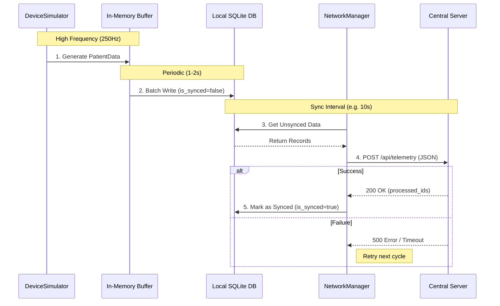

# Purpose
Defines data lifecycle from generation through caching, persistence, and synchronization with central server. Covers in-memory buffering, batch writes, network sync protocol, and patient association requirements.

# Data Flow Path



1. **Generation**: DeviceSimulator produces PatientData at high frequency.
2. **In-Memory Buffering**: Short-term (1-2s) buffer before batch persistence.
3. **Batch Cache**: Periodic writes to `vitals` table (local SQLite/SQLCipher).
4. **Synchronization**:
   - NetworkManager retrieves unsynced data (`is_synced = false`).
   - Batch JSON payload sent to `/api/telemetry`.
   - Server responds with processed IDs.
   - Local DB updated (`is_synced = true`) only for confirmed records.
   - On failure: unsynced data retained for next attempt.

# Server Payload Structure
```json
{
  "deviceId": "DEVICE-SERIAL-001",
  "deviceLabel": "ICU-MON-04",
  "patientMrn": "12345",
  "patientName": "John Doe",
  "bedLocation": "ICU-4B",
  "timestamp": "2025-11-22T14:30:00Z",
  "vitals": [
    {"id": 101, "timestamp": "2025-11-22T14:29:58Z", "heart_rate": 78, "spo2": 98.5}
  ],
  "alarms": [
    {"id": 201, "timestamp": "2025-11-22T14:30:00Z", "alarmType": "high_heart_rate", "priority": "high"}
  ]
}
```

**Critical Requirements:**
- Device identity: `deviceId`, `deviceLabel`.
- Patient association: `patientMrn`, `patientName`, `bedLocation` (REQUIRED for all patient data).
- Standby state: no patient telemetry sent if `patientMrn` is empty.

# Server Response
- Success: `{"status": "success", "processed_ids": [101, 102]}`.
- Failure: empty/invalid ID list; local DB unchanged; retry on next sync.

# Patient Association Requirements
- All telemetry MUST include `patientMrn` for correlation, compliance (HIPAA, IEC 62304), audit trails.
- `bedLocation` from Patient object; reflects current assignment.

# Integration Points
- DeviceSimulator (data generation).
- DatabaseManager (getUnsyncedData, markDataAsSynced).
- NetworkManager (sync orchestration).
- See DOC-ARCH-011 for thread assignments.

# Verification
- Functional: simulate generation, buffer, batch write, sync success/failure scenarios.
- Code Quality: enforce patient association validation; no hardcoded sync intervals.
- Documentation: diagram data flow and sync state machine.
- Integration: end-to-end sync test with mock server; verify partial success handling.
- Tests: unit tests for batch logic, sync protocol; integration tests for network failures.

# Document Metadata
| Field          | Value        |
| -------------- | ------------ |
| Original Doc   | DESIGN-011   |
| Migration Date | 2025-12-01   |
| New Doc ID     | DOC-ARCH-005 |

# Revision History
- 1.0 (2025-12-01): Migrated from 11_DATA_FLOW_AND_CACHING.md; aligned with architecture and threading.
