# DOC-PROC-001: Device Provisioning Workflow

## 1. Overview

## 2. Process Flow



## 3. Steps

### 3.1 Step 1: {Step Name}

**Responsible:** {Role}

**Prerequisites:**
- {Prerequisite}

**Actions:**
1. {Action}

**Outputs:**
- {Output}

**Success Criteria:**
- {Criterion}


This document describes the secure device provisioning and pairing workflow for the Z Monitor, replacing manual network configuration with an industry-standard QR code-based pairing system.

**Key Benefits:**
- **Security:** Eliminates manual certificate handling and reduces human error
- **Efficiency:** Faster device setup with QR code scanning  
- **Auditability:** All provisioning events logged for compliance
- **Scalability:** Supports batch provisioning of multiple devices
- **User Experience:** Intuitive workflow for technicians

---

## 2. Provisioning Workflow Steps

### 2.1 Workflow Steps

1. **Enable Provisioning Mode:** Device enters provisioning mode (explicit action required for security)
2. **Generate Pairing Information:** Device generates QR code and pairing code
3. **Scan/Enter Pairing Code:** Technician scans QR code or enters pairing code on authorized tablet
4. **Central Station Validation:** Central Station validates device and generates secure configuration
5. **Push Configuration:** Central Station securely pushes configuration to device
6. **Device Validation:** Device validates and applies configuration
7. **Connection Test:** Device tests connection with new configuration
8. **Provisioning Complete:** Device exits provisioning mode and connects to server

### 2.2 Security Features

- **Time-Limited Pairing:** QR code and pairing code expire after 10 minutes (configurable)
- **One-Time Use:** Pairing codes can only be used once
- **Encrypted Configuration:** Configuration payload encrypted with device's public key
- **Signed Configuration:** Configuration signed by Central Station's private key
- **Device Verification:** Device verifies Central Station's authority before accepting configuration
- **Audit Logging:** All provisioning events logged to `security_audit_log`

---

## 3. QR Code Format

The QR code contains the following information in JSON format:

```json
{
  "deviceId": "ZM-001",
  "deviceSerial": "SN-2024-001234",
  "ipAddress": "192.168.1.100",
  "pairingCode": "ABC-123-XYZ",
  "pairingToken": "base64-encoded-time-limited-token",
  "expiresAt": "2024-11-25T14:30:00Z",
  "firmwareVersion": "1.2.3"
}
```

**Security:**
- `pairingToken`: Cryptographically secure random token, HMAC-signed with device's private key
- `expiresAt`: Timestamp when pairing code expires (10 minutes from generation)
- QR code regenerated every 30 seconds to prevent replay attacks

---

## 4. Configuration Payload

The Central Station pushes the following configuration to the device:

```json
{
  "serverUrl": "https://monitoring.hospital.com:8443",
  "caCertificate": "base64-encoded-ca-cert",
  "clientCertificate": "base64-encoded-client-cert",
  "clientPrivateKey": "base64-encoded-encrypted-private-key",
  "deviceId": "ZM-001",
  "deviceLabel": "ICU-MON-04",
  "timestamp": "2024-11-25T14:25:00Z",
  "signature": "base64-encoded-signature"
}
```

**Security:**
- **Encryption:** Payload encrypted with device's public key (RSA-2048 or ECDSA-P256)
- **Signature:** Payload signed with Central Station's private key
- **Time-Limited:** Payload expires after 1 hour
- **One-Time Use:** Pairing code invalidated after successful provisioning

---

## 5. State Machine

### 5.1 Provisioning States

```
UNPROVISIONED (Initial State)
    ↓
    | [User presses "Enable Provisioning Mode" button]
    ↓
READY_TO_PAIR (Display QR code + pairing code)
    ↓
    | [Technician scans QR code on Central Station tablet]
    ↓
PAIRING_RECEIVED (Validating configuration payload)
    ↓
    | [Signature valid, pairing code matches, not expired]
    ↓
APPLYING_CONFIG (Installing certificates, saving settings)
    ↓
    | [Configuration applied successfully]
    ↓
TESTING_CONNECTION (Testing server connection with new config)
    ↓
    | [Connection successful]
    ↓
PROVISIONED (Success - device ready for use)

// Error States
PAIRING_RECEIVED → PROVISIONING_FAILED (Validation error)
APPLYING_CONFIG → PROVISIONING_FAILED (Installation error)
TESTING_CONNECTION → PROVISIONING_FAILED (Connection error)
PROVISIONING_FAILED → UNPROVISIONED (Retry)
```

---

## 6. Error Handling

### 6.1 Common Errors

| Error                 | Cause                         | User Action              | Developer Action                |
| --------------------- | ----------------------------- | ------------------------ | ------------------------------- |
| Pairing code mismatch | Wrong pairing code entered    | Re-scan QR code          | Validate pairing code matches   |
| Payload expired       | Configuration took > 1 hour   | Request new provisioning | Check timestamp validation      |
| Signature invalid     | Tampered payload or wrong key | Contact IT support       | Verify signature implementation |
| Certificate invalid   | Malformed certificate         | Contact IT support       | Validate certificate format     |
| Connection failed     | Network or server issue       | Check network, retry     | Test server reachability        |

---

## 7. Implementation Details

See `DOC-API-005` (IProvisioningService Interface) for complete API documentation including:
- QR code generation
- Configuration payload structure
- Signature verification
- Certificate installation
- Error handling
- Testing strategies

---

## 8. Related Documents

- **DOC-API-005:** IProvisioningService - Provisioning interface contract
- **DOC-PROC-002:** Certificate Provisioning - Certificate management workflow
- **DOC-COMP-022:** SettingsManager - Configuration storage

---

## 9. Changelog

| Version | Date       | Author         | Changes                                 |
| ------- | ---------- | -------------- | --------------------------------------- |
| 1.0     | 2025-11-27 | Z Monitor Team | Migrated from 17_DEVICE_PROVISIONING.md |

---

*This workflow enables secure, efficient device provisioning through QR code pairing, eliminating manual errors and improving deployment speed.*
