# DOC-PROC-002: Certificate Provisioning Workflow

## 1. Overview

## 2. Process Flow



## 3. Steps

### 3.1 Step 1: {Step Name}

**Responsible:** {Role}

**Prerequisites:**
- {Prerequisite}

**Actions:**
1. {Action}

**Outputs:**
- {Output}

**Success Criteria:**
- {Criterion}


This document defines how device X.509 certificates are created, installed, validated, renewed, and revoked to enable mutual TLS (mTLS) between devices and the central server.

Devices require:
- Client certificate (per-device, signed by platform CA)
- Client private key (never exported from device, encrypted at rest)
- CA certificate (to validate server certs)
- Optional CRL/OCSP configuration

---

## 2. Workflows

### 2.1 Initial Provisioning
1. Create or select platform CA (offline or on-secure-host)
2. Generate device keypair and CSR (device or server-side)
3. Sign CSR using CA → produce client certificate (365 days)
4. Deliver certs via provisioning payload (QR-based, see DOC-PROC-001)
5. Install into encrypted keystore; set permissions to system only
6. Validate chain and complete mTLS handshake test

### 2.2 Renewal
1. Monitor expiry (90/30/7 day thresholds)
2. Request renewal (authenticated channel)
3. Issue new certificate (same deviceId as CN/SAN)
4. Deliver and install; keep old cert valid during 7‑day grace
5. Swap active identity to new certificate; remove old after grace

### 2.3 Revocation
1. Trigger: device compromised, decommissioned, or lost
2. Revoke certificate (CRL/OCSP)
3. Distribute CRL periodically; pin revocation sources
4. Reject connections presenting revoked certs
5. Audit event for compliance

---

## 3. CA Setup (reference)

```bash
mkdir -p ca/{private,certs,crl,newcerts} && cd ca
chmod 700 private && touch index.txt && echo 1000 > serial
# CA key (encrypted)
openssl genrsa -aes256 -out private/ca.key 4096
# CA cert (10 years)
openssl req -new -x509 -days 3650 -key private/ca.key \
  -out certs/ca.crt -subj "/C=US/ST=State/O=Hospital/OU=IT/CN=Z-Monitor-CA"
```

---

## 4. Device Certificate Issuance (reference)

```bash
# Generate key + CSR (on device or server)
openssl genrsa -out device-ZM-001.key 2048
openssl req -new -key device-ZM-001.key -out device-ZM-001.csr \
  -subj "/C=US/O=Hospital/OU=ICU/CN=ZM-001"

# Sign CSR with CA (policy via ca.conf)
openssl ca -config ca.conf -in device-ZM-001.csr -out device-ZM-001.crt -days 365
```

---

## 5. Installation Flow (device)
1. Receive encrypted, signed payload (QR pairing → HTTPS pull)
2. Validate HMAC/signature and pairing code
3. Import certs into keystore (permissions 0600, owner: system)
4. Persist CA bundle; enable certificate pinning if configured
5. Smoke test: mTLS connection to central server endpoint

---

## 6. Validation

### 6.1 Client-side (device)
- Verify server chain against CA; enforce TLS1.2+
- Check server cert expiry and hostname match

```cpp
QSslConfiguration cfg;
cfg.setCaCertificates({m_caCertificate});
cfg.setPeerVerifyMode(QSslSocket::VerifyPeer);
```

### 6.2 Server-side
- Verify client chain against CA; require ClientAuth
- Enforce CRL/OCSP; block revoked certs

---

## 7. Lifecycle Automation

```cpp
// Pseudocode
void CertificateManager::checkExpiry() {
  int d = daysUntil(m_clientCert.expiryDate());
  if (d <= 7) requestRenewal();
  else if (d <= 30) emit warning(d);
}
```

- Daily check; alerts at 90/30/7 days
- Auto-renew ≤7 days to expiry

---

## 8. Security
- Encrypt private keys at rest (AES‑256); no export
- Restrict access to keystore to privileged service
- Pin server certificate or CA to reduce MITM risk
- Distribute CRL daily; cache up to 48h offline

---

## 9. Troubleshooting

| Issue        | Symptom                    | Resolution                |
| ------------ | -------------------------- | ------------------------- |
| Expired cert | Handshake fails, "expired" | Renew certificate         |
| Wrong CA     | Untrusted server           | Install correct CA bundle |
| Revoked      | Handshake rejected         | Reprovision device        |
| Clock skew   | "Not yet valid"            | Sync NTP                  |

---

## 10. Diagrams

- Initial Provisioning: `processes/diagrams/15_CERTIFICATE_PROVISIONING_INITIAL.svg`
- Renewal: `processes/diagrams/15_CERTIFICATE_PROVISIONING_RENEWAL.svg`
- Revocation: `processes/diagrams/15_CERTIFICATE_PROVISIONING_REVOCATION.svg`
- Transmission: `processes/diagrams/15_CERTIFICATE_PROVISIONING_TRANSMISSION.svg`
- Validation: `processes/diagrams/15_CERTIFICATE_PROVISIONING_VALIDATION.svg`

(Note: ensure these are copied from the source diagrams directory.)

---

## 11. Related Documents
- DOC-PROC-001 Device Provisioning Workflow
- DOC-API-002 ITelemetryServer (mTLS)
- DOC-API-005 IProvisioningService (delivery mechanism)

---

## 12. Changelog

| Version | Date       | Author         | Changes                                          |
| ------- | ---------- | -------------- | ------------------------------------------------ |
| 1.0     | 2025-12-01 | Z Monitor Team | Migrated from DESIGN-015, consolidated workflows |
