# DOC-PROC-003: ADT (Admission, Discharge, Transfer) Workflow

## 1. Overview

## 2. Process Flow



## 3. Steps

### 3.1 Step 1: {Step Name}

**Responsible:** {Role}

**Prerequisites:**
- {Prerequisite}

**Actions:**
1. {Action}

**Outputs:**
- {Output}

**Success Criteria:**
- {Criterion}


Replaces legacy "Bed ID" configuration with a proper hospital ADT flow. Device identity (Device Label) is independent of the Patient identity (MRN). Admission creates an association; discharge removes it; transfer moves it across devices.

---

## 2. Workflow

### 2.1 Admission Methods
- Manual entry: clinician searches by MRN or name; confirms patient
- Barcode scan: MRN extracted from wristband; lookup + confirm
- Central Station push: auto-admit notification; optional confirmation

### 2.2 Discharge
- Manual: Discharge action in UI
- Central push: Discharge notification
- Automatic: Bed sensor indicates removal (if available)

Effects:
- Data retained for audit per retention policy
- Device returns to STANDBY (no patient)

### 2.3 Transfer
- Source device discharges; target device admits
- Data continuity configurable (copy reference metadata or keep on source)

---

## 3. Patient Object Model

```cpp
struct Patient {
  QString mrn;
  QString name;
  QDate dateOfBirth;
  QString sex;            // "M","F","O","U"
  QStringList allergies;
  QString bedLocation;
  QDateTime admittedAt;
  QDateTime dischargedAt; // null if currently admitted
  QString admissionSource; // manual, barcode, central_station
};
```

States:
- NotAdmitted → Admitted → Discharged

---

## 4. UI Components

- Admission Modal: manual/barcode/central tabs, patient preview, Admit button
- Patient Banner: shows name/MRN/bed; STANDBY when no patient
- Settings: remove Bed ID; add read-only Device Label (technician-editable only)

---

## 5. Database Changes

```sql
-- patients table enhancements
ALTER TABLE patients ADD COLUMN bed_location TEXT NULL;
ALTER TABLE patients ADD COLUMN admitted_at INTEGER NULL;
ALTER TABLE patients ADD COLUMN discharged_at INTEGER NULL;
ALTER TABLE patients ADD COLUMN admission_source TEXT NULL;
ALTER TABLE patients ADD COLUMN device_label TEXT NULL;

-- admission events
CREATE TABLE IF NOT EXISTS admission_events (
  id INTEGER PRIMARY KEY AUTOINCREMENT,
  timestamp INTEGER NOT NULL,
  event_type TEXT NOT NULL,   -- admission | discharge | transfer
  patient_mrn TEXT NOT NULL,
  patient_name TEXT NULL,
  device_label TEXT NOT NULL,
  bed_location TEXT NULL,
  admission_source TEXT NULL,
  user_id TEXT NULL,
  details TEXT NULL
);
CREATE INDEX IF NOT EXISTS idx_adm_patient ON admission_events(patient_mrn, timestamp);
```

---

## 6. Integration

- HIS/EHR Lookup: `IPatientLookupService` by MRN
- Central Station Notifications: secure admission/discharge messages with patient payload

Payload example (admission):
```json
{
  "event":"admission",
  "patient": {"mrn":"12345","name":"John Doe","dob":"1980-01-15","sex":"M","allergies":["Penicillin"],"bedLocation":"ICU-4B"},
  "deviceLabel":"ICU-MON-04",
  "timestamp":"2024-11-25T14:30:00Z",
  "source":"central_station"
}
```

---

## 7. Security & Audit

- Role-gated actions (see DOC-PROC-004/005):
  - Admit/Discharge/Transfer require authenticated roles
- Audit:
  - Log to `admission_events`, `audit_log`, and `security_audit_log` for central pushes

---

## 8. Testing

- Unit: PatientManager admit/discharge/transfer transitions
- Integration: Central push → device state change
- E2E: Barcode scan → lookup → confirm → admit; header displays patient

---

## 9. Related Documents
- DOC-API-001 IPatientLookupService
- DOC-PROC-004 Authentication Workflow
- DOC-PROC-005 Login Workflow & Action Logging

---

## 10. Changelog

| Version | Date       | Author         | Changes                                            |
| ------- | ---------- | -------------- | -------------------------------------------------- |
| 1.0     | 2025-12-01 | Z Monitor Team | Migrated from DESIGN-019; consolidated UI, DB, API |
