# DOC-PROC-004: Authentication and Authorization Workflow

## 1. Overview

## 2. Process Flow



## 3. Steps

### 3.1 Step 1: {Step Name}

**Responsible:** {Role}

**Prerequisites:**
- {Prerequisite}

**Actions:**
1. {Action}

**Outputs:**
- {Output}

**Success Criteria:**
- {Criterion}


Defines user authentication with hospital servers and local RBAC enforcement. Supports REST and LDAP/AD backends, plus a mock service for development. Provides session lifecycle, permission model, and audit requirements.

---

## 2. Roles & Permissions

### 2.1 Role Hierarchy
Administrator > Physician > Nurse > Technician > Observer (read‑only)

### 2.2 Enforcement
- Central `PermissionRegistry` maps `UserRole` → `PermissionSet`
- `SecurityService::checkPermission(Permission)` gates all sensitive actions
- Controllers/services never use string literals; use enums only

```cpp
if (!m_security->checkPermission(Permission::AdjustAlarmThresholds)) {
  emit permissionDenied(tr("Insufficient permissions."));
  return;
}
```

---

## 3. Server Integration

### 3.1 REST (recommended)
- `POST /api/v1/auth/login` → profile, role, permissions, sessionToken
- `POST /api/v1/auth/validate` → keep-alive/expiry
- `POST /api/v1/auth/logout` → revoke

### 3.2 LDAP/AD (alternative)
- Bind DN with user credentials
- Map `memberOf` groups → `UserRole`

### 3.3 Mock Service (dev/test)
- Hardcoded test users and roles
- Configurable latency/failure simulation

---

## 4. Session Management

- Timeout: 60–120 minutes configurable
- Validation: local expiry check + server validate every 5 minutes
- Signals: `sessionExpired()`, `requestLoginScreen()`

```cpp
void SecurityService::handleSessionExpired(const QString& reason) {
  logAuditEvent("SESSION_EXPIRED", reason);
  m_currentSession.reset();
  emit sessionExpired();
  emit requestLoginScreen();
}
```

---

## 5. Security Requirements

- TLS 1.2+ with certificate pinning
- Secret codes never logged; cleared immediately after use
- Brute-force protection (server lockout; client retry delay)
- Tokens in memory only; short expiry; revocation supported

---

## 6. Audit Logging (security_audit_log)

Log at least:
- `LOGIN_ATTEMPT`, `LOGIN_SUCCESS`, `LOGIN_FAILED`, `LOGIN_BLOCKED`
- `SESSION_EXPIRED`, `SESSION_REVOKED`, `USER_LOGOUT`
- `PERMISSION_DENIED`, `PERMISSION_GRANTED`

Include: userId, role, deviceId, timestamp, result, hashed token, details.

---

## 7. UI/UX

- LoginView states: Ready, Authenticating, Success, Failure
- Session indicator in header (user name, role, logout)
- Timeout warning at T‑1 minute before expiry

---

## 8. Configuration

- `user_mgmt_use_mock` (bool), `user_mgmt_server_url` (string)
- `session_timeout_minutes`, `session_validation_interval`
- `certificate_pinning_enabled`, `offline_mode_supported`

---

## 9. Testing

- Unit: MockUserManagementService, SecurityService session logic
- Integration: REST adapter against mock HTTP server
- E2E: Login flow, permission‑gated actions, session timeout

---

## 10. Related Documents
- DOC-API-004 IUserManagementService
- DOC-PROC-005 Login Workflow & Action Logging

---

## 11. Changelog

| Version | Date       | Author         | Changes                                                          |
| ------- | ---------- | -------------- | ---------------------------------------------------------------- |
| 1.0     | 2025-12-01 | Z Monitor Team | Migrated from DESIGN-038; condensed and aligned to RBAC registry |
