# DOC-PROC-006: Data Migration Workflow

## 1. Overview

## 2. Process Flow



## 3. Steps

### 3.1 Step 1: {Step Name}

**Responsible:** {Role}

**Prerequisites:**
- {Prerequisite}

**Actions:**
1. {Action}

**Outputs:**
- {Output}

**Success Criteria:**
- {Criterion}


Defines safe procedures for schema, data, and seed migrations; rollback; pre/post validation; runner tooling; CI integration.

---

## 2. Migration Types

- Schema (DDL): CREATE/ALTER/DROP tables & indices (medium risk)
- Data (DML): Transform existing rows (high risk)
- Seed: Insert initial/reference data (low risk)
- Rollback: Undo previous migration (high risk)

---

## 3. Layout & Naming

```
schema/
  migrations/
    schema/    0001_initial.sql, 0002_add_adt.sql, ...
    data/      0005_migrate_patient_ids_to_mrn.sql
    seed/      0001_default_settings.sql
    rollback/  0005_rollback.sql
```

- Number sequentially; do not reuse numbers; never modify applied migrations

---

## 4. Examples (condensed)

### 4.1 Schema Add Column
```sql
BEGIN; ALTER TABLE patients ADD COLUMN emergency_contact TEXT NULL; COMMIT;
```

### 4.2 Data Transform
```sql
BEGIN; UPDATE vitals SET patient_mrn=(SELECT mrn FROM patients WHERE patients.mrn=vitals.patient_id)
WHERE patient_mrn IS NULL AND patient_id IS NOT NULL; COMMIT;
```

### 4.3 Seed Defaults
```sql
BEGIN; INSERT OR IGNORE INTO settings(key,value,updated_at)
VALUES('deviceLabel','DEVICE-001',datetime('now')); COMMIT;
```

---

## 5. Runner Tool

`python3 scripts/migrate.py --db <path> [--dry-run] [--rollback N] [--status] [--target N]`

- Tracks applied versions in `schema_version`
- Stores file hash and execution time
- Supports ordered application across schema/data/seed folders

---

## 6. Validation

- Pre: integrity check, foreign keys, DB size; script `scripts/pre_migration_check.py`
- Post: version match, key invariants (e.g., no NULL `patient_mrn`); `scripts/post_migration_check.py`

---

## 7. Rollback Strategy

- Prefer transactional rollback on failure
- Provide manual rollback scripts for each migration
- Have backups and a restore plan in production

---

## 8. Large Data Strategy

- Batch updates (e.g., 10k rows per batch) with commits per batch
- Python loop driver for progress; estimate runtime and lock impact

---

## 9. CI/CD

- PR checks: numbering, apply on empty DB, sample data, rollback
- Publish artifacts (coverage, benchmark, logs) if relevant

---

## 10. Monitoring

- Record execution time, rows affected, failure rates
- Alert on slow migrations or validation failures

---

## 11. Diagrams

- `processes/diagrams/34_DATA_MIGRATION_WORKFLOW.svg` (copy from source)

---

## 12. Changelog

| Version | Date       | Author         | Changes                                                     |
| ------- | ---------- | -------------- | ----------------------------------------------------------- |
| 1.0     | 2025-12-01 | Z Monitor Team | Migrated from DESIGN-034; condensed with tooling references |
