# DOC-PROC-007: Testing Workflow and Strategy

## 2. Process Flow



## 3. Steps

### 3.1 Step 1: {Step Name}

**Responsible:** {Role}

**Prerequisites:**
- {Prerequisite}

**Actions:**
1. {Action}

**Outputs:**
- {Output}

**Success Criteria:**
- {Criterion}


## 2. Process Flow


## 3. Steps

### 3.1 Step 1: {Step Name}

**Responsible:** {Role}

**Prerequisites:**
- {Prerequisite}

**Actions:**
1. {Action}

**Outputs:**
- {Output}

**Success Criteria:**
- {Criterion}


## 1. Goals
- Fast, deterministic unit tests
- Integration tests for component interactions
- E2E flows through real UI + backends
- Repeatable benchmarks; coverage reporting; CI gating

---

## 2. Test Pyramid

| Level         | Scope                 | Tools                                |
| ------------- | --------------------- | ------------------------------------ |
| Unit          | Single class/function | GoogleTest, Qt Test                  |
| Integration   | Multi-component       | GoogleTest + fixtures, qmltestrunner |
| E2E           | Device→UI→Server      | Squish/QML + pytest                  |
| Benchmark     | Perf-critical code    | Google Benchmark                     |
| Static/Format | Style & scans         | clang-format, clang-tidy, cppcheck   |

---

## 3. Layout

```
tests/
  unit/{core,qml}
  integration/{network,security}
  e2e/scenarios
  benchmarks/core
scripts/run_tests.sh
```

---

## 4. Workflows

- Developer: `./scripts/run_tests.sh unit` before coding; add tests with features
- Pre-commit: `./scripts/run_tests.sh unit integration lint`
- Pre-push: `./scripts/run_tests.sh all`

---

## 5. Unified Runner

```bash
./scripts/run_tests.sh unit|integration|e2e|bench|coverage|all
```

Coverage artifacts: `build/coverage/index.html`

---

## 6. Coverage
- `-DENABLE_COVERAGE=ON` (CMake)
- lcov/genhtml on Linux; llvm-cov on macOS
- Thresholds enforced in CI (e.g., ≥80% for core)

---

## 7. Benchmarks
- Run on dedicated runner; store CSV/JSON
- Fail build if regression > threshold (e.g., 10% median)

---

## 8. Next Steps
- Scaffold test dirs & runner
- Add CI jobs for unit/integration/e2e/coverage/bench

---

## 9. Related
- Performance measurement strategy (benchmarks doc)

---

## 10. Changelog

| Version | Date       | Author         | Changes                                                 |
| ------- | ---------- | -------------- | ------------------------------------------------------- |
| 1.0     | 2025-12-01 | Z Monitor Team | Migrated from DESIGN-018; condensed and aligned with CI |
