# DOC-PROC-009: Schema Management and Code Generation

## 2. Process Flow



## 3. Steps

### 3.1 Step 1: {Step Name}

**Responsible:** {Role}

**Prerequisites:**
- {Prerequisite}

**Actions:**
1. {Action}

**Outputs:**
- {Output}

**Success Criteria:**
- {Criterion}


## 2. Process Flow


## 3. Steps

### 3.1 Step 1: {Step Name}

**Responsible:** {Role}

**Prerequisites:**
- {Prerequisite}

**Actions:**
1. {Action}

**Outputs:**
- {Output}

**Success Criteria:**
- {Criterion}


## Purpose

This document defines the **schema-first** approach for database management in Z Monitor, using YAML schema definitions and code generation to eliminate hardcoded table/column names and ensure single source of truth.

**Problem:** Hardcoded table and column names scattered throughout codebase (no autocomplete, runtime errors on typos, hard to refactor).  
**Solution:** Define schema in YAML, generate C++ constants for type-safe table/column access.

## Problem with Hardcoded Names

### Anti-Pattern: Magic Strings Everywhere

```cpp
// ❌ BAD: Hardcoded column names (typos, no autocomplete)
void PatientRepository::save(const Patient& patient) {
    QSqlQuery query;
    query.prepare("INSERT INTO patients (mrn, name, bed_location) VALUES (?, ?, ?)");
    
    // Typo: "bed_location" vs "bed_loc" (runtime error!)
    query.addBindValue(patient.getMrn());
    query.addBindValue(patient.getName());
    query.addBindValue(patient.getBedLocation());
    query.exec();
}

void AlarmRepository::findByPatient(const QString& mrn) {
    query.prepare("SELECT * FROM alarms WHERE patient_mrn = ?");
    
    // Different developer uses "patientMrn" (inconsistent)
    // No compile-time check
}
```

**Problems:**
- ❌ No autocomplete for table/column names
- ❌ Typos detected only at runtime
- ❌ Inconsistent naming (snake_case vs camelCase)
- ❌ Hard to refactor (global search required)
- ❌ Duplicate schema definition (SQL + code)

## Schema-First Approach

### Single Source of Truth: YAML Schema

Define database schema in `schema/database.yaml`:

```yaml
# schema/database.yaml
database:
  name: zmonitor
  version: "1.0.0"
  
tables:
  - name: patients
    columns:
      - name: patient_id
        type: INTEGER
        primary_key: true
        auto_increment: true
      
      - name: mrn
        type: TEXT
        nullable: false
        unique: true
        description: "Medical Record Number"
      
      - name: name
        type: TEXT
        nullable: false
      
      - name: date_of_birth
        type: TEXT  # ISO 8601 date
        nullable: true
      
      - name: sex
        type: TEXT
        nullable: true
      
      - name: bed_location
        type: TEXT
        nullable: false
      
      - name: admission_source
        type: TEXT
        nullable: false
        description: "manual, barcode, central_station"
      
      - name: admitted_at
        type: TEXT  # ISO 8601 datetime
        nullable: false
      
      - name: discharged_at
        type: TEXT  # ISO 8601 datetime
        nullable: true
      
      - name: device_label
        type: TEXT
        nullable: true
    
    indices:
      - name: idx_patients_mrn
        columns: [mrn]
        unique: true
      
      - name: idx_patients_device_label
        columns: [device_label]

  - name: vitals
    columns:
      - name: vital_id
        type: INTEGER
        primary_key: true
        auto_increment: true
      
      - name: patient_mrn
        type: TEXT
        nullable: false
        foreign_key:
          table: patients
          column: mrn
          on_delete: CASCADE
      
      - name: device_label
        type: TEXT
        nullable: false
      
      - name: parameter_type
        type: TEXT
        nullable: false
        description: "HR, SpO2, RR, BP_SYS, BP_DIA, etc."
      
      - name: value
        type: REAL
        nullable: false
      
      - name: unit
        type: TEXT
        nullable: false
      
      - name: timestamp_utc
        type: TEXT  # ISO 8601 datetime
        nullable: false
      
      - name: quality_flag
        type: INTEGER
        nullable: false
        default: 0
    
    indices:
      - name: idx_vitals_patient_mrn
        columns: [patient_mrn]
      
      - name: idx_vitals_timestamp
        columns: [timestamp_utc]

  - name: alarms
    columns:
      - name: alarm_id
        type: INTEGER
        primary_key: true
        auto_increment: true
      
      - name: patient_mrn
        type: TEXT
        nullable: false
        foreign_key:
          table: patients
          column: mrn
          on_delete: CASCADE
      
      - name: device_label
        type: TEXT
        nullable: false
      
      - name: parameter_type
        type: TEXT
        nullable: false
      
      - name: alarm_type
        type: TEXT
        nullable: false
        description: "high, low, technical"
      
      - name: severity
        type: TEXT
        nullable: false
        description: "critical, warning, advisory"
      
      - name: value
        type: REAL
        nullable: false
      
      - name: threshold_low
        type: REAL
        nullable: true
      
      - name: threshold_high
        type: REAL
        nullable: true
      
      - name: triggered_at
        type: TEXT  # ISO 8601 datetime
        nullable: false
      
      - name: acknowledged_at
        type: TEXT
        nullable: true
      
      - name: acknowledged_by
        type: TEXT
        nullable: true
    
    indices:
      - name: idx_alarms_patient_mrn
        columns: [patient_mrn]
      
      - name: idx_alarms_triggered_at
        columns: [triggered_at]

  # ... more tables (telemetry_metrics, action_log, security_audit_log, etc.)
```

### Generated Code: SchemaInfo.h

Python script `scripts/generate_schema.py` reads YAML and generates:

```cpp
// include/database/SchemaInfo.h (AUTO-GENERATED - DO NOT EDIT)

#ifndef SCHEMA_INFO_H
#define SCHEMA_INFO_H

namespace Schema {

// Table names
namespace Tables {
    constexpr const char* PATIENTS = "patients";
    constexpr const char* VITALS = "vitals";
    constexpr const char* ALARMS = "alarms";
    constexpr const char* TELEMETRY_METRICS = "telemetry_metrics";
    constexpr const char* ACTION_LOG = "action_log";
    constexpr const char* SECURITY_AUDIT_LOG = "security_audit_log";
    constexpr const char* SETTINGS = "settings";
    constexpr const char* CERTIFICATES = "certificates";
}

// Column names (namespaced by table)
namespace Columns {

namespace Patients {
    constexpr const char* PATIENT_ID = "patient_id";
    constexpr const char* MRN = "mrn";
    constexpr const char* NAME = "name";
    constexpr const char* DATE_OF_BIRTH = "date_of_birth";
    constexpr const char* SEX = "sex";
    constexpr const char* BED_LOCATION = "bed_location";
    constexpr const char* ADMISSION_SOURCE = "admission_source";
    constexpr const char* ADMITTED_AT = "admitted_at";
    constexpr const char* DISCHARGED_AT = "discharged_at";
    constexpr const char* DEVICE_LABEL = "device_label";
}

namespace Vitals {
    constexpr const char* VITAL_ID = "vital_id";
    constexpr const char* PATIENT_MRN = "patient_mrn";
    constexpr const char* DEVICE_LABEL = "device_label";
    constexpr const char* PARAMETER_TYPE = "parameter_type";
    constexpr const char* VALUE = "value";
    constexpr const char* UNIT = "unit";
    constexpr const char* TIMESTAMP_UTC = "timestamp_utc";
    constexpr const char* QUALITY_FLAG = "quality_flag";
}

namespace Alarms {
    constexpr const char* ALARM_ID = "alarm_id";
    constexpr const char* PATIENT_MRN = "patient_mrn";
    constexpr const char* DEVICE_LABEL = "device_label";
    constexpr const char* PARAMETER_TYPE = "parameter_type";
    constexpr const char* ALARM_TYPE = "alarm_type";
    constexpr const char* SEVERITY = "severity";
    constexpr const char* VALUE = "value";
    constexpr const char* THRESHOLD_LOW = "threshold_low";
    constexpr const char* THRESHOLD_HIGH = "threshold_high";
    constexpr const char* TRIGGERED_AT = "triggered_at";
    constexpr const char* ACKNOWLEDGED_AT = "acknowledged_at";
    constexpr const char* ACKNOWLEDGED_BY = "acknowledged_by";
}

// ... more column namespaces

} // namespace Columns

} // namespace Schema

#endif // SCHEMA_INFO_H
```

## Code Generator Implementation

### Python Script: generate_schema.py

```python
#!/usr/bin/env python3
# scripts/generate_schema.py

import yaml
import sys
from pathlib import Path

def to_upper_snake_case(s):
    """Convert 'patient_id' → 'PATIENT_ID'"""
    return s.upper()

def to_pascal_case(s):
    """Convert 'patient_mrn' → 'PatientMrn', 'action_log' → 'ActionLog'"""
    return ''.join(word.capitalize() for word in s.split('_'))

def generate_schema_header(schema_data, output_path):
    """Generate SchemaInfo.h from YAML schema"""
    
    with open(output_path, 'w') as f:
        # Header guard
        f.write("// AUTO-GENERATED FILE - DO NOT EDIT MANUALLY\n")
        f.write("// Generated from schema/database.yaml\n\n")
        f.write("#ifndef SCHEMA_INFO_H\n")
        f.write("#define SCHEMA_INFO_H\n\n")
        f.write("namespace Schema {\n\n")
        
        # Generate table names
        f.write("// Table names\n")
        f.write("namespace Tables {\n")
        for table in schema_data['tables']:
            table_name = table['name']
            const_name = to_upper_snake_case(table_name)
            f.write(f'    constexpr const char* {const_name} = "{table_name}";\n')
        f.write("}\n\n")
        
        # Generate column names (namespaced by table)
        f.write("// Column names (namespaced by table)\n")
        f.write("namespace Columns {\n\n")
        
        for table in schema_data['tables']:
            table_name = table['name']
            namespace_name = to_pascal_case(table_name)
            
            f.write(f"namespace {namespace_name} {{\n")
            
            for column in table['columns']:
                column_name = column['name']
                const_name = to_upper_snake_case(column_name)
                f.write(f'    constexpr const char* {const_name} = "{column_name}";\n')
            
            f.write("}\n\n")
        
        f.write("} // namespace Columns\n\n")
        f.write("} // namespace Schema\n\n")
        f.write("#endif // SCHEMA_INFO_H\n")

def main():
    schema_file = Path("schema/database.yaml")
    output_file = Path("include/database/SchemaInfo.h")
    
    # Load YAML schema
    with open(schema_file, 'r') as f:
        schema_data = yaml.safe_load(f)
    
    # Generate header file
    generate_schema_header(schema_data, output_file)
    
    print(f"✅ Generated {output_file}")

if __name__ == "__main__":
    main()
```

### Usage

```bash
# Regenerate SchemaInfo.h after editing database.yaml
$ python3 scripts/generate_schema.py
✅ Generated include/database/SchemaInfo.h
```

## Using Schema Constants

### Before (Magic Strings)

```cpp
// ❌ BAD: Hardcoded strings
void PatientRepository::save(const Patient& patient) {
    query.prepare("INSERT INTO patients (mrn, name, bed_location) VALUES (?, ?, ?)");
    query.addBindValue(patient.getMrn());
    query.addBindValue(patient.getName());
    query.addBindValue(patient.getBedLocation());
}

QString PatientRepository::buildSelectQuery() {
    return "SELECT patient_id, mrn, name FROM patients WHERE mrn = ?";
}
```

### After (Schema Constants)

```cpp
// ✅ GOOD: Type-safe constants with autocomplete
#include "database/SchemaInfo.h"

void PatientRepository::save(const Patient& patient) {
    QString sql = QString("INSERT INTO %1 (%2, %3, %4) VALUES (?, ?, ?)")
        .arg(Schema::Tables::PATIENTS)
        .arg(Schema::Columns::Patients::MRN)
        .arg(Schema::Columns::Patients::NAME)
        .arg(Schema::Columns::Patients::BED_LOCATION);
    
    query.prepare(sql);
    query.addBindValue(patient.getMrn());
    query.addBindValue(patient.getName());
    query.addBindValue(patient.getBedLocation());
}

QString PatientRepository::buildSelectQuery() {
    return QString("SELECT %1, %2, %3 FROM %4 WHERE %2 = ?")
        .arg(Schema::Columns::Patients::PATIENT_ID)
        .arg(Schema::Columns::Patients::MRN)
        .arg(Schema::Columns::Patients::NAME)
        .arg(Schema::Tables::PATIENTS);
}
```

**Benefits:**
- ✅ Autocomplete after typing `Schema::Columns::Patients::`
- ✅ Compile-time checking (typo = compiler error)
- ✅ Easy refactoring (rename column in YAML, regenerate, recompile)
- ✅ IDE "Find Usages" works

## Migration Workflow

### Schema Changes Process

1. **Edit YAML schema** (`schema/database.yaml`)
   ```yaml
   # Add new column to patients table
   - name: emergency_contact
     type: TEXT
     nullable: true
   ```

2. **Regenerate SchemaInfo.h**
   ```bash
   $ python3 scripts/generate_schema.py
   ```

3. **Create migration file** (see DOC-PROC-010)
   ```sql
   -- migrations/schema/0012_add_emergency_contact.sql
   ALTER TABLE patients ADD COLUMN emergency_contact TEXT;
   ```

4. **Update code to use new constant**
   ```cpp
   query.addBindValue(patient.getEmergencyContact());
   // Autocomplete suggests: Schema::Columns::Patients::EMERGENCY_CONTACT
   ```

5. **Test migration**
   ```bash
   $ python3 scripts/migration_runner.py --dry-run
   $ python3 scripts/migration_runner.py --apply
   ```

6. **Commit YAML + generated header + migration**
   ```bash
   $ git add schema/database.yaml \
             include/database/SchemaInfo.h \
             migrations/schema/0012_add_emergency_contact.sql
   $ git commit -m "Add emergency_contact column to patients table"
   ```

## Build System Integration

### CMakeLists.txt

```cmake
# Auto-generate SchemaInfo.h before build
add_custom_command(
    OUTPUT ${CMAKE_SOURCE_DIR}/include/database/SchemaInfo.h
    COMMAND python3 ${CMAKE_SOURCE_DIR}/scripts/generate_schema.py
    DEPENDS ${CMAKE_SOURCE_DIR}/schema/database.yaml
    COMMENT "Generating SchemaInfo.h from database schema"
)

# Add generated file as dependency
add_custom_target(generate_schema 
    DEPENDS ${CMAKE_SOURCE_DIR}/include/database/SchemaInfo.h
)

# Ensure schema generation runs before compilation
add_dependencies(zmonitor_lib generate_schema)
```

**Effect:** SchemaInfo.h regenerated automatically whenever `database.yaml` changes.

## Qt SQL Plugin Deployment Configuration

**Purpose:** Qt applications require SQL driver plugins to be available at runtime. On macOS, the QSQLITE driver must be deployed alongside the executable for database operations to work.

### CMake Plugin Deployment

The build system automatically copies the SQLite plugin from the Qt installation to the build directory:

```cmake
# z-monitor/src/CMakeLists.txt
# Deploy SQLite plugin to build directory for runtime loading
if(Qt6_FOUND)
    get_target_property(QT_QMAKE_EXECUTABLE Qt6::qmake IMPORTED_LOCATION)
    execute_process(
        COMMAND ${QT_QMAKE_EXECUTABLE} -query QT_INSTALL_PLUGINS
        OUTPUT_VARIABLE QT_PLUGINS_DIR
        OUTPUT_STRIP_TRAILING_WHITESPACE
    )

    set(SQL_PLUGIN_SOURCE "${QT_PLUGINS_DIR}/sqldrivers/libqsqlite.dylib")
    set(SQL_PLUGIN_DEST "${CMAKE_CURRENT_BINARY_DIR}/sqldrivers")

    add_custom_command(TARGET z-monitor POST_BUILD
        COMMAND ${CMAKE_COMMAND} -E make_directory ${SQL_PLUGIN_DEST}
        COMMAND ${CMAKE_COMMAND} -E copy_if_different
        "${SQL_PLUGIN_SOURCE}"
        "${SQL_PLUGIN_DEST}/libqsqlite.dylib"
        COMMENT "Deploying SQLite plugin to ${SQL_PLUGIN_DEST}"
    )
endif()
```

**Key Points:**
- Plugin deployed to `build/src/sqldrivers/libqsqlite.dylib`
- Same directory as executable (`build/src/z-monitor`)
- `POST_BUILD` command ensures plugin is copied after each build

### Runtime Plugin Path Configuration

The application must configure Qt's plugin search paths BEFORE any QSqlDatabase operations:

```cpp
// main.cpp
int main(int argc, char *argv[])
{
    QGuiApplication app(argc, argv);

    // Add executable directory to plugin search path
    // Qt will automatically append "/sqldrivers" when searching for SQL plugins
    // MUST be done before any QSqlDatabase operations
    QCoreApplication::addLibraryPath(QCoreApplication::applicationDirPath());
    // Also add explicit sqldrivers subdir to be safe
    QCoreApplication::addLibraryPath(QCoreApplication::applicationDirPath() + "/sqldrivers");
    
    // Verify SQLite driver is available
    if (!QSqlDatabase::isDriverAvailable("QSQLITE"))
    {
        qCritical() << "QSQLITE driver not available!";
        qCritical() << "Available drivers:" << QSqlDatabase::drivers();
        qCritical() << "Library paths:" << QCoreApplication::libraryPaths();
        return 1;
    }
    
    // Database operations can now proceed...
}
```

**Critical Timing:**
1. `QCoreApplication` must be constructed first
2. `addLibraryPath()` called immediately after
3. BEFORE any `QSqlDatabase` calls (including `QSqlDatabase::drivers()`)

### Verification Script

Use `scripts/verify_sql_plugin.sh` to diagnose plugin deployment issues:

```bash
#!/bin/bash
# Run verification script
./scripts/verify_sql_plugin.sh

# Expected output:
# ✅ Found executable: build/src/z-monitor
# ✅ SQLite plugin found: build/src/sqldrivers/libqsqlite.dylib
# ✅ Plugin deployment verified - should work correctly
```

**The script checks:**
- Executable exists at `build/src/z-monitor`
- Plugin exists at `build/src/sqldrivers/libqsqlite.dylib`
- Plugin has correct architecture (arm64/x86_64)
- Plugin dependencies are satisfied
- Runtime driver loading works

### Troubleshooting

**Problem:** "Driver not loaded" error

**Solutions:**
1. Verify plugin was deployed: `ls -la build/src/sqldrivers/`
2. Check CMake output: Should see "Deploying SQLite plugin to build/src/sqldrivers"
3. Run diagnostic: `./scripts/verify_sql_plugin.sh`
4. Enable debug output: `QT_DEBUG_PLUGINS=1 ./build/src/z-monitor`
5. Verify library paths: Check `QCoreApplication::libraryPaths()` output

**Problem:** Plugin exists but still not loaded

**Cause:** `addLibraryPath()` called too late (after QSqlDatabase is first accessed)

**Solution:** Ensure `addLibraryPath()` is called immediately after `QCoreApplication` construction, BEFORE any database operations.

## Schema Validation

### Validation Script

```python
# scripts/validate_schema.py

def validate_schema(schema_data):
    """Validate schema for common issues"""
    errors = []
    
    for table in schema_data['tables']:
        table_name = table['name']
        
        # Check: Every table must have primary key
        has_pk = any(col.get('primary_key', False) for col in table['columns'])
        if not has_pk:
            errors.append(f"Table '{table_name}' has no primary key")
        
        # Check: Foreign keys reference valid tables
        for col in table['columns']:
            if 'foreign_key' in col:
                fk = col['foreign_key']
                ref_table = fk['table']
                if not any(t['name'] == ref_table for t in schema_data['tables']):
                    errors.append(f"Foreign key in '{table_name}.{col['name']}' "
                                  f"references unknown table '{ref_table}'")
    
    return errors

# Run validation
errors = validate_schema(schema_data)
if errors:
    print("❌ Schema validation failed:")
    for err in errors:
        print(f"  - {err}")
    sys.exit(1)
else:
    print("✅ Schema validation passed")
```

Run before generating code:
```bash
$ python3 scripts/validate_schema.py && python3 scripts/generate_schema.py
```

## Verification Guidelines

### Schema Management Verification

1. **YAML Validation:** Verify `database.yaml` passes schema validation (primary keys, foreign keys, etc.)
2. **Code Generation:** Verify `SchemaInfo.h` regenerates correctly after YAML changes
3. **No Magic Strings:** Verify no hardcoded table/column names in codebase (use grep check)
4. **Migration Sync:** Verify migration files match YAML schema

### Grep Check for Hardcoded Names

```bash
# Check for hardcoded "patients" table references (should use Schema::Tables::PATIENTS)
$ grep -r '"patients"' src/ --include="*.cpp" | grep -v "SchemaInfo.h"

# Check for hardcoded column names (should use Schema::Columns::*)
$ grep -r '"mrn"' src/ --include="*.cpp" | grep -v "SchemaInfo.h"
```

**Expected:** No matches (all usages should use `Schema::` constants)

## Document Metadata

**Original Document ID:** DESIGN-033  
**Migration Date:** 2025-12-01  
**New Document ID:** DOC-PROC-009

## Revision History

| Version | Date       | Changes                                                                                                                                       |
| ------- | ---------- | --------------------------------------------------------------------------------------------------------------------------------------------- |
| 1.0     | 2025-12-01 | Initial migration from DESIGN-033 to DOC-PROC-009. Schema-first YAML approach, code generation, migration workflow, build system integration. |
