# DOC-PROC-010: Data Migration Workflow

## 2. Process Flow



## 3. Steps

### 3.1 Step 1: {Step Name}

**Responsible:** {Role}

**Prerequisites:**
- {Prerequisite}

**Actions:**
1. {Action}

**Outputs:**
- {Output}

**Success Criteria:**
- {Criterion}


## 2. Process Flow


## 3. Steps

### 3.1 Step 1: {Step Name}

**Responsible:** {Role}

**Prerequisites:**
- {Prerequisite}

**Actions:**
1. {Action}

**Outputs:**
- {Output}

**Success Criteria:**
- {Criterion}


## Purpose

This document defines the **data migration workflow** for Z Monitor, covering schema changes, data transformations, rollback procedures, and deployment strategies.

**Migrations** are versioned, sequential changes to the database schema or data, managed by a migration runner script.

## Migration Types

### 1. Schema Migrations (DDL)

**Purpose:** Modify database structure (tables, columns, indices, constraints)

**Examples:**
- Add new column to `patients` table
- Create new `alarms` table
- Add index on `vitals.timestamp_utc`
- Modify column type (TEXT → INTEGER)

**Location:** `migrations/schema/`

### 2. Data Migrations (DML)

**Purpose:** Transform or backfill existing data

**Examples:**
- Backfill default values for new column
- Normalize data format (e.g., phone numbers)
- Transform data between schema versions
- Clean up orphaned records

**Location:** `migrations/data/`

### 3. Seed Migrations

**Purpose:** Insert initial/reference data

**Examples:**
- Default alarm thresholds
- Initial admin user
- Default settings
- Certificate templates

**Location:** `migrations/seed/`

### 4. Rollback Migrations

**Purpose:** Reverse a migration (undo schema/data changes)

**Location:** `migrations/rollback/`

## Migration File Structure

```
migrations/
├── schema/          # DDL (structure changes)
│   ├── 0001_create_patients_table.sql
│   ├── 0002_create_vitals_table.sql
│   ├── 0003_add_emergency_contact_column.sql
│   └── 0004_create_alarms_index.sql
│
├── data/            # DML (data transformations)
│   ├── 0001_backfill_default_bed_locations.sql
│   ├── 0002_normalize_phone_numbers.sql
│   └── 0003_migrate_old_alarm_format.sql
│
├── seed/            # Initial data
│   ├── 0001_insert_default_settings.sql
│   ├── 0002_insert_default_alarm_thresholds.sql
│   └── 0003_insert_admin_user.sql
│
└── rollback/        # Undo migrations
    ├── 0003_rollback_emergency_contact_column.sql
    └── 0004_rollback_alarms_index.sql
```

## Migration Naming Convention

**Format:** `NNNN_description.sql`

- **NNNN:** 4-digit sequential number (0001, 0002, etc.)
- **description:** Lowercase with underscores (e.g., `add_emergency_contact_column`)
- **Extension:** `.sql` for SQL migrations, `.py` for Python data migrations

**Examples:**
- `0001_create_patients_table.sql`
- `0012_add_discharged_at_index.sql`
- `0023_backfill_patient_identifiers.sql`

## Schema Migration Examples

### Adding a Column

```sql
-- migrations/schema/0012_add_emergency_contact_column.sql

-- Add emergency_contact column to patients table
ALTER TABLE patients ADD COLUMN emergency_contact TEXT;

-- Update schema version
INSERT INTO schema_version (version, applied_at, description)
VALUES (12, datetime('now'), 'Add emergency_contact column to patients');
```

**Rollback:**
```sql
-- migrations/rollback/0012_rollback_emergency_contact_column.sql

-- Remove emergency_contact column
ALTER TABLE patients DROP COLUMN emergency_contact;

-- Revert schema version
DELETE FROM schema_version WHERE version = 12;
```

### Creating a New Table

```sql
-- migrations/schema/0002_create_vitals_table.sql

CREATE TABLE IF NOT EXISTS vitals (
    vital_id INTEGER PRIMARY KEY AUTOINCREMENT,
    patient_mrn TEXT NOT NULL,
    device_label TEXT NOT NULL,
    parameter_type TEXT NOT NULL,
    value REAL NOT NULL,
    unit TEXT NOT NULL,
    timestamp_utc TEXT NOT NULL,
    quality_flag INTEGER NOT NULL DEFAULT 0,
    
    FOREIGN KEY (patient_mrn) REFERENCES patients(mrn) ON DELETE CASCADE
);

-- Create indices
CREATE INDEX idx_vitals_patient_mrn ON vitals(patient_mrn);
CREATE INDEX idx_vitals_timestamp ON vitals(timestamp_utc);

-- Update schema version
INSERT INTO schema_version (version, applied_at, description)
VALUES (2, datetime('now'), 'Create vitals table');
```

### Modifying a Column (Requires Rebuild in SQLite)

```sql
-- migrations/schema/0015_change_mrn_to_integer.sql

-- SQLite doesn't support ALTER COLUMN, so rebuild table

-- 1. Create new table with modified schema
CREATE TABLE patients_new (
    patient_id INTEGER PRIMARY KEY AUTOINCREMENT,
    mrn INTEGER NOT NULL UNIQUE,  -- Changed from TEXT to INTEGER
    name TEXT NOT NULL,
    -- ... other columns same as before
);

-- 2. Copy data (with type conversion)
INSERT INTO patients_new SELECT 
    patient_id,
    CAST(mrn AS INTEGER),  -- Convert TEXT → INTEGER
    name,
    -- ... other columns
FROM patients;

-- 3. Drop old table
DROP TABLE patients;

-- 4. Rename new table
ALTER TABLE patients_new RENAME TO patients;

-- 5. Recreate indices
CREATE UNIQUE INDEX idx_patients_mrn ON patients(mrn);

-- Update schema version
INSERT INTO schema_version (version, applied_at, description)
VALUES (15, datetime('now'), 'Change mrn column from TEXT to INTEGER');
```

## Data Migration Examples

### Backfilling Default Values

```sql
-- migrations/data/0001_backfill_default_bed_locations.sql

-- Set default bed location for patients without one
UPDATE patients
SET bed_location = 'UNASSIGNED'
WHERE bed_location IS NULL OR bed_location = '';

-- Verification
-- SELECT COUNT(*) FROM patients WHERE bed_location = 'UNASSIGNED';
```

### Data Transformation

```sql
-- migrations/data/0002_normalize_phone_numbers.sql

-- Normalize phone numbers to E.164 format (+1XXXXXXXXXX)
UPDATE patients
SET emergency_contact = '+1' || REPLACE(REPLACE(REPLACE(emergency_contact, '-', ''), ' ', ''), '(', '')
WHERE emergency_contact IS NOT NULL
  AND emergency_contact NOT LIKE '+%';

-- Verification
-- SELECT emergency_contact FROM patients WHERE emergency_contact IS NOT NULL;
```

## Migration Runner

### Python Script: migration_runner.py

```python
#!/usr/bin/env python3
# scripts/migration_runner.py

import sqlite3
import hashlib
from pathlib import Path
from datetime import datetime

class MigrationRunner:
    def __init__(self, db_path, migrations_dir):
        self.db_path = db_path
        self.migrations_dir = Path(migrations_dir)
        self.conn = sqlite3.connect(db_path)
        self.cursor = self.conn.cursor()
        
        # Initialize schema_version table
        self._initialize_schema_version_table()
    
    def _initialize_schema_version_table(self):
        """Create schema_version table if not exists"""
        self.cursor.execute("""
            CREATE TABLE IF NOT EXISTS schema_version (
                version INTEGER PRIMARY KEY,
                applied_at TEXT NOT NULL,
                description TEXT NOT NULL,
                file_hash TEXT NOT NULL,
                rollback_file TEXT
            )
        """)
        self.conn.commit()
    
    def get_current_version(self):
        """Get the current schema version"""
        self.cursor.execute("SELECT MAX(version) FROM schema_version")
        result = self.cursor.fetchone()[0]
        return result if result is not None else 0
    
    def get_pending_migrations(self, migration_type='schema'):
        """Get list of unapplied migrations"""
        current_version = self.get_current_version()
        
        migration_dir = self.migrations_dir / migration_type
        all_migrations = sorted(migration_dir.glob('*.sql'))
        
        # Filter out already applied migrations
        pending = []
        for migration_file in all_migrations:
            version = int(migration_file.stem.split('_')[0])
            if version > current_version:
                pending.append(migration_file)
        
        return pending
    
    def _calculate_file_hash(self, file_path):
        """Calculate SHA-256 hash of migration file"""
        with open(file_path, 'rb') as f:
            return hashlib.sha256(f.read()).hexdigest()
    
    def apply_migration(self, migration_file):
        """Apply a single migration"""
        print(f"⏳ Applying migration: {migration_file.name}")
        
        # Read migration SQL
        with open(migration_file, 'r') as f:
            sql = f.read()
        
        # Extract version and description from filename
        version = int(migration_file.stem.split('_')[0])
        description = '_'.join(migration_file.stem.split('_')[1:])
        
        # Calculate file hash for integrity check
        file_hash = self._calculate_file_hash(migration_file)
        
        try:
            # Execute migration SQL
            self.cursor.executescript(sql)
            
            # Record migration in schema_version
            self.cursor.execute("""
                INSERT INTO schema_version (version, applied_at, description, file_hash)
                VALUES (?, ?, ?, ?)
            """, (version, datetime.utcnow().isoformat(), description, file_hash))
            
            self.conn.commit()
            print(f"✅ Migration {version} applied successfully")
            
        except sqlite3.Error as e:
            self.conn.rollback()
            print(f"❌ Migration {version} failed: {e}")
            raise
    
    def rollback_migration(self, version):
        """Rollback a specific migration"""
        print(f"⏳ Rolling back migration version {version}")
        
        # Find rollback file
        rollback_file = self.migrations_dir / 'rollback' / f'{version:04d}_rollback_*.sql'
        rollback_files = list(self.migrations_dir.glob(str(rollback_file)))
        
        if not rollback_files:
            print(f"❌ No rollback file found for version {version}")
            return False
        
        rollback_file = rollback_files[0]
        
        # Read rollback SQL
        with open(rollback_file, 'r') as f:
            sql = f.read()
        
        try:
            # Execute rollback SQL
            self.cursor.executescript(sql)
            
            # Remove from schema_version
            self.cursor.execute("DELETE FROM schema_version WHERE version = ?", (version,))
            
            self.conn.commit()
            print(f"✅ Rollback of version {version} completed")
            return True
            
        except sqlite3.Error as e:
            self.conn.rollback()
            print(f"❌ Rollback failed: {e}")
            return False
    
    def run(self, migration_type='schema', dry_run=False):
        """Run all pending migrations"""
        pending = self.get_pending_migrations(migration_type)
        
        if not pending:
            print("✅ No pending migrations")
            return
        
        print(f"Found {len(pending)} pending migration(s):")
        for migration in pending:
            print(f"  - {migration.name}")
        
        if dry_run:
            print("\n🔍 DRY RUN - No migrations applied")
            return
        
        # Apply migrations sequentially
        for migration in pending:
            self.apply_migration(migration)
        
        print(f"\n✅ All {len(pending)} migration(s) applied successfully")
    
    def status(self):
        """Print current migration status"""
        current_version = self.get_current_version()
        print(f"Current schema version: {current_version}")
        
        # List applied migrations
        self.cursor.execute("""
            SELECT version, applied_at, description
            FROM schema_version
            ORDER BY version ASC
        """)
        
        print("\nApplied migrations:")
        for version, applied_at, description in self.cursor.fetchall():
            print(f"  {version:04d} - {description} (applied {applied_at})")
        
        # List pending migrations
        pending_schema = self.get_pending_migrations('schema')
        pending_data = self.get_pending_migrations('data')
        
        if pending_schema or pending_data:
            print("\nPending migrations:")
            for migration in pending_schema:
                print(f"  [SCHEMA] {migration.name}")
            for migration in pending_data:
                print(f"  [DATA] {migration.name}")
        else:
            print("\n✅ No pending migrations")
    
    def close(self):
        """Close database connection"""
        self.conn.close()

def main():
    import argparse
    
    parser = argparse.ArgumentParser(description='Z Monitor Migration Runner')
    parser.add_argument('--db', default='data/zmonitor.db', help='Database file path')
    parser.add_argument('--migrations', default='migrations', help='Migrations directory')
    parser.add_argument('--type', choices=['schema', 'data', 'seed'], default='schema',
                        help='Migration type to run')
    parser.add_argument('--dry-run', action='store_true', help='Show pending migrations without applying')
    parser.add_argument('--rollback', type=int, metavar='VERSION', help='Rollback specific version')
    parser.add_argument('--status', action='store_true', help='Show migration status')
    
    args = parser.parse_args()
    
    runner = MigrationRunner(args.db, args.migrations)
    
    try:
        if args.status:
            runner.status()
        elif args.rollback:
            runner.rollback_migration(args.rollback)
        else:
            runner.run(args.type, args.dry_run)
    finally:
        runner.close()

if __name__ == '__main__':
    main()
```

## Migration Workflow

### Development Workflow

1. **Edit YAML schema** (if schema change)
   ```bash
   $ vim schema/database.yaml  # Add new column
   ```

2. **Regenerate SchemaInfo.h**
   ```bash
   $ python3 scripts/generate_schema.py
   ```

3. **Create migration file**
   ```bash
   $ vim migrations/schema/0012_add_emergency_contact_column.sql
   ```

4. **Test migration locally**
   ```bash
   # Check pending migrations
   $ python3 scripts/migration_runner.py --status
   
   # Dry-run to preview
   $ python3 scripts/migration_runner.py --dry-run
   
   # Apply migration
   $ python3 scripts/migration_runner.py
   ```

5. **Verify migration**
   ```bash
   $ sqlite3 data/zmonitor.db "PRAGMA table_info(patients);"
   # Verify emergency_contact column exists
   ```

6. **Create rollback file** (optional but recommended)
   ```bash
   $ vim migrations/rollback/0012_rollback_emergency_contact_column.sql
   ```

7. **Commit**
   ```bash
   $ git add schema/database.yaml \
             include/database/SchemaInfo.h \
             migrations/schema/0012_add_emergency_contact_column.sql \
             migrations/rollback/0012_rollback_emergency_contact_column.sql
   $ git commit -m "Add emergency_contact column to patients table"
   ```

### Production Deployment Workflow

1. **Backup database**
   ```bash
   $ cp /var/lib/zmonitor/zmonitor.db /var/lib/zmonitor/zmonitor.db.backup-$(date +%Y%m%d-%H%M%S)
   ```

2. **Check migration status**
   ```bash
   $ python3 scripts/migration_runner.py --status
   # Review pending migrations
   ```

3. **Run in dry-run mode**
   ```bash
   $ python3 scripts/migration_runner.py --dry-run
   # Verify migration files are correct
   ```

4. **Apply migrations**
   ```bash
   $ python3 scripts/migration_runner.py
   ```

5. **Verify database integrity**
   ```bash
   $ sqlite3 /var/lib/zmonitor/zmonitor.db "PRAGMA integrity_check;"
   # Should return: ok
   ```

6. **Test application**
   ```bash
   $ systemctl restart zmonitor
   $ journalctl -u zmonitor -f  # Check for errors
   ```

7. **Rollback if needed**
   ```bash
   # If migration caused issues
   $ systemctl stop zmonitor
   $ python3 scripts/migration_runner.py --rollback 12
   $ systemctl start zmonitor
   ```

## Pre-Migration Checks

```python
def pre_migration_checks(db_path):
    """Run checks before applying migrations"""
    conn = sqlite3.connect(db_path)
    cursor = conn.cursor()
    
    print("🔍 Running pre-migration checks...")
    
    # Check 1: Foreign key integrity
    cursor.execute("PRAGMA foreign_key_check")
    fk_violations = cursor.fetchall()
    if fk_violations:
        print(f"❌ Foreign key violations found: {fk_violations}")
        return False
    
    # Check 2: Database integrity
    cursor.execute("PRAGMA integrity_check")
    result = cursor.fetchone()[0]
    if result != 'ok':
        print(f"❌ Database integrity check failed: {result}")
        return False
    
    # Check 3: Sufficient disk space (at least 100MB free)
    import shutil
    disk_usage = shutil.disk_usage(Path(db_path).parent)
    free_space_mb = disk_usage.free / (1024 * 1024)
    if free_space_mb < 100:
        print(f"❌ Insufficient disk space: {free_space_mb:.1f} MB free")
        return False
    
    print("✅ All pre-migration checks passed")
    conn.close()
    return True
```

## Post-Migration Validation

```python
def post_migration_validation(db_path, expected_version):
    """Validate database after migration"""
    conn = sqlite3.connect(db_path)
    cursor = conn.cursor()
    
    print("🔍 Running post-migration validation...")
    
    # Check 1: Schema version updated
    cursor.execute("SELECT MAX(version) FROM schema_version")
    current_version = cursor.fetchone()[0]
    if current_version != expected_version:
        print(f"❌ Schema version mismatch: expected {expected_version}, got {current_version}")
        return False
    
    # Check 2: Database integrity
    cursor.execute("PRAGMA integrity_check")
    result = cursor.fetchone()[0]
    if result != 'ok':
        print(f"❌ Database integrity check failed: {result}")
        return False
    
    # Check 3: Row counts (basic sanity check)
    cursor.execute("SELECT COUNT(*) FROM patients")
    patient_count = cursor.fetchone()[0]
    print(f"  Patients: {patient_count} rows")
    
    print("✅ Post-migration validation passed")
    conn.close()
    return True
```

## Best Practices

### DO:
✅ **Always backup database before migration** (production)  
✅ **Test migrations locally first** (development database)  
✅ **Use sequential numbering** (0001, 0002, etc.)  
✅ **Create rollback files** for schema changes  
✅ **Run dry-run before production** deployment  
✅ **Include verification queries** in migration comments  
✅ **Use transactions** (automatic in SQLite)

### DON'T:
❌ **Edit applied migrations** (create new migration instead)  
❌ **Skip version numbers** (maintain sequential order)  
❌ **Run migrations manually** (use migration runner)  
❌ **Delete migration files** (needed for audit trail)  
❌ **Apply migrations directly in production** (test first)

## Verification Guidelines

### Migration Workflow Verification

1. **Sequential Numbering:** Verify migrations are numbered sequentially without gaps
2. **Rollback Files:** Verify rollback files exist for all schema migrations
3. **File Integrity:** Verify migration file hashes match recorded hashes in `schema_version`
4. **Pre/Post Checks:** Verify pre-migration checks and post-migration validation passed

### Database State Verification

1. **Schema Version:** Verify `schema_version` table matches latest migration
2. **Integrity Check:** Verify `PRAGMA integrity_check` returns "ok"
3. **Foreign Keys:** Verify `PRAGMA foreign_key_check` returns no violations
4. **Row Counts:** Verify row counts match expectations after data migrations

## Document Metadata

**Original Document ID:** DESIGN-034  
**Migration Date:** 2025-12-01  
**New Document ID:** DOC-PROC-010

## Revision History

| Version | Date       | Changes                                                                                                                                          |
| ------- | ---------- | ------------------------------------------------------------------------------------------------------------------------------------------------ |
| 1.0     | 2025-12-01 | Initial migration from DESIGN-034 to DOC-PROC-010. Complete data migration workflow, migration runner, deployment strategies, validation checks. |
