# DOC-PROC-011: Certificate Provisioning Workflow

## 2. Process Flow



## 3. Steps

### 3.1 Step 1: {Step Name}

**Responsible:** {Role}

**Prerequisites:**
- {Prerequisite}

**Actions:**
1. {Action}

**Outputs:**
- {Output}

**Success Criteria:**
- {Criterion}


## 2. Process Flow


## 3. Steps

### 3.1 Step 1: {Step Name}

**Responsible:** {Role}

**Prerequisites:**
- {Prerequisite}

**Actions:**
1. {Action}

**Outputs:**
- {Output}

**Success Criteria:**
- {Criterion}


## Purpose

Define the end-to-end workflow for provisioning device TLS certificates used for secure communication, encryption (SQLCipher key derivation option), and mutual authentication with the Central Station.

## Overview

- Root of trust: Hospital CA (offline) → Intermediate CA (online) → Device certificates
- Identity: Each device has a unique `deviceId` and `deviceLabel`
- Mutual TLS: Devices authenticate to Central Station using client certificates
- Storage: Certificates and private keys stored in secure keystore; access controlled

## Roles

- PKI Admin: Manages CA, issuance policies
- Central Station: Issues provisioning payloads and validates pairing
- Device: Requests, validates, installs certificates

## Provisioning Flow

1. Pairing initiation (device boots without cert):
   - Device requests provisioning with `deviceId` and pairing code
   - Central Station verifies device record and pairing code validity
2. Certificate issuance:
   - CSR generated on device (private key stays on device)
   - Central Station/CA signs CSR → returns X.509 client certificate
3. Payload delivery:
   - Provisioning payload includes `clientCertificate`, `clientPrivateKey` (if generated centrally), `caCertificate`, server URL, expiry, and signature
4. Installation:
   - Device verifies payload signature
   - Installs certs to secure storage; sets correct file permissions
5. Validation:
   - Device performs mutual TLS handshake to server
   - Server validates client certificate against CA chain and CRL/OCSP

## CSR Generation (on device)

- Key type: `ECDSA P-256` (preferred) or `RSA 3072`
- Private key protection: Secure Enclave (macOS/iOS) or OS keystore
- CSR fields:
  - CN: `<deviceId>`
  - OU: `ZMonitor`
  - SAN: `deviceId=<id>, deviceLabel=<label>`
  - Key usage: `digitalSignature, keyEncipherment`
  - Extended key usage: `clientAuth`

## Payload Structure

```json
{
  "deviceId": "DEV-001",
  "pairingCode": "ABCD-1234",
  "serverUrl": "https://central.example.org",
  "clientCertificate": "PEM...",
  "clientPrivateKey": "PEM...", // optional if CSR signed on device
  "caCertificate": "PEM...",
  "issuedAt": "2025-12-01T10:00:00Z",
  "expiresAt": "2026-12-01T10:00:00Z",
  "signature": "base64(HMAC-SHA256(payload, server_key))"
}
```

## Device Installation Steps

1. Validate payload signature
2. Check expiry window and device identity matches
3. Write files to keystore paths with `0600` permissions
4. Update configuration: `serverUrl`, cert paths
5. Test mutual TLS connection
6. Record success to `security_audit_log`

## Revocation and Rotation

- Revocation: Use CRL/OCSP; server rejects revoked certs
- Rotation: Renew certificates before expiry; trigger CSR renewal
- Compromise: Re-key device, disable old identity, audit trail

## Integration Points

- SQLCipher: Optionally derive DB key from device private key fingerprint
- Telemetry: Client cert used for mTLS to Central Station
- Audit: Log provisioning events, signature verification, and install outcomes

## Security Considerations

- Never store private keys in logs
- Require secure RNG for key generation
- Enforce file permissions and keystore usage
- Verify entire chain (client → intermediate → root) on connect

## Verification Checklist

- CSR created on device; private key never leaves
- Payload signature verified before installation
- mTLS handshake succeeds against Central Station
- Audit entries written with hash chain integrity
- Rotation and revocation paths tested

## Revision History

| Version | Date       | Changes                                                                                                         |
| ------- | ---------- | --------------------------------------------------------------------------------------------------------------- |
| 1.0     | 2025-12-01 | Initial migration from DESIGN-015 to DOC-PROC-011. End-to-end certificate provisioning and validation workflow. |
