# DOC-PROC-012: Device Provisioning Workflow

## 2. Process Flow

## 3. Steps

### 3.1 Step 1: {Step Name}

**Responsible:** {Role}

**Prerequisites:**
- {Prerequisite}

**Actions:**
1. {Action}

**Outputs:**
- {Output}

**Success Criteria:**
- {Criterion}

## 2. Process Flow

## 3. Steps

### 3.1 Step 1: {Step Name}

**Responsible:** {Role}

**Prerequisites:**
- {Prerequisite}

**Actions:**
1. {Action}

**Outputs:**
- {Output}

**Success Criteria:**
- {Criterion}

## Purpose

Define the standardized process to onboard a new device, pair it with Central Station, install certificates, and apply configuration safely.

## Stages

1. Factory Reset / Clean State
2. Identity Assignment (`deviceId`, `deviceLabel`)
3. Certificate Provisioning (see DOC-PROC-011)
4. Configuration Fetch and Apply
5. Health Checks and Validation

## Pairing

- Device initiates pairing with `deviceId` and one-time `pairingCode`
- Central Station validates and issues a provisioning payload
- Payload is signed; device verifies before applying

## Configuration Items

- `serverUrl`
- Measurement units and locale
- Alarm thresholds defaults
- Logging levels and endpoints
- Network settings (if applicable)

## Apply Flow

1. Verify provisioning payload signature and expiry
2. Install certificates into keystore
3. Write configuration to `settings` table via `UpdateSettingCommand`
4. Restart services that depend on configuration (e.g., NetworkManager)
5. Run comprehensive health checks

## Health Checks

- mTLS connection test to Central Station
- Database integrity (`PRAGMA integrity_check`)
- Sensor connectivity and basic telemetry
- Disk space and clock sync

## Failure Handling

- Abort on signature verification failure
- Rollback configuration changes if health checks fail
- Record failures in `security_audit_log` with hash chain

## Verification Checklist

- Pairing accepted and payload signature verified
- Certificates installed with correct permissions
- Configuration applied and persisted
- Health checks passed; device is operational

## Revision History

| Version | Date       | Changes                                                                                               |
| ------- | ---------- | ----------------------------------------------------------------------------------------------------- |
| 1.0     | 2025-12-01 | Initial migration from DESIGN-017 to DOC-PROC-012. Standard device provisioning flow and validations. |
