# DOC-PROC-013: ADT (Admit, Discharge, Transfer) Workflow

## 2. Process Flow



## 3. Steps

### 3.1 Step 1: {Step Name}

**Responsible:** {Role}

**Prerequisites:**
- {Prerequisite}

**Actions:**
1. {Action}

**Outputs:**
- {Output}

**Success Criteria:**
- {Criterion}


## 2. Process Flow


## 3. Steps

### 3.1 Step 1: {Step Name}

**Responsible:** {Role}

**Prerequisites:**
- {Prerequisite}

**Actions:**
1. {Action}

**Outputs:**
- {Output}

**Success Criteria:**
- {Criterion}


## Purpose

Define the standardized processes for patient **Admission**, **Discharge**, and **Transfer** in Z Monitor, including DTOs, repository usage, audit logging, and data integrity.

## Overview

- Patient MRN is required for all clinical data
- Admission creates an active patient record; discharge marks inactive
- Transfers move association between device and bed locations
- All ADT operations are audited and not on the real-time alarm path

## DTOs

- `AdmitPatientCommand` (see DOC-GUIDE-015)
- `DischargePatientCommand`
- `TransferPatientCommand`

## Admission Flow

1. UI collects patient details → constructs `AdmitPatientCommand`
2. Application service validates and checks existing active patient
3. Domain aggregate `PatientAggregate` is created/admitted
4. Repository persists patient in `patients` table
5. Audit entry recorded in `action_log`

```cpp
Result<void, Error> AdmissionService::admitPatient(const AdmitPatientCommand& cmd) {
    if (!cmd.isValid()) return Error("Invalid admission data");
    if (m_patientRepo->findByMrn(cmd.mrn)) return Error("Already admitted");
    
    PatientAggregate patient(...);
    patient.admit(cmd.admissionSource, cmd.admittedAt);
    
    if (!m_patientRepo->save(patient)) return Error("Persist failed");
    
    m_actionLog->recordPatientAdmitted(cmd.mrn, cmd.userId, cmd.admittedAt);
    return Success();
}
```

## Discharge Flow

1. UI triggers `DischargePatientCommand`
2. Service validates, ensures patient exists and active
3. Aggregate performs `discharge()` and sets `discharged_at`
4. Repository updates record
5. Audit entry recorded

```cpp
Result<void, Error> AdmissionService::dischargePatient(const DischargePatientCommand& cmd) {
    auto patient = m_patientRepo->findByMrn(cmd.mrn);
    if (!patient) return Error("Not admitted");
    
    patient->discharge(cmd.dischargedAt);
    if (!m_patientRepo->update(*patient)) return Error("Persist failed");
    
    m_actionLog->recordPatientDischarged(cmd.mrn, cmd.userId, cmd.dischargedAt);
    return Success();
}
```

## Transfer Flow

1. UI triggers `TransferPatientCommand`
2. Service validates target device/bed
3. Aggregate updates `device_label` and `bed_location`
4. Repository updates record
5. Audit entry recorded

```cpp
Result<void, Error> AdmissionService::transferPatient(const TransferPatientCommand& cmd) {
    auto patient = m_patientRepo->findByMrn(cmd.mrn);
    if (!patient) return Error("Not admitted");
    
    patient->transfer(cmd.targetDeviceLabel, cmd.targetBedLocation, cmd.transferredAt);
    if (!m_patientRepo->update(*patient)) return Error("Persist failed");
    
    m_actionLog->recordPatientTransferred(cmd.mrn, cmd.userId, cmd.transferredAt,
                                          cmd.targetDeviceLabel, cmd.targetBedLocation);
    return Success();
}
```

## Data Integrity

- `patients.mrn` is `NOT NULL` and `UNIQUE`
- `discharged_at` set for inactive records; filters use `WHERE discharged_at IS NULL`
- Foreign keys: `vitals.patient_mrn → patients.mrn (CASCADE)`

## Audit Logging

- `action_log`: records ADT events with timestamps and user IDs
- Hash chain: each log entry includes SHA-256 of previous entry
- `security_audit_log`: security-related events (login, provisioning)

## Concurrency and Threads

- ADT operations occur in Application Services thread
- Database writes are background (not in alarm-critical path)
- UI uses Qt signals/slots (queued connections) to avoid blocking

## Verification Checklist

- MRN required and validated at boundary
- Admission prevents duplicate active records
- Discharge marks record inactive and filters reflect state
- Transfer updates device and bed consistently
- Audit logs written with hash chain integrity

## Revision History

| Version | Date       | Changes                                                                                                              |
| ------- | ---------- | -------------------------------------------------------------------------------------------------------------------- |
| 1.0     | 2025-12-01 | Initial migration from DESIGN-019 to DOC-PROC-013. Complete ADT flow with DTOs, repository usage, and audit logging. |
