# DOC-PROC-014: Authentication Workflow

## 2. Process Flow



## 3. Steps

### 3.1 Step 1: {Step Name}

**Responsible:** {Role}

**Prerequisites:**
- {Prerequisite}

**Actions:**
1. {Action}

**Outputs:**
- {Output}

**Success Criteria:**
- {Criterion}


## 2. Process Flow


## 3. Steps

### 3.1 Step 1: {Step Name}

**Responsible:** {Role}

**Prerequisites:**
- {Prerequisite}

**Actions:**
1. {Action}

**Outputs:**
- {Output}

**Success Criteria:**
- {Criterion}


## Purpose

Define the user authentication process, credential handling, session management, and audit logging in Z Monitor.

## Overview

- Credentials: User ID + PIN (hashed client-side with per-user salt)
- Transport: TLS; never send raw PIN over network
- Validation: Server verifies user and PIN hash; enforces lockouts on failure
- Logging: Security events recorded to `security_audit_log` with hash chain

## DTO: LoginRequest

```cpp
struct LoginRequest {
    QString userId;
    QString pinHash;  // SHA-256(pin + salt)
    QString salt;
    QString deviceId;
    QDateTime timestamp;
    bool isValid() const { return !userId.isEmpty() && pinHash.length() == 64; }
};
```

## Flow

1. UI prompts for credentials; hashes PIN with salt before creating `LoginRequest`
2. Application service sends DTO to `SecurityService`
3. Server side validates credentials:
   - Fetch user (by `userId`)
   - Derive expected hash and compare
   - Check account state (locked, disabled)
4. On success:
   - Create session (`sessionId`, expiry)
   - Update `users.last_login`
   - Write audit entry (`login_success`)
5. On failure:
   - Increment `failed_attempts`
   - Lock account after threshold
   - Write audit entry (`login_failed`)

## Session Management

- Session token bound to `deviceId`
- Expiry and idle timeout enforced
- Refresh via `SessionRefreshRequest` DTO
- Logout clears session and writes audit log

## Security Controls

- Rate limiting login attempts per device/user
- MFA optional: second factor via staff badge or OTP
- Keychain/keystore storage for session tokens
- TLS pinning of Central Station certificate

## Audit Logging

- `security_audit_log` records: login, logout, failures, lockouts
- Hash chain ensures tamper evidence
- Include `deviceId`, timestamps, result, and user context

## Verification Checklist

- PIN never logged; only hashes handled
- `LoginRequest` validated at UI boundary
- Lockout thresholds enforced and tested
- Session expiry and refresh behavior verified
- Audit entries written for success and failure

## Revision History

| Version | Date       | Changes                                                                                                                 |
| ------- | ---------- | ----------------------------------------------------------------------------------------------------------------------- |
| 1.0     | 2025-12-01 | Initial migration from DESIGN-038 to DOC-PROC-014. Complete authentication flow, session management, and audit logging. |
