# DOC-PROC-015: Login Workflow and Action Logging

## 2. Process Flow



## 3. Steps

### 3.1 Step 1: {Step Name}

**Responsible:** {Role}

**Prerequisites:**
- {Prerequisite}

**Actions:**
1. {Action}

**Outputs:**
- {Output}

**Success Criteria:**
- {Criterion}


## 2. Process Flow


## 3. Steps

### 3.1 Step 1: {Step Name}

**Responsible:** {Role}

**Prerequisites:**
- {Prerequisite}

**Actions:**
1. {Action}

**Outputs:**
- {Output}

**Success Criteria:**
- {Criterion}


## Purpose

Define the login UX flow, session initialization, and how user actions are recorded in `action_log` and security events in `security_audit_log` with tamper-evident hash chains.

## Login UX Flow

1. User enters `userId` and PIN
2. Client derives `pinHash = SHA-256(pin + salt)`
3. Create `LoginRequest` DTO and submit over TLS
4. On success: show dashboard, initialize session/token
5. On failure: show error, enforce retry limits

## Session Initialization

- Bind session to `deviceId`
- Store session token in OS keystore
- Set idle timeout and absolute expiry
- Emit `userLoggedIn(userId)` signal for modules

## Action Logging

- `action_log` records user actions (admit/discharge/transfer, settings changes, acknowledgments)
- Each entry includes: `action_type`, `user_id`, `patient_mrn` (if applicable), `timestamp`, `details`
- Hash chain field: `previous_hash` with SHA-256 of previous entry payload

### Example Entry

```json
{
  "action_type": "settings_updated",
  "user_id": "nurse.123",
  "patient_mrn": null,
  "timestamp": "2025-12-01T10:15:00Z",
  "details": { "key": "alarm.severity.threshold", "old": 3, "new": 4 },
  "previous_hash": "09af..."
}
```

## Security Audit Logging

- `security_audit_log` captures login success/failure, logout, provisioning, lockouts
- Includes `deviceId`, IP (if available), timestamps, outcome
- Also uses hash chain for tamper evidence

## Hash Chain Implementation

```cpp
QByteArray computeEntryHash(const AuditEntry& e, const QByteArray& prev) {
    QCryptographicHash h(QCryptographicHash::Sha256);
    h.addData(prev);
    h.addData(e.serialize());  // Stable serialization (e.g., JSON canonical)
    return h.result().toHex();
}
```

## Verification Checklist

- Login creates session and writes `login_success` to `security_audit_log`
- Failed login writes `login_failed` with reason and increments counters
- All user actions write to `action_log` with details
- Hash chain verified across audit/action logs

## Revision History

| Version | Date       | Changes                                                                                        |
| ------- | ---------- | ---------------------------------------------------------------------------------------------- |
| 1.0     | 2025-12-01 | Initial migration from DESIGN-039 to DOC-PROC-015. Login UX and tamper-evident action logging. |
