# DOC-PROC-016: Testing Workflow

## 2. Process Flow



## 3. Steps

### 3.1 Step 1: {Step Name}

**Responsible:** {Role}

**Prerequisites:**
- {Prerequisite}

**Actions:**
1. {Action}

**Outputs:**
- {Output}

**Success Criteria:**
- {Criterion}


## 2. Process Flow


## 3. Steps

### 3.1 Step 1: {Step Name}

**Responsible:** {Role}

**Prerequisites:**
- {Prerequisite}

**Actions:**
1. {Action}

**Outputs:**
- {Output}

**Success Criteria:**
- {Criterion}


## Purpose

Define the testing strategy, types, environments, and CI integration for Z Monitor.

## Test Types

- Unit tests: Fast, isolated, per class/module
- Integration tests: Repository + Database, Network + DTO serialization
- System tests: End-to-end device simulation and workflows
- Performance tests: Benchmarks for caching and UI rendering

## Environments

- Local dev: macOS with Qt Test framework
- CI: Docker-based builds, headless Qt tests
- Hardware-in-the-loop (optional): Sensor simulator and device provisioning

## Example Test: Query Registry

```cpp
TEST_F(QueryRegistryTest, PatientFindByMrnPreparesAndExecutes) {
    DatabaseManager db;
    auto q = db.prepareQuery(QueryId::Patient::FIND_BY_MRN);
    ASSERT_TRUE(q.isValid());
    q.bindValue(":mrn", "TEST123");
    EXPECT_TRUE(q.exec());
}
```

## Example Test: DTO Validation

```cpp
TEST(DTOTest, AdmitPatientCommandValidation) {
    AdmitPatientCommand cmd{.mrn = "", .name = "A", .bedLocation = "ICU-5A", .admissionSource = "manual"};
    EXPECT_FALSE(cmd.isValid());
}
```

## CI Integration

- Build matrix: macOS + Linux
- Targets: `cmake --build build` then run `ctest`
- Artifacts: Test reports (XML), coverage (gcov/lcov)

## Verification Checklist

- All unit tests pass locally and in CI
- Integration tests cover DB, network, and key workflows
- Performance thresholds tracked and enforced
- Logs capture failures with clear error contexts

## Revision History

| Version | Date       | Changes                                                                                               |
| ------- | ---------- | ----------------------------------------------------------------------------------------------------- |
| 1.0     | 2025-12-01 | Initial migration from DESIGN-018 to DOC-PROC-016. Comprehensive testing workflow and CI integration. |
