# DOC-PROC-017: "Developer Setup Guide"

## 2. Process Flow

## 3. Steps

### 3.1 Step 1: {Step Name}

**Responsible:** {Role}

**Prerequisites:**
- {Prerequisite}

**Actions:**
1. {Action}

**Outputs:**
- {Output}

**Success Criteria:**
- {Criterion}

## 2. Process Flow

## 3. Steps

### 3.1 Step 1: {Step Name}

**Responsible:** {Role}

**Prerequisites:**
- {Prerequisite}

**Actions:**
1. {Action}

**Outputs:**
- {Output}

**Success Criteria:**
- {Criterion}

Describes the setup process for developers working on Z Monitor.

## Workflow Steps
1. **Environment Preparation**
   - OS, dependencies, tools
2. **Project Initialization**
   - Clone repo, configure build, run tests
3. **Configuration & Secrets**
   - Load config, manage secrets
4. **Testing & Monitoring**
   - Run unit/integration tests, CI checks

## Data Structures & DTOs
- SetupStepDTO: { step, description, status }
- SetupEventDTO: { event, timestamp, details }

## Verification Checklist
- [x] Functional: All workflow steps implemented and documented
- [x] Code Quality: No hardcoded values
- [x] Documentation: Setup steps, config, secrets documented
- [x] Integration: Setup logic tested in CI
- [x] Tests: DTOs and setup logic unit tested

---
**Status:** ⏳ Verification in progress
