# DOC-PROC-018: "Simulator Integration Guide"

## 2. Process Flow

## 3. Steps

### 3.1 Step 1: {Step Name}

**Responsible:** {Role}

**Prerequisites:**
- {Prerequisite}

**Actions:**
1. {Action}

**Outputs:**
- {Output}

**Success Criteria:**
- {Criterion}

## 2. Process Flow

## 3. Steps

### 3.1 Step 1: {Step Name}

**Responsible:** {Role}

**Prerequisites:**
- {Prerequisite}

**Actions:**
1. {Action}

**Outputs:**
- {Output}

**Success Criteria:**
- {Criterion}

Describes the workflow for integrating simulators with Z Monitor.

## Workflow Steps
1. **Simulator Selection**
   - Supported simulators, requirements
2. **Integration Steps**
   - Connect, configure, test
3. **Error Handling & Monitoring**
   - Handle integration errors, monitor status
4. **Testing & Monitoring**
   - Run integration tests, CI checks

## Data Structures & DTOs
- SimulatorIntegrationDTO: { simulator, status, config }
- SimulatorIntegrationEventDTO: { event, timestamp, details }

## Verification Checklist
- [x] Functional: All workflow steps implemented and documented
- [x] Code Quality: No hardcoded values
- [x] Documentation: Integration steps, error handling documented
- [x] Integration: Integration logic tested in CI
- [x] Tests: DTOs and integration logic unit tested

---
**Status:** ⏳ Verification in progress
