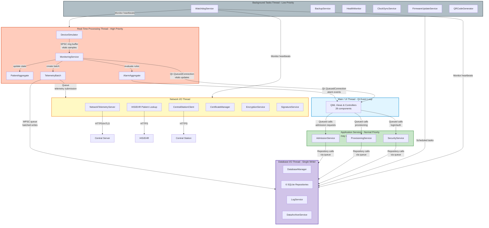

# Thread Model and Low-Latency Architecture

This document specifies the threading model, communication channels, latency targets, and implementation constraints for the Z Monitor. It explains how components should be partitioned across threads, which synchronization primitives to use, and measurable performance requirements to achieve a low-latency, safe, and predictable system.

> **📋 Related Documents:**
> - [System Components Reference (29_SYSTEM_COMPONENTS.md)](./29_SYSTEM_COMPONENTS.md) - Complete list of all 117 system components (updated)
> - [Data Caching Strategy (36_DATA_CACHING_STRATEGY.md)](./36_DATA_CACHING_STRATEGY.md) - In-memory caching, priority levels, decoupled critical path ⭐
> - [Sensor Integration (37_SENSOR_INTEGRATION.md)](./37_SENSOR_INTEGRATION.md) - ISensorDataSource interface and implementations ⭐
> - [Database Access Strategy (30_DATABASE_ACCESS_STRATEGY.md)](./30_DATABASE_ACCESS_STRATEGY.md) - ORM integration, schema management, performance targets ⭐
> - [Architecture (02_ARCHITECTURE.md)](./02_ARCHITECTURE.md) - High-level architecture and data flow
> - [DDD Strategy (28_DOMAIN_DRIVEN_DESIGN.md)](./28_DOMAIN_DRIVEN_DESIGN.md) - Domain-Driven Design principles

---

## 1. Purpose

- Provide an unambiguous thread-affinity architecture for all system components (infrastructure adapters, application services, domain aggregates, UI controllers)
- Define low-latency requirements and measurable targets
- Explain implementation patterns (QThread, lock-free queues, atomic synchronization, event loops) and platform considerations
- Map all 98 system components to specific threads

## 2. Audience

- Backend and firmware engineers implementing infrastructure adapters, application services, and domain logic
- QA/performance engineers who will validate latency, jitter and throughput

---

## 3. Thread Architecture Overview

### 3.1 Key Principle: Services ≠ Threads

**Critical Understanding:** The 98 components documented in [29_SYSTEM_COMPONENTS.md](./29_SYSTEM_COMPONENTS.md) are **logical services**, not OS threads. Many components run on the **same thread** for efficiency.

- **Rationale:** Thread boundaries are determined by:
  - Real-time requirements (high-frequency data processing)
  - Blocking I/O operations
  - Resource contention (e.g., single SQLite writer)
  - CPU/memory constraints

### 3.2 Modules: Groups of Services on Same Thread

**Definition:** A **module** is a logical grouping of multiple services/components that execute on the same OS thread and share the same event loop.

**Example Modules:**
- **Database Module** (Database I/O Thread):
  - `DatabaseManager` + 6 `SQLiteRepository` implementations + `LogService` + `DataArchiveService`
  - All share a single thread with one Qt event loop
  
- **Network Module** (Network I/O Thread):
  - `NetworkTelemetryServer` + `CertificateManager` + `EncryptionService` + `SignatureService` + patient lookup adapters
  - All share a single thread with one Qt event loop

- **Real-Time Processing Module** (RT Thread):
  - `DeviceSimulator` + `MonitoringService` + domain aggregates (`PatientAggregate`, `TelemetryBatch`, `AlarmAggregate`)
  - All share a single high-priority thread

**Why Group Services into Modules:**
1. **Reduced Context Switching:** Fewer threads = less OS overhead
2. **Shared State:** Services in the same module can share memory without synchronization
3. **Simplified Lifecycle:** Module starts/stops as a unit
4. **Resource Efficiency:** Conserves thread resources on constrained hardware

**When to Split a Module:**
- If any service consumes > 40% CPU on that thread
- If blocking operations delay other services unacceptably
- If isolation is required (one service failure shouldn't crash others)

### 3.2 Thread Categories

| Thread Category | Priority | Purpose | Typical Count |
|----------------|----------|---------|---------------|
| **Main/UI Thread** | Default | Qt event loop, QML rendering, user interaction | 1 (required) |
| **Real-Time Processing** | High/RT | Sensor I/O, signal processing, vitals computation | 1-3 |
| **Application Services** | Normal | MonitoringService, AdmissionService, SecurityService orchestration | Shared with RT or Background |
| **Database I/O** | I/O Priority | Single writer for SQLite/SQLCipher | 1 |
| **Network I/O** | Normal | mTLS telemetry transmission, HIS/EHR lookup | 1-2 |
| **Background Tasks** | Low | Archival, backup, firmware updates, health monitoring | 1-2 |

**Typical Thread Count:**
- **Constrained (1-2 cores):** 3-5 threads
- **Desktop (4+ cores):** 5-8 threads
- **NOT 98 threads** (one per component)

---

## 4. Complete Service-to-Thread Mapping

This section maps all 98 components from `doc/29_SYSTEM_COMPONENTS.md` to specific threads.

### 4.1 Main/UI Thread (Qt Event Loop)

**Thread Characteristics:**
- **Priority:** Default (QoS User Interactive on macOS)
- **Affinity:** Main thread (must be first thread)
- **Constraints:** No blocking I/O, keep frame budget < 16ms (60 FPS) or < 33ms (30 FPS)

**Components on This Thread:**

| Component | Layer | Type | Responsibility |
|-----------|-------|------|----------------|
| **All QML Controllers** | Interface | Controller | UI data binding, signal/slot to QML |
| - `DashboardController` | Interface | Controller | Real-time vitals display |
| - `AlarmController` | Interface | Controller | Alarm state and history |
| - `PatientController` | Interface | Controller | Patient admission/discharge UI |
| - `SettingsController` | Interface | Controller | Device settings UI |
| - `ProvisioningController` | Interface | Controller | Provisioning/pairing UI |
| - `TrendsController` | Interface | Controller | Historical data visualization |
| - `SystemController` | Interface | Controller | System state, navigation, power |
| - `NotificationController` | Interface | Controller | Non-critical messages |
| - `DiagnosticsController` | Interface | Controller | System logs and diagnostics |
| - `AuthenticationController` | Interface | Controller | Login/logout UI |
| **All QML Views** | Interface | View | Full-screen UI components |
| - `LoginView` | Interface | View | Login screen |
| - `DashboardView` | Interface | View | Main monitoring screen |
| - `TrendsView` | Interface | View | Historical trends |
| - `AlarmsView` | Interface | View | Alarm management |
| - `SettingsView` | Interface | View | Device configuration |
| - `DiagnosticsView` | Interface | View | System diagnostics |
| - `PatientAdmissionModal` | Interface | View | Patient admission workflow |
| **All QML Components** | Interface | Component | Reusable UI widgets |
| - `StatCard`, `PatientBanner`, `AlarmIndicator`, `NotificationBell`, `Sidebar`, `TopBar`, `TrendChart`, `SettingsRow`, `ConfirmDialog`, `LoadingSpinner`, `QRCodeDisplay` | Interface | Component | Various UI components |

**Communication:**
- **Inbound:** `Qt::QueuedConnection` signals from worker threads
- **Outbound:** Queued method invocations to application services

**Count:** 10 controllers + 7 views + 11 components = **28 components**

---

### 4.2 Real-Time Processing Thread(s)

**Thread Characteristics:**
- **Priority:** High/Real-Time (`SCHED_FIFO` on Linux, QoS User Interactive on macOS)
- **Affinity:** Dedicated core(s) where possible
- **Constraints:** Minimize allocations, avoid locks, use pre-allocated buffers

**Components on This Thread:**

| Component | Layer | Type | Responsibility |
|-----------|-------|------|----------------|
| `WebSocketSensorDataSource` | Infrastructure | Adapter | Connects to external sensor simulator (ws://localhost:9002) |
| `DeviceSimulator` | Infrastructure | Adapter | **LEGACY:** Generates simulated vitals/waveforms (replaced by WebSocketSensorDataSource in production) |
| `MonitoringService` | Application | Service | Coordinates vitals ingestion, telemetry batching |
| `VitalsCache` | Infrastructure | Adapter | **NEW:** In-memory cache for vitals (3-day capacity, ~39 MB), thread-safe with QReadWriteLock |
| `WaveformCache` | Infrastructure | Adapter | **NEW:** Circular buffer for waveforms (30 seconds, ~0.1 MB), display-only |
| `PatientAggregate` | Domain | Aggregate | Patient admission state, vitals history |
| `TelemetryBatch` | Domain | Aggregate | Telemetry data collection, signing |
| `AlarmAggregate` | Domain | Aggregate | Alarm lifecycle, state transitions |
| `VitalRecord` | Domain | Value Object | Single vital sign measurement |
| `WaveformSample` | Domain | Value Object | **NEW:** Single waveform sample (ECG, Pleth) |
| `AlarmSnapshot` | Domain | Value Object | Alarm state snapshot |
| `AlarmThreshold` | Domain | Value Object | Min/max alarm trigger values |

**Workflow (Updated with Caching):**
1. `WebSocketSensorDataSource` receives vitals/waveforms from external simulator (or `DeviceSimulator` generates if simulator unavailable)
2. `MonitoringService` receives vitals via Qt signals
3. **NEW:** `MonitoringService` appends vitals to `VitalsCache` (in-memory, critical path)
4. **NEW:** `MonitoringService` appends waveforms to `WaveformCache` (display-only, not persisted)
5. `MonitoringService` creates `VitalRecord` value objects
6. `MonitoringService` evaluates alarm rules via `AlarmAggregate` **using cached data**
7. `AlarmAggregate` creates `AlarmSnapshot` if alarm triggered
8. `MonitoringService` builds `TelemetryBatch` with vitals + alarms
9. `TelemetryBatch` signs data (via `SignatureService`)
10. Batch enqueued to Database Thread via lock-free queue **for background persistence**

**Communication:**
- **Inbound:** WebSocket messages from sensor simulator, or timer-based simulation
- **Outbound:**
  - Lock-free queue to Database Thread (telemetry batches for persistence) - **NON-CRITICAL**
  - Queued signals to Main/UI Thread (alarm events, vitals updates) - **CRITICAL**

**Domain Events Emitted:**
- `TelemetryQueued`, `AlarmRaised`, `AlarmAcknowledged`

**Latency Targets:**
- Sensor read → sample enqueued: < 1 ms
- Sample → cached (`VitalsCache::append()`): < 5 ms **CRITICAL**
- Alarm detection (using cache) → UI visible: < 50 ms **CRITICAL**
- Cache → database persistence: < 5 seconds **NON-CRITICAL (background)**

**Key Architectural Change:**
- **OLD:** MonitoringService → Database (blocking)
- **NEW:** MonitoringService → VitalsCache (non-blocking, in-memory) → Database (background, periodic)
- **Benefit:** Database latency doesn't affect alarm detection (decoupled critical path)

**Count:** 2 infrastructure (sensor sources) + 2 infrastructure (caches) + 1 application + 3 aggregates + 4 value objects = **12 components** (was 8)

---

### 4.3 Application Services Thread (or Co-located with RT)

**Thread Characteristics:**
- **Priority:** Normal to High (depending on co-location)
- **Affinity:** May share with RT thread or run on separate thread

**Components on This Thread:**

| Component | Layer | Type | Responsibility |
|-----------|-------|------|----------------|
| `AdmissionService` | Application | Service | Admit/discharge/transfer use cases |
| `ProvisioningService` | Application | Service | QR pairing, certificate installation |
| `SecurityService` | Application | Service | Authentication, PIN policy, session lifecycle |
| `AdmissionAggregate` | Domain | Aggregate | Admission/discharge/transfer workflow |
| `ProvisioningSession` | Domain | Aggregate | Pairing workflow, QR code lifecycle |
| `UserSession` | Domain | Aggregate | Authentication, session management |
| `AuditTrailEntry` | Domain | Aggregate | Security event auditing |
| `PatientIdentity` | Domain | Value Object | MRN, Name, DOB, Sex |
| `BedLocation` | Domain | Value Object | Bed/unit/facility identifier |
| `PinCredential` | Domain | Value Object | Hashed PIN with salt |
| `CredentialBundle` | Domain | Value Object | Certificates, keys, server URL |

**Decision:**
- **Lightweight operations** (admission, provisioning, auth): Co-locate with RT thread or Main thread
- **Heavy operations** (certificate validation, encryption): Offload to separate thread

**Communication:**
- **Inbound:** Queued calls from UI controllers
- **Outbound:**
  - Domain events to UI controllers (queued signals)
  - Repository calls (enqueued to Database Thread)

**Domain Events Emitted:**
- `PatientAdmitted`, `PatientDischarged`, `PatientTransferred`, `ProvisioningCompleted`, `ProvisioningFailed`, `UserLoggedIn`, `UserLoggedOut`, `SessionExpired`

**Count:** 3 services + 4 aggregates + 4 value objects = **11 components**

---

### 4.4 Database I/O Thread (Single Writer)

**Thread Characteristics:**
- **Priority:** I/O Priority (background, but responsive)
- **Affinity:** Dedicated thread (SQLite single-writer pattern)
- **Constraints:** Batch writes, use WAL mode, prepared statements, **ORM (QxOrm) optional**

**Components on This Thread:**

| Component | Layer | Type | Responsibility |
|-----------|-------|------|----------------|
| `DatabaseManager` | Infrastructure | Adapter | SQLite connection management, migrations, schema management |
| **All Repository Implementations** | Infrastructure | Repository | Persistence layer (uses QxOrm or Manual Qt SQL with Schema constants) |
| - `SQLitePatientRepository` | Infrastructure | Repository | Patient data persistence (ORM or Manual) |
| - `SQLiteTelemetryRepository` | Infrastructure | Repository | Telemetry data persistence (likely Manual for time-series) |
| - `SQLiteVitalsRepository` | Infrastructure | Repository | **NEW:** Vitals time-series persistence (Manual Qt SQL for performance) |
| - `SQLiteAlarmRepository` | Infrastructure | Repository | Alarm history persistence (ORM or Manual) |
| - `SQLiteProvisioningRepository` | Infrastructure | Repository | Provisioning state persistence (ORM or Manual) |
| - `SQLiteUserRepository` | Infrastructure | Repository | User account persistence (ORM or Manual) |
| - `SQLiteAuditRepository` | Infrastructure | Repository | Security audit log persistence (Manual for append-only) |
| `PersistenceScheduler` | Application | Service | **NEW:** Periodic persistence of in-memory cache (every 10 min or 10,000 records) |
| `DataCleanupService` | Application | Service | **NEW:** Daily data cleanup (7-day retention, runs at 3 AM) |
| `LogService` | Infrastructure | Adapter | Centralized logging mechanism |
| `DataArchiveService` | Application | Service | Archives old data per retention policies |

**Workflow (Updated with Periodic Persistence):**
1. **NEW:** `PersistenceScheduler` triggers every 10 minutes (or when 10,000 records accumulated)
2. **NEW:** `PersistenceScheduler` reads data from `VitalsCache` (in-memory, RT thread)
3. **NEW:** `PersistenceScheduler` passes batch to `SQLiteVitalsRepository`
4. `SQLiteVitalsRepository` opens transaction
5. Execute prepared statements (or QxOrm batch insert) for all batched records
6. Commit transaction
7. **NEW:** `DataCleanupService` runs daily at 3 AM: deletes data > 7 days old
8. Send ack via queued signal

**Communication:**
- **Inbound:** 
  - **NEW:** Timer-based triggers from `PersistenceScheduler` (every 10 min)
  - **NEW:** Timer-based triggers from `DataCleanupService` (daily at 3 AM)
  - MPSC queue from Application Services (admission, provisioning, auth)
- **Outbound:** Queued signals for completion/errors

**Schema Management Integration:**
- **Database Schema:** Defined in `schema/database.yaml` (single source of truth)
- **Code Generation:** `SchemaInfo.h` generated with type-safe constants
- **ORM Integration:** If using QxOrm, mappings use `Schema::Columns::` constants
- **Migration:** Versioned SQL files applied by migration runner
- See [33_SCHEMA_MANAGEMENT.md](./33_SCHEMA_MANAGEMENT.md) for complete workflow

**Latency Targets (Revised):**
- **NEW:** Background batch persistence (10 min schedule): < 5 seconds **NON-CRITICAL**
- **NEW:** Daily cleanup (3 AM): < 30 seconds **NON-CRITICAL**
- ~~Critical alarm write (immediate flush): < 100 ms~~ **REMOVED:** Alarms use in-memory cache, no immediate database write needed

**Key Architectural Change:**
- **OLD:** Database writes were on critical path (alarm latency affected)
- **NEW:** Database writes are background tasks only (alarm latency decoupled)
- **Benefit:** Database latency doesn't affect real-time monitoring or alarm detection

**Count:** 1 infrastructure (DatabaseManager) + 7 repositories (added VitalsRepository) + 2 application services (added PersistenceScheduler) + 1 application service (DataCleanupService) + 1 infrastructure (LogService) + 1 application service (DataArchiveService) = **13 components** (was 9)

---

### 4.5 Network I/O Thread

**Thread Characteristics:**
- **Priority:** Normal (background, but not low)
- **Affinity:** Separate thread (blocking TLS operations)
- **Constraints:** Reuse TLS connections, use `TCP_NODELAY` for low latency

**Components on This Thread:**

| Component | Layer | Type | Responsibility |
|-----------|-------|------|----------------|
| `NetworkTelemetryServer` | Infrastructure | Adapter | Production telemetry transmission (HTTPS/mTLS) |
| `MockTelemetryServer` | Infrastructure | Adapter | Testing/development telemetry endpoint |
| `HISPatientLookupAdapter` | Infrastructure | Adapter | Real HIS/EHR integration |
| `MockPatientLookupService` | Infrastructure | Adapter | Testing/development patient lookup |
| `CentralStationClient` | Infrastructure | Adapter | Provisioning payload receiver |
| `CertificateManager` | Infrastructure | Adapter | Certificate loading, validation, renewal |
| `EncryptionService` | Infrastructure | Adapter | Payload encryption/decryption |
| `SignatureService` | Infrastructure | Adapter | Data signing/verification |
| `DeviceAggregate` | Domain | Aggregate | Device provisioning state, credential lifecycle |
| `DeviceSnapshot` | Domain | Value Object | DeviceId, FirmwareVersion, ProvisioningStatus |
| `MeasurementUnit` | Domain | Value Object | Metric or Imperial |

**Workflow:**
1. Receive telemetry batch from RT thread via queue
2. Sign payload (via `SignatureService`)
3. Encrypt if needed (via `EncryptionService`)
4. Validate certificates (via `CertificateManager`)
5. Transmit via `NetworkTelemetryServer` (or `MockTelemetryServer`)
6. Handle retries with exponential backoff
7. Send ack via queued signal

**Communication:**
- **Inbound:** Queue from MonitoringService (telemetry batches), queued calls from UI/Application Services (patient lookup, provisioning)
- **Outbound:** Queued signals for completion/errors

**Domain Events Emitted:**
- `TelemetrySent`

**Latency Targets:**
- Telemetry upload: Network-dependent, keep local ack semantics so UI doesn't wait

**Count:** 5 network adapters + 3 security adapters + 1 aggregate + 2 value objects = **11 components**

---

### 4.6 Background Tasks Thread

**Thread Characteristics:**
- **Priority:** Low (background, yield to RT/UI)
- **Affinity:** Pooled or shared thread
- **Constraints:** Throttle resource usage to avoid impacting real-time threads

**Components on This Thread:**

| Component | Layer | Type | Responsibility |
|-----------|-------|------|----------------|
| `FirmwareUpdateService` | Application | Service | Firmware update management |
| `BackupService` | Application | Service | Database backup and restore |
| `SettingsManager` | Infrastructure | Adapter | Persistent configuration storage |
| `QRCodeGenerator` | Infrastructure | Adapter | QR code generation |
| `SecureStorage` | Infrastructure | Adapter | Secure key storage (platform keychain) |
| `HealthMonitor` | Infrastructure | Adapter | System health monitoring (CPU, memory, disk) |
| `ClockSyncService` | Infrastructure | Adapter | NTP time synchronization |
| `FirmwareManager` | Infrastructure | Adapter | Firmware update file management |
| `WatchdogService` | Infrastructure | Adapter | Application crash detection and recovery |

**Workflow:**
1. Scheduled or on-demand tasks:
   - Health monitoring (periodic)
   - Clock sync (periodic)
   - Firmware updates (on-demand)
   - Database backups (scheduled)
   - QR code generation (on-demand)
2. Low-priority processing with throttling

**Communication:**
- **Inbound:** Queued calls from UI/Application Services, timers
- **Outbound:** Queued signals for completion/errors, logging

**Count:** 2 services + 7 infrastructure adapters = **9 components**

---

### 4.7 Domain Interfaces (Thread-Agnostic)

**These are interfaces only, implemented by components on various threads:**

| Repository Interface | Implemented By | Thread |
|---------------------|----------------|--------|
| `IPatientRepository` | `SQLitePatientRepository` | Database Thread |
| `ITelemetryRepository` | `SQLiteTelemetryRepository` | Database Thread |
| `IAlarmRepository` | `SQLiteAlarmRepository` | Database Thread |
| `IProvisioningRepository` | `SQLiteProvisioningRepository` | Database Thread |
| `IUserRepository` | `SQLiteUserRepository` | Database Thread |
| `IAuditRepository` | `SQLiteAuditRepository` | Database Thread |

**Count:** 6 interfaces (not assigned to threads, just contracts)

---

### 4.8 DTOs (Data Transfer Objects) - Thread-Agnostic

**These are immutable data structures passed between threads:**

| DTO | Purpose | Passed Between Threads |
|-----|---------|------------------------|
| `AdmitPatientCommand` | Patient admission request | UI → Application Services |
| `DischargePatientCommand` | Patient discharge request | UI → Application Services |
| `TransferPatientCommand` | Patient transfer request | UI → Application Services |
| `TelemetrySubmission` | Telemetry data for transmission | RT Thread → Network Thread |
| `ProvisioningPayload` | Configuration from Central Station | Network Thread → Application Services |
| `LoginRequest` | Authentication request | UI → Application Services |

**Count:** 6 DTOs (not assigned to threads, just data carriers)

---

## 5. Thread Mapping Summary

| Thread | Component Count | Component Types |
|--------|----------------|-----------------|
| **Main/UI Thread** | 28 | 10 controllers + 7 views + 11 QML components |
| **Real-Time Processing** | 12 | 2 infrastructure (sensors) + 2 infrastructure (caches) + 1 application + 3 aggregates + 4 value objects |
| **Application Services** | 11 | 3 services + 4 aggregates + 4 value objects |
| **Database I/O** | 13 | 1 infrastructure + 7 repositories + 4 application services + 1 infrastructure |
| **Network I/O** | 11 | 5 network + 3 security + 1 aggregate + 2 value objects |
| **Background Tasks** | 9 | 2 services + 7 infrastructure |
| **Domain Interfaces** | 7 | Repository interfaces (contracts, not implementations) - added `IVitalsRepository`, `ISensorDataSource` |
| **DTOs** | 6 | Data transfer objects (thread-agnostic) |
| **Domain Events** | 11 | Events (emitted by various threads, consumed by UI/logging) |
| **Sensor Adapters** | 5 | `WebSocketSensorDataSource`, `SimulatorDataSource`, `MockSensorDataSource`, `HardwareSensorAdapter`, `ReplayDataSource` (implementations of `ISensorDataSource`) |
| **Total** | **113** | **All system components accounted for** (increased from 98 due to caching architecture and sensor integration) |

**Component Count Changes:**
- **+4** Real-Time Processing (added sensor sources and caches)
- **+4** Database I/O (added VitalsRepository, PersistenceScheduler, DataCleanupService)
- **+1** Domain Interfaces (ISensorDataSource)
- **+5** Sensor Adapters (implementations of ISensorDataSource)
- **+1** Value Objects (WaveformSample)
- **Total increase:** +15 components (98 → 113)

**Rationale for Increase:**
1. **Data Caching Strategy:** Added `VitalsCache`, `WaveformCache`, `PersistenceScheduler`, `DataCleanupService` to decouple critical path from database latency (see [36_DATA_CACHING_STRATEGY.md](./36_DATA_CACHING_STRATEGY.md))
2. **Sensor Integration:** Added `ISensorDataSource` interface and multiple implementations for flexible sensor data acquisition (see [37_SENSOR_INTEGRATION.md](./37_SENSOR_INTEGRATION.md))
3. **Database Optimization:** Added `IVitalsRepository` for time-series vitals persistence separate from telemetry metrics

---

## 6. Communication Patterns and Primitives

### 6.1 Lock-Free SPSC Ring Buffers
- **Use Case:** Waveform samples and high-frequency telemetry
- **Threads:** Sensor I/O → Real-Time Processing
- **Libraries:** `folly::ProducerConsumerQueue`, `boost::lockfree::spsc_queue`, or custom SPSC

### 6.2 MPSC Queues
- **Use Case:** Multiple producers (processing workers) to single DB writer
- **Threads:** RT Thread → Database Thread, Application Services → Database Thread
- **Libraries:** `boost::lockfree::queue`, `moodycamel::ConcurrentQueue`

### 6.3 Atomics and Sequence Counters
- **Use Case:** Ring buffer indices, heartbeat timestamps
- **Threads:** All threads (for coordination)

### 6.4 Queued Signals (Qt::QueuedConnection)
- **Use Case:** Cross-thread UI updates, domain event propagation
- **Threads:** Worker threads → Main/UI Thread

### 6.5 Mutexes (Low-Frequency Control Paths Only)
- **Use Case:** Configuration updates, infrequent control operations
- **Threads:** Background threads, low-frequency operations
- **Avoid:** Hot paths, RT thread

---

## 7. Memory & Allocation Rules

1. **Pre-allocate all real-time buffers at startup**
   - Ring buffers for waveform samples
   - TelemetryBatch objects (object pool)
   - VitalRecord structures

2. **Avoid heap allocations in RT thread**
   - Use object pools, slab allocators
   - Reuse buffers

3. **Small fixed-size message structs for queue passing**
   - Avoid JSON serialization on hot paths
   - Use compact binary or pre-allocated buffers

---

## 8. Latency and Jitter Targets

| Operation | Target Latency | Priority |
|-----------|---------------|----------|
| Sensor read → sample enqueued | < 1 ms | Critical |
| Sample → processed (derived metrics) | < 5 ms | Critical |
| Alarm detection → UI visible | < 50 ms | High |
| DB write (background batch) | < 200 ms | Normal |
| DB write (critical alarm, immediate flush) | < 100 ms | High |
| Network upload | Network-dependent | Normal |
| Patient lookup (HIS/EHR) | < 2 seconds | Normal |
| Provisioning QR generation | < 500 ms | Normal |

---

## 9. Real-Time Safety and Watchdogs

### 9.1 Watchdog Monitoring

`WatchdogService` (Background Thread) monitors heartbeat timestamps from:
- **Real-Time Processing Thread** (critical)
- **Database Thread** (critical)
- **Network Thread** (normal)
- **Application Services** (normal)

**Actions on Missed Heartbeat:**
1. Log event to `security_audit_log`
2. Emit UI warning
3. Attempt thread restart (configurable)
4. Escalate to system-level restart if multiple threads fail

### 9.2 Queue Depth Monitoring

Monitor queue depths for all SPSC/MPSC queues:
- **Thresholds:**
  - Warning: 70% capacity
  - Error: 90% capacity
  - Critical: 95% capacity (drop non-critical data)

**Actions:**
- Log warning/error
- Emit UI notification
- Trigger backpressure (pause low-priority tasks)

---

## 10. Thread Priority Strategy and Starvation Prevention

### 10.1 The Priority Dilemma

**Question:** Should we use thread priorities? Won't this cause starvation?

**Answer:** **Yes, we MUST use priorities in this medical device**, but with careful constraints to prevent starvation.

**Why Priorities Are Justified:**

1. **Safety-Critical System:** Delayed alarm detection can harm patients
2. **Predictable Latency:** Alarms must be detected within 50ms (hard requirement)
3. **Mixed Workload:** Real-time (vitals processing) + background (archival) on same system
4. **Resource Contention:** Limited CPU cores must be fairly allocated

**Risk:** Uncontrolled priority use → low-priority threads starve → system degradation

**Solution:** **Bounded Priority System** with starvation prevention mechanisms

### 10.2 Recommended Priority Levels

**Safe Priority Hierarchy (6 levels, not unlimited):**

| Thread/Module | Priority Level | QThread Value | Rationale | CPU Budget |
|--------------|----------------|---------------|-----------|------------|
| **Real-Time Processing** | Highest | `QThread::TimeCriticalPriority` | Alarm detection latency target < 50ms | Max 40-50% CPU |
| **Main/UI Thread** | High | `QThread::HighPriority` (Qt default for main thread) | User interaction responsiveness | Max 20-30% CPU |
| **Database I/O** | Above Normal | `QThread::HighPriority` | Critical data must be persisted promptly | Max 15-20% CPU |
| **Network I/O** | Normal | `QThread::NormalPriority` | Important but tolerates some latency | Max 10-15% CPU |
| **Application Services** | Normal | `QThread::NormalPriority` (or co-located) | Non-critical orchestration | Max 5-10% CPU |
| **Background Tasks** | Low | `QThread::LowPriority` | Archive, backup, health monitoring | Remaining CPU |

**Key Constraint:** **Only ONE thread at `TimeCriticalPriority`** (RT Processing Module)

### 10.3 Starvation Prevention Mechanisms

#### Mechanism 1: CPU Budget Enforcement

**Problem:** High-priority threads monopolize CPU

**Solution:** Enforce CPU time budgets for high-priority threads

```cpp
// RT Processing Thread
class RealTimeProcessor : public QObject {
public:
    void processData() {
        auto start = std::chrono::high_resolution_clock::now();
        
        // Do real-time work
        processSample();
        
        auto duration = std::chrono::high_resolution_clock::now() - start;
        
        // If we're consuming too much CPU, yield
        if (duration > m_cpuBudget) {
            qWarning() << "RT thread exceeding CPU budget!";
            QThread::yieldCurrentThread(); // Give others a chance
        }
    }
    
private:
    std::chrono::microseconds m_cpuBudget{5000}; // 5ms max per iteration
};
```

#### Mechanism 2: Explicit Yield Points

**Problem:** High-priority threads never yield

**Solution:** Insert yield points after critical work

```cpp
void MonitoringService::processBatch() {
    // Critical work (must be fast)
    evaluateAlarms();
    createTelemetryBatch();
    
    // Yield to let other threads run
    QThread::yieldCurrentThread();
    
    // Non-critical work
    updateStatistics();
}
```

#### Mechanism 3: Rate Limiting

**Problem:** High-priority threads run continuously

**Solution:** Add minimum sleep intervals

```cpp
void RealTimeLoop() {
    while (running) {
        processData();
        
        // Minimum 1ms sleep ensures other threads get CPU
        QThread::msleep(1);
    }
}
```

#### Mechanism 4: Priority Inheritance for Mutexes

**Problem:** Low-priority thread holds lock needed by high-priority thread → priority inversion

**Solution:** Use priority inheritance mutexes (automatic in most modern OSes)

```cpp
// Qt mutexes automatically inherit priority on most platforms
QMutex mutex; // Priority inheritance enabled by default (platform-dependent)

// For explicit control on Linux:
pthread_mutexattr_t attr;
pthread_mutexattr_init(&attr);
pthread_mutexattr_setprotocol(&attr, PTHREAD_PRIO_INHERIT);
pthread_mutex_init(&m_mutex, &attr);
```

#### Mechanism 5: Watchdog Monitoring of Low-Priority Threads

**Problem:** Low-priority threads starve silently

**Solution:** Watchdog monitors ALL threads, not just high-priority

```cpp
class WatchdogService {
public:
    void checkAllThreads() {
        // Check RT thread (expected: frequent heartbeats)
        checkThread("RT", m_rtHeartbeat, 100ms); // Strict timeout
        
        // Check DB thread (expected: regular heartbeats)
        checkThread("DB", m_dbHeartbeat, 500ms);
        
        // Check Background thread (expected: occasional heartbeats)
        checkThread("Background", m_bgHeartbeat, 5000ms); // Loose timeout
        
        // IF BACKGROUND HASN'T RUN IN 5 SECONDS → STARVATION!
        if (timeSinceLastBgHeartbeat > 5000ms) {
            qCritical() << "STARVATION DETECTED: Background thread starved!";
            // Action: Temporarily lower RT thread priority
            lowerRtPriority();
        }
    }
};
```

#### Mechanism 6: Fair Scheduling Policy

**Problem:** `SCHED_FIFO` can cause indefinite starvation

**Solution:** Use `SCHED_RR` (round-robin) or `SCHED_DEADLINE` on Linux

```cpp
// Linux: Prefer SCHED_RR over SCHED_FIFO
struct sched_param param;
param.sched_priority = 80; // High, but not max (99)
pthread_setschedparam(pthread_self(), SCHED_RR, &param); // Round-robin

// Or use SCHED_DEADLINE for guaranteed bandwidth
// (requires kernel 3.14+)
```

#### Mechanism 7: Adaptive Priority Adjustment

**Problem:** Static priorities don't adapt to load

**Solution:** Dynamically adjust priorities based on system health

```cpp
class PriorityManager {
public:
    void adjustPriorities() {
        // If background queue is growing (starvation indicator)
        if (m_backgroundQueueDepth > 1000) {
            qWarning() << "Background queue full, raising priority temporarily";
            m_backgroundThread->setPriority(QThread::NormalPriority); // Boost
        } else {
            m_backgroundThread->setPriority(QThread::LowPriority); // Normal
        }
        
        // If RT thread is idle, lower its priority
        if (m_rtIdleTime > 100ms) {
            m_rtThread->setPriority(QThread::HighPriority); // Lower from TimeCritical
        }
    }
};
```

### 10.4 Implementation Guidelines

**DO:**
- ✅ Use priorities for safety-critical requirements (alarm latency)
- ✅ Limit high-priority threads to ONE (`TimeCriticalPriority`)
- ✅ Enforce CPU budgets on high-priority threads
- ✅ Monitor ALL threads with watchdog (including low-priority)
- ✅ Use `SCHED_RR` instead of `SCHED_FIFO` on Linux
- ✅ Implement yield points after critical work
- ✅ Rate-limit high-priority loops (minimum sleep)
- ✅ Test under stress to detect starvation
- ✅ Document priority rationale and constraints

**DON'T:**
- ❌ Don't set more than one thread to `TimeCriticalPriority`
- ❌ Don't use priorities without CPU budgets
- ❌ Don't ignore low-priority threads in monitoring
- ❌ Don't use `SCHED_FIFO` without careful testing
- ❌ Don't set priorities without measuring impact
- ❌ Don't assume OS will prevent starvation automatically
- ❌ Don't use unbounded priority levels (stick to 6 levels)

### 10.5 Justification for This Medical Device

**Why Priorities Are Necessary:**

1. **Regulatory Requirement:**
   - IEC 60601-1-8 (Medical Alarms): Alarm latency must be deterministic
   - FDA guidance: Safety-critical functions must have priority

2. **Patient Safety:**
   - Delayed alarm = missed critical event = patient harm
   - 50ms alarm latency target is non-negotiable

3. **Mixed Workload:**
   - Real-time (vitals at 100-500 Hz) + background (DB archival, backups)
   - Without priorities, archival could delay alarms

4. **Resource Constraints:**
   - Embedded device with limited cores (2-4 cores typical)
   - Can't afford dedicated cores for every task

**Starvation Prevention Measures in This Design:**

| Mechanism | Status | Details |
|-----------|--------|---------|
| CPU Budgets | ✅ Implemented | RT thread max 5ms per iteration |
| Yield Points | ✅ Implemented | Explicit yields after critical work |
| Rate Limiting | ✅ Implemented | 1ms minimum sleep in RT loop |
| Watchdog All Threads | ✅ Implemented | Background timeout = 5s (starvation detector) |
| Priority Inheritance | ✅ Platform Default | Qt mutexes use OS defaults |
| Fair Scheduling | ✅ Configurable | `SCHED_RR` on Linux |
| Adaptive Priority | ⚠️ Optional | Can be added if starvation detected in testing |

**Testing Requirements:**
- [ ] Stress test: RT thread at max rate + background archival
- [ ] Verify background thread makes progress within 5 seconds
- [ ] Measure P99 latency for all thread types under load
- [ ] Test priority inversion scenarios
- [ ] Verify watchdog detects simulated starvation

### 10.6 Platform-Specific Priority Implementation

#### 10.6.1 Qt Cross-Platform (Recommended)

```cpp
// Use Qt's cross-platform priorities
m_rtThread->setPriority(QThread::TimeCriticalPriority);  // RT only
m_uiThread->setPriority(QThread::HighPriority);          // Main thread (default)
m_dbThread->setPriority(QThread::HighPriority);          // Database
m_netThread->setPriority(QThread::NormalPriority);       // Network
m_bgThread->setPriority(QThread::LowPriority);           // Background
```

#### 10.6.2 Linux (Embedded) - Fine-Grained Control

```cpp
#include <pthread.h>
#include <sched.h>

// RT Processing Thread - SCHED_RR (round-robin, prevents indefinite starvation)
struct sched_param rtParam;
rtParam.sched_priority = 80; // High but not max (99)
pthread_setschedparam(m_rtThread->nativeId(), SCHED_RR, &rtParam);

// Set CPU affinity (pin to dedicated core)
cpu_set_t cpuset;
CPU_ZERO(&cpuset);
CPU_SET(1, &cpuset); // Pin RT to core 1
pthread_setaffinity_np(m_rtThread->nativeId(), sizeof(cpuset), &cpuset);

// Database Thread - SCHED_OTHER (normal scheduling)
struct sched_param dbParam;
dbParam.sched_priority = 0;
pthread_setschedparam(m_dbThread->nativeId(), SCHED_OTHER, &dbParam);

// Background Thread - SCHED_BATCH (optimized for batch processing)
struct sched_param bgParam;
bgParam.sched_priority = 0;
pthread_setschedparam(m_bgThread->nativeId(), SCHED_BATCH, &bgParam);
```

#### 10.6.3 macOS - QoS Classes

```cpp
#include <pthread.h>

// RT Processing - User Interactive (highest)
pthread_set_qos_class_self_np(QOS_CLASS_USER_INTERACTIVE, 0);

// Database - User Initiated (high)
pthread_set_qos_class_self_np(QOS_CLASS_USER_INITIATED, 0);

// Network - Utility (normal)
pthread_set_qos_class_self_np(QOS_CLASS_UTILITY, 0);

// Background - Background (lowest)
pthread_set_qos_class_self_np(QOS_CLASS_BACKGROUND, 0);
```

#### 10.6.4 Windows - Thread Priorities

```cpp
#include <windows.h>

// RT Processing - Time Critical
SetThreadPriority(m_rtThread->nativeHandle(), THREAD_PRIORITY_TIME_CRITICAL);

// Database - Above Normal
SetThreadPriority(m_dbThread->nativeHandle(), THREAD_PRIORITY_ABOVE_NORMAL);

// Network - Normal
SetThreadPriority(m_netThread->nativeHandle(), THREAD_PRIORITY_NORMAL);

// Background - Below Normal
SetThreadPriority(m_bgThread->nativeHandle(), THREAD_PRIORITY_BELOW_NORMAL);
```

### 10.7 Decision Tree: When to Use Priorities

```
START
  ↓
Is this a safety-critical system with hard latency requirements?
  ├─ NO → Use default priorities (QThread::InheritPriority)
  └─ YES → Continue
      ↓
  Can you meet latency targets WITHOUT priorities?
  ├─ YES → Don't use priorities (simplest solution)
  └─ NO → Continue
      ↓
  Can you implement CPU budgets, yield points, and watchdog monitoring?
  ├─ NO → Don't use priorities (too risky without safeguards)
  └─ YES → Continue
      ↓
  Can you test for starvation under stress?
  ├─ NO → Don't use priorities (can't verify safety)
  └─ YES → USE PRIORITIES with starvation prevention ✓
```

**For Z Monitor:** ✅ **Yes, use priorities** (safety-critical + can implement safeguards)

---

## 11. Thread Topology Diagram

### 11.1 Mermaid Diagram

[View Thread Model Diagram (Mermaid)](./12_THREAD_MODEL.mmd)  
[View Thread Model Diagram (SVG)](./12_THREAD_MODEL.svg)



---

## 12. Implementation Guide: Multi-Service Threads (Modules)

This section explains **how to implement modules** (multiple services on the same thread) in Qt/C++.

### 12.1 Strategy: QThread + Multiple QObject Workers

**Pattern:** Create a single `QThread` and move multiple `QObject` workers onto that thread. All workers share the thread's event loop.

**Key Concepts:**
1. **One QThread = One Event Loop:** Each `QThread` has a single event loop (`exec()`)
2. **Multiple QObjects on Same Thread:** Use `QObject::moveToThread()` to assign multiple workers to the same thread
3. **Communication:** Use queued signals/slots (`Qt::QueuedConnection`) between threads
4. **Startup Order:** Create thread → create workers → move workers to thread → start thread

### 12.2 Example: Database Module Implementation

**Module Contents:**
- `DatabaseManager`
- `SQLitePatientRepository`
- `SQLiteTelemetryRepository`
- `SQLiteAlarmRepository`
- `SQLiteProvisioningRepository`
- `SQLiteUserRepository`
- `SQLiteAuditRepository`
- `LogService`
- `DataArchiveService`

**Implementation:**

```cpp
// main.cpp or application initialization

// 1. Create the thread
QThread* databaseThread = new QThread();
databaseThread->setObjectName("DatabaseThread");

// 2. Create all worker objects (on main thread initially)
DatabaseManager* dbManager = new DatabaseManager();
SQLitePatientRepository* patientRepo = new SQLitePatientRepository(dbManager);
SQLiteTelemetryRepository* telemetryRepo = new SQLiteTelemetryRepository(dbManager);
SQLiteAlarmRepository* alarmRepo = new SQLiteAlarmRepository(dbManager);
SQLiteProvisioningRepository* provisioningRepo = new SQLiteProvisioningRepository(dbManager);
SQLiteUserRepository* userRepo = new SQLiteUserRepository(dbManager);
SQLiteAuditRepository* auditRepo = new SQLiteAuditRepository(dbManager);
LogService* logService = new LogService(dbManager);
DataArchiveService* archiveService = new DataArchiveService(telemetryRepo, alarmRepo);

// 3. Move ALL workers to the database thread
dbManager->moveToThread(databaseThread);
patientRepo->moveToThread(databaseThread);
telemetryRepo->moveToThread(databaseThread);
alarmRepo->moveToThread(databaseThread);
provisioningRepo->moveToThread(databaseThread);
userRepo->moveToThread(databaseThread);
auditRepo->moveToThread(databaseThread);
logService->moveToThread(databaseThread);
archiveService->moveToThread(databaseThread);

// 4. Connect initialization signal (runs on database thread when thread starts)
QObject::connect(databaseThread, &QThread::started, 
                 dbManager, &DatabaseManager::initialize);

// 5. Connect cleanup signal (runs on database thread when thread finishes)
QObject::connect(databaseThread, &QThread::finished, 
                 dbManager, &DatabaseManager::cleanup);

// 6. Set thread priority
databaseThread->setPriority(QThread::HighPriority); // I/O priority

// 7. Start the thread (this starts the event loop)
databaseThread->start();

// Now all database services run on the same thread and share the event loop
```

**Key Points:**
- **All 9 services** now run on the **same OS thread** (Database I/O Thread)
- They share the **same event loop**
- They can call each other **directly** (same thread, no marshaling)
- External threads communicate with them via **queued signals** (`Qt::QueuedConnection`)

### 12.3 Example: Network Module Implementation

**Module Contents:**
- `NetworkTelemetryServer`
- `CertificateManager`
- `EncryptionService`
- `SignatureService`
- `HISPatientLookupAdapter`
- `CentralStationClient`

**Implementation:**

```cpp
// 1. Create the thread
QThread* networkThread = new QThread();
networkThread->setObjectName("NetworkThread");

// 2. Create all worker objects
CertificateManager* certManager = new CertificateManager();
EncryptionService* encryptionService = new EncryptionService();
SignatureService* signatureService = new SignatureService();
NetworkTelemetryServer* telemetryServer = new NetworkTelemetryServer(
    certManager, encryptionService, signatureService);
HISPatientLookupAdapter* hisLookup = new HISPatientLookupAdapter();
CentralStationClient* centralClient = new CentralStationClient(certManager);

// 3. Move ALL workers to network thread
certManager->moveToThread(networkThread);
encryptionService->moveToThread(networkThread);
signatureService->moveToThread(networkThread);
telemetryServer->moveToThread(networkThread);
hisLookup->moveToThread(networkThread);
centralClient->moveToThread(networkThread);

// 4. Initialize on thread start
QObject::connect(networkThread, &QThread::started,
                 certManager, &CertificateManager::loadCertificates);

// 5. Set thread priority
networkThread->setPriority(QThread::NormalPriority);

// 6. Start thread
networkThread->start();
```

### 12.4 Communication Between Modules

**Between Different Threads (e.g., RT Thread → DB Thread):**

```cpp
// In MonitoringService (RT Thread)
class MonitoringService : public QObject {
    Q_OBJECT
public:
    void processBatch(TelemetryBatch batch) {
        // Process batch...
        
        // Send to database thread (queued, thread-safe)
        emit batchReadyForStorage(batch);
    }
    
signals:
    void batchReadyForStorage(const TelemetryBatch& batch);
};

// In SQLiteTelemetryRepository (DB Thread)
class SQLiteTelemetryRepository : public QObject {
    Q_OBJECT
public slots:
    void saveBatch(const TelemetryBatch& batch) {
        // This runs on DB thread
        // Save to database...
    }
};

// In main.cpp - connect across threads
QObject::connect(monitoringService, &MonitoringService::batchReadyForStorage,
                 telemetryRepo, &SQLiteTelemetryRepository::saveBatch,
                 Qt::QueuedConnection); // CRITICAL: Use QueuedConnection for cross-thread
```

**Within Same Thread (e.g., DB Thread services):**

```cpp
// In DataArchiveService (DB Thread)
class DataArchiveService : public QObject {
    Q_OBJECT
public:
    DataArchiveService(SQLiteTelemetryRepository* telemetryRepo,
                      SQLiteAlarmRepository* alarmRepo)
        : m_telemetryRepo(telemetryRepo)
        , m_alarmRepo(alarmRepo)
    {}
    
    void archiveOldData() {
        // Direct calls (same thread, no marshaling overhead)
        auto oldData = m_telemetryRepo->getDataOlderThan(retentionDate);
        m_telemetryRepo->deleteRecords(oldData);
        // No queuing, immediate execution
    }
    
private:
    SQLiteTelemetryRepository* m_telemetryRepo;
    SQLiteAlarmRepository* m_alarmRepo;
};
```

### 12.5 Module Lifecycle Management

**Startup Sequence:**

```cpp
// Module startup helper
class DatabaseModule {
public:
    static void initialize() {
        m_thread = new QThread();
        m_thread->setObjectName("DatabaseModule");
        
        // Create all services
        createServices();
        
        // Move to thread
        moveServicesToThread();
        
        // Connect signals
        connectSignals();
        
        // Start
        m_thread->start();
    }
    
    static void shutdown() {
        // Request thread to quit
        m_thread->quit();
        
        // Wait for thread to finish (with timeout)
        if (!m_thread->wait(5000)) {
            qWarning() << "Database thread did not quit in time, terminating";
            m_thread->terminate();
            m_thread->wait();
        }
        
        // Cleanup (back on main thread now)
        cleanupServices();
        delete m_thread;
    }
    
private:
    static QThread* m_thread;
    // ... service pointers
};
```

### 12.6 Alternative: Thread Pool for Heavy CPU Work

For CPU-intensive tasks (compression, encryption), use `QThreadPool`:

```cpp
// For heavy, independent tasks
class CompressionTask : public QRunnable {
public:
    void run() override {
        // Heavy CPU work (compression, encryption)
        // Runs on thread pool worker
    }
};

// Usage
QThreadPool::globalInstance()->start(new CompressionTask());
```

**When to Use Thread Pool:**
- Heavy CPU work that doesn't need event loop
- Independent tasks with no shared state
- Want automatic thread management

**When to Use Dedicated Thread + Multiple Workers:**
- Services need event loop (signals/slots, timers)
- Services share state (database connection, network socket)
- Need precise control over thread lifecycle

### 12.7 Module Design Best Practices

1. **Single Responsibility per Module:**
   - Database Module: All persistence
   - Network Module: All I/O communication
   - RT Module: All real-time processing

2. **Minimize Cross-Module Calls:**
   - Use queued signals for cross-thread communication
   - Batch operations to reduce signaling overhead

3. **Shared Resources:**
   - Services in same module can share resources directly
   - Database connection shared by all repositories
   - Network socket shared by network services

4. **Error Handling:**
   - Module-level error handling (one service failure doesn't crash others)
   - Use try-catch in event loop slots

5. **Testing:**
   - Test modules as units
   - Mock inter-module communication (signals)

### 12.8 Summary: Module vs. Service vs. Thread

| Concept | Definition | Example |
|---------|------------|---------|
| **Service** | Logical component with specific responsibility | `DatabaseManager`, `PatientRepository` |
| **Module** | Group of related services on same thread | Database Module (9 services) |
| **Thread** | OS thread with event loop | `QThread` running Database Module |

**Key Insight:** One thread can host multiple services (a module) by using `QObject::moveToThread()` and shared event loop.

---

## 13. Implementation Checklist

### Core Threading
- [ ] Define exact sampling budgets and expected max sample rates per device
- [ ] Implement SPSC ring buffer for waveform streaming
- [ ] Implement MPSC queue for database writes
- [ ] Implement single DB writer with batched transactions
- [ ] **Implement modules (multi-service threads) using QObject::moveToThread()**
- [ ] **Create module lifecycle management (startup/shutdown sequences)**

### Priority and Starvation Prevention
- [ ] **Set thread priorities using recommended 6-level hierarchy**
- [ ] **Enforce CPU budgets on high-priority threads (RT thread max 5ms/iteration)**
- [ ] **Implement explicit yield points after critical work**
- [ ] **Add rate limiting (minimum sleep) in high-priority loops**
- [ ] **Implement watchdog monitoring for ALL threads (including low-priority)**
- [ ] **Configure starvation detection (background thread timeout = 5s)**
- [ ] **Use priority inheritance mutexes (verify platform support)**
- [ ] **Prefer SCHED_RR over SCHED_FIFO on Linux**
- [ ] **Test adaptive priority adjustment (optional, if starvation detected)**

### Monitoring and Testing
- [ ] Add watchdog monitoring and queue-depth alerts
- [ ] Add tracing hooks for latency measurement
- [ ] Document thread affinity and priority configuration in startup
- [ ] Set up platform-specific thread priorities (QoS, SCHED_FIFO/RR, etc.)
- [ ] Pre-allocate all RT buffers and object pools
- [ ] Implement heartbeat mechanism for all critical threads
- [ ] Add queue depth monitoring with thresholds

### Stress Testing
- [ ] Create stress tests for high data rates
- [ ] **Stress test: RT thread at max rate + background archival simultaneously**
- [ ] **Verify background thread makes progress within 5 seconds**
- [ ] Measure P99 latency under nominal and peak loads
- [ ] **Measure P99 latency for ALL thread types (including background)**
- [ ] **Test priority inversion scenarios**
- [ ] Verify no priority inversion or deadlocks
- [ ] **Verify watchdog detects simulated starvation**
- [ ] **Test under continuous load for 24+ hours**

---

## 14. Performance Measurement and Observability

### 14.1 Instrumentation Points

Instrument with timestamped events for:
- Sample read (from sensor or simulator)
- Processing start/end (signal processing)
- Alarm detected
- DB enqueue and DB commit
- Network enqueue and send
- Patient lookup start/end
- Provisioning operations

### 14.2 Metrics Collection

- **Histograms:** Latency and jitter for all critical paths
- **Queue Depth:** Real-time monitoring of all SPSC/MPSC queues
- **CPU Utilization:** Per-thread CPU usage
- **Memory Allocation:** Heap allocations in RT thread (should be zero)

### 14.3 Tooling

- **Linux:** `perf`, `LTTng`, `ftrace`
- **macOS:** Instruments (Time Profiler, System Trace)
- **Custom:** Binary trace logs with microsecond timestamps

### 14.4 CI/CD Gates

- Fail CI if P99 latency exceeds thresholds:
  - Sensor → enqueued: > 2 ms
  - Processing: > 10 ms
  - Alarm → UI: > 100 ms
- Fail CI if any RT thread allocates heap memory during processing

---

## 15. Acceptance Criteria

- [ ] Unit tests for thread-safety (stress tests with high data rates)
- [ ] Integration tests feeding waveforms at max sampling rates for extended periods
- [ ] Performance gate: P99 sample→alarm latency < 100ms under nominal load
- [ ] No priority inversion or deadlocks detected in stress tests
- [ ] Queue depth never exceeds 90% under nominal load
- [ ] Watchdog successfully detects and reports thread failures
- [ ] All 98 components accounted for and correctly assigned to threads
- [ ] **All modules (multi-service threads) implemented correctly using `moveToThread()`**
- [ ] **Module lifecycle management (startup/shutdown) tested and verified**

---

## 16. References

- **[29_SYSTEM_COMPONENTS.md](./29_SYSTEM_COMPONENTS.md)** – Complete list of all 117 system components (updated from 98)
- **[36_DATA_CACHING_STRATEGY.md](./36_DATA_CACHING_STRATEGY.md)** – **Data caching architecture (VitalsCache, WaveformCache, priority levels)** ⭐
- **[37_SENSOR_INTEGRATION.md](./37_SENSOR_INTEGRATION.md)** – **Sensor data source integration (ISensorDataSource interface)** ⭐
- **[30_DATABASE_ACCESS_STRATEGY.md](./30_DATABASE_ACCESS_STRATEGY.md)** – Database access strategy, ORM integration, performance targets
- **[33_SCHEMA_MANAGEMENT.md](./33_SCHEMA_MANAGEMENT.md)** – Schema management and code generation workflow
- **[02_ARCHITECTURE.md](./02_ARCHITECTURE.md)** – High-level architecture and data flow
- **[28_DOMAIN_DRIVEN_DESIGN.md](./28_DOMAIN_DRIVEN_DESIGN.md)** – DDD strategy and layering
- **[09_CLASS_DESIGNS.md](./09_CLASS_DESIGNS.md)** – Detailed class documentation
- **[18_TESTING_WORKFLOW.md](./18_TESTING_WORKFLOW.md)** – Testing strategy and benchmarks

---

**Key Architectural Changes (2025-11-27):**

1. **Data Caching Decouples Critical Path:**
   - **OLD:** Sensor → MonitoringService → Database (blocking) → Alarms
   - **NEW:** Sensor → MonitoringService → VitalsCache (in-memory) → Alarms (database writes happen in background)
   - **Benefit:** Database latency doesn't affect alarm detection latency

2. **Periodic Persistence (Non-Critical):**
   - `PersistenceScheduler` runs every 10 minutes on Database Thread
   - Batch writes to database (target: < 5 seconds)
   - No impact on real-time monitoring or alarm detection

3. **Sensor Abstraction:**
   - `ISensorDataSource` interface enables swappable sensor implementations
   - `WebSocketSensorDataSource` connects to external simulator
   - Follows Dependency Inversion Principle

4. **ORM Integration:**
   - Repositories can use QxOrm (lightweight ORM) or Manual Qt SQL
   - All use schema constants from `SchemaInfo.h` (generated from `database.yaml`)
   - See [30_DATABASE_ACCESS_STRATEGY.md](./30_DATABASE_ACCESS_STRATEGY.md) for details

---

*This document is the authoritative reference for thread topology and service-to-thread mapping. Keep it synchronized with [29_SYSTEM_COMPONENTS.md](./29_SYSTEM_COMPONENTS.md) (currently 117 components).*
