# Data Caching Architecture Review

**Document ID:** DESIGN-036  
**Version:** 1.0  
**Status:** Approved  
**Last Updated:** 2025-11-27

---

---

## 1. Current Design Summary

### What You Described:
1. **Z-Monitor → Telemetry Server:** Device sends data to external telemetry server
2. **Local 7-day Cache:** Device caches 7 days of data locally, cleans up daily
3. **In-Memory Buffer:** Device has 3-day capacity in-memory cache (critical path)
4. **Periodic Persistence:** In-memory → Database (lower priority, scheduled)
5. **Database Non-Critical:** Saving to database is not time-critical
6. **Sensor Interface:** Need interface between simulator app and z-monitor

---

## 2. Design Analysis: ✅ Strengths & ⚠️ Issues

### ✅ **GOOD Design Decisions:**

1. **✅ In-Memory Critical Path**
   - **Good:** Separating critical (in-memory) from non-critical (database) operations
   - **Benefit:** Low latency for real-time monitoring and alarm detection
   - **Correct Priority:** Sensors → Memory → Alarms (< 50ms) is critical path

2. **✅ Periodic Persistence**
   - **Good:** Non-blocking database writes scheduled at low-priority times
   - **Benefit:** Doesn't interfere with real-time monitoring
   - **Smart:** Batch writes more efficient than per-record writes

3. **✅ 3-Day In-Memory Capacity**
   - **Good:** Provides buffer for network outages or database issues
   - **Benefit:** System continues operating even if persistence fails temporarily
   - **Safety Net:** Data survives short-term failures

4. **✅ 7-Day Local Storage**
   - **Good:** Meets requirement (REQ-DATA-RET-001: 7 days)
   - **Benefit:** Historical trend analysis, regulatory compliance

### ⚠️ **ISSUES & RISKS:**

#### **🔴 CRITICAL Issue #1: Missing Interface - Sensor Data Source**

**Problem:** No `ISensorDataSource` or `IVitalSignsSource` interface exists.

Currently you have:
- ✅ `IPatientLookupService` - for patient data
- ✅ `ITelemetryServer` - for sending data OUT
- ✅ `IProvisioningService` - for device setup
- ❌ **MISSING:** Interface for receiving data IN from sensors/simulator

**Current Design Flaw:**
```cpp
// CURRENT (tightly coupled):
class MonitoringService {
    DeviceSimulator* m_simulator;  // ❌ Direct dependency on simulator!
};
```

**Why This is Bad:**
- Can't swap simulator for real sensors without changing `MonitoringService`
- Can't mock sensor data for testing
- Violates Dependency Inversion Principle (DIP)
- Can't run multiple data sources (simulator + real sensors for testing)

**Solution:** Create `ISensorDataSource` interface

```cpp
/**
 * @interface ISensorDataSource
 * @brief Interface for vital signs data source (simulator or real sensors).
 */
class ISensorDataSource : public QObject {
    Q_OBJECT
public:
    virtual ~ISensorDataSource() = default;
    
    /**
     * @brief Start data acquisition.
     */
    virtual bool start() = 0;
    
    /**
     * @brief Stop data acquisition.
     */
    virtual void stop() = 0;
    
    /**
     * @brief Check if data source is active.
     */
    virtual bool isActive() const = 0;
    
signals:
    /**
     * @brief Emitted when new vital signs data available.
     * @param vitals Vital signs record
     */
    void vitalSignsReceived(const VitalRecord& vitals);
    
    /**
     * @brief Emitted when sensor connection status changes.
     */
    void connectionStatusChanged(bool connected);
    
    /**
     * @brief Emitted when sensor error occurs.
     */
    void sensorError(const QString& error);
};
```

**Implementations:**
- `SimulatorDataSource` - wraps DeviceSimulator
- `HardwareSensorAdapter` - real sensors (future)
- `MockSensorDataSource` - testing
- `ReplayDataSource` - replay recorded data

---

#### **🟠 MEDIUM Issue #2: In-Memory Cache Design Unclear**

**Problem:** No specification for in-memory cache structure and eviction policy.

**Questions:**
1. **Data Structure:** Ring buffer? Deque? Fixed-size array?
2. **Eviction Policy:** FIFO? Drop oldest when full?
3. **Thread Safety:** How is concurrent access managed?
4. **Memory Estimation:** 3 days × 24 hours × 3600 seconds × 10 Hz = ~2.6M records
   - At 150 bytes/record → ~390 MB (doable)
   - But what about waveforms? ECG at 500 Hz = 10x more data
5. **Partial Flush:** Can we flush subset of cache to database?

**Recommendation:**

```cpp
/**
 * @class VitalsCache
 * @brief Thread-safe in-memory cache for vital signs (3-day capacity).
 */
class VitalsCache {
public:
    /**
     * @brief Add vital signs record to cache.
     * @param vital Vital signs record
     * @return true if added, false if cache full
     * 
     * @note If cache full, oldest record is evicted (FIFO)
     * @note Thread-safe (uses mutex)
     */
    bool append(const VitalRecord& vital);
    
    /**
     * @brief Get all vitals in time range.
     * @param start Start time
     * @param end End time
     * @return List of vitals in range
     * 
     * @note Thread-safe (uses read lock)
     */
    QList<VitalRecord> getRange(const QDateTime& start, const QDateTime& end);
    
    /**
     * @brief Get vitals not yet persisted to database.
     * @return List of unpersisted vitals
     * 
     * @note Thread-safe
     */
    QList<VitalRecord> getUnpersistedVitals();
    
    /**
     * @brief Mark vitals as persisted (remove from unsaved queue).
     * @param upToTimestamp Mark all vitals up to this time as saved
     * 
     * @note Thread-safe
     */
    void markAsPersisted(const QDateTime& upToTimestamp);
    
    /**
     * @brief Get cache statistics.
     */
    CacheStats getStats() const;  // count, memory usage, oldest/newest timestamps
    
private:
    QReadWriteLock m_lock;
    std::deque<VitalRecord> m_vitals;  // FIFO deque (efficient front/back ops)
    QDateTime m_oldestUnsaved;         // Track what needs persistence
    size_t m_maxRecords;               // Capacity (e.g., 2.6M for 3 days)
};
```

---

#### **🟠 MEDIUM Issue #3: Database Persistence Timing Unclear**

**Problem:** "Lower priority" and "scheduled at specific time" not well-defined.

**Questions:**
1. **Frequency:** How often? Every 5 min? 30 min? 1 hour?
2. **Trigger:** Time-based? Record count? Memory pressure?
3. **Batch Size:** How many records per batch?
4. **Failure Handling:** What if database write fails? Retry? Discard?
5. **Shutdown:** What happens to unpersisted data on app close?

**Recommendation:**

```cpp
/**
 * @class PersistenceScheduler
 * @brief Manages periodic persistence of in-memory cache to database.
 */
class PersistenceScheduler : public QObject {
    Q_OBJECT
public:
    /**
     * @brief Schedule: Persist every 10 minutes OR when 10,000 records accumulated.
     */
    void start();
    
signals:
    void persistenceRequested();
    void persistenceCompleted(int recordsPersisted);
    void persistenceFailed(const QString& error);

private slots:
    void onScheduledPersistence();
    void persistCache();
    
private:
    QTimer* m_timer;                    // 10-minute timer
    VitalsCache* m_cache;
    IVitalsRepository* m_repository;
    int m_batchSize = 10000;            // Max records per transaction
};
```

**Recommended Schedule:**
- **Normal Operation:** Every 10 minutes
- **High Volume:** When 10,000 unpersisted records accumulated
- **Graceful Shutdown:** Persist all remaining records before exit
- **Low Priority:** Run on Database I/O thread (not real-time thread)
- **Memory Pressure:** If in-memory cache > 80% full, trigger early persistence

---

#### **🟠 MEDIUM Issue #4: Cleanup Timing Ambiguous**

**Problem:** "Clean up data at end of day" - which day? Whose timezone?

**Questions:**
1. **Retention:** Keep last 7 days (rolling window) or calendar days?
2. **Timing:** End of day = midnight? 3 AM (low activity)?
3. **Timezone:** Device local time? Server time? UTC?
4. **Safety:** What if cleanup fails? Retry? Skip?

**Recommendation:**

```cpp
/**
 * @class DataCleanupService
 * @brief Manages 7-day data retention policy.
 */
class DataCleanupService : public QObject {
    Q_OBJECT
public:
    /**
     * @brief Schedule daily cleanup at 3 AM local time.
     * 
     * Deletes vitals older than 7 days (rolling 7-day window).
     * Runs on Database I/O thread (low priority).
     */
    void scheduleCleanup();
    
private slots:
    void performCleanup();
    
private:
    QTimer* m_dailyTimer;
    IVitalsRepository* m_repository;
    int m_retentionDays = 7;  // Configurable
};
```

**Recommended Policy:**
- **Retention:** Rolling 7-day window (e.g., delete vitals older than `now - 7 days`)
- **Timing:** 3 AM local time (low patient activity, low CPU load)
- **Batch Delete:** Delete in batches of 10,000 records (avoid long transactions)
- **Safety:** If cleanup fails, log error and retry next day (don't block operations)
- **Vacuum:** Run SQLite VACUUM quarterly (not daily - expensive operation)

---

#### **🟡 LOW Issue #5: Missing Waveform Data Strategy**

**Problem:** Waveforms (ECG, SpO2 pleth) are 50-500x more data than vitals.

**Questions:**
1. **Storage:** Separate cache for waveforms vs vitals?
2. **Retention:** Store waveforms for 7 days? (Massive storage)
3. **Compression:** Use compression for waveforms?
4. **Display:** Real-time display from in-memory or database?

**Typical Waveform Data Volume:**
- ECG: 500 Hz × 3 leads × 2 bytes = 3 KB/second = 10.8 GB/hour
- SpO2 Pleth: 125 Hz × 2 bytes = 250 bytes/second = 21.6 MB/hour
- **Total:** ~11 GB/hour (260 GB/day!)

**Recommendation:**

```cpp
/**
 * @class WaveformCache
 * @brief Separate cache for high-frequency waveform data.
 * 
 * Waveforms have different requirements than vitals:
 * - Much higher data rate (500 Hz vs 1 Hz)
 * - Shorter retention (30 seconds for display, not 7 days)
 * - Display-only (not sent to telemetry server)
 * - Circular buffer (overwrite oldest)
 */
class WaveformCache {
public:
    /**
     * @brief Add waveform sample.
     * @note Overwrites oldest sample when buffer full
     */
    void append(const WaveformSample& sample);
    
    /**
     * @brief Get last N seconds of waveform data.
     * @param seconds Seconds of data (max 30)
     * @return Waveform samples
     */
    QList<WaveformSample> getLastSeconds(int seconds);
    
private:
    std::deque<WaveformSample> m_samples;
    size_t m_maxSamples = 15000;  // 30 seconds @ 500 Hz
};
```

**Waveform Strategy:**
- **In-Memory Only:** Keep last 30 seconds in-memory (circular buffer)
- **No Database:** Don't persist waveforms (too much data)
- **Display:** Real-time display from in-memory cache
- **Telemetry:** Don't send waveforms to server (bandwidth)
- **Snapshots:** Optionally save 10-second waveform snapshots for critical alarms

---

## 3. Recommended Architecture

### 3.1 Component Diagram

**Mermaid Source:** [36_DATA_CACHING_COMPONENT.mmd](./36_DATA_CACHING_COMPONENT.mmd)  
**SVG Diagram:** [36_DATA_CACHING_COMPONENT.svg](./36_DATA_CACHING_COMPONENT.svg)


### 3.2 Data Flow Priority Levels

**Mermaid Source:** [36_DATA_CACHING_PRIORITY.mmd](./36_DATA_CACHING_PRIORITY.mmd)  
**SVG Diagram:** [36_DATA_CACHING_PRIORITY.svg](./36_DATA_CACHING_PRIORITY.svg)



**Priority Levels:**

- **PRIORITY 1 (CRITICAL - Real-Time Thread):** Sensor → In-Memory Cache → Alarm Evaluation | Target: < 50ms end-to-end
- **PRIORITY 2 (HIGH - Real-Time Thread):** In-Memory Cache → Telemetry Batch → Network Transmission | Target: Every 10 seconds (batched)
- **PRIORITY 3 (MEDIUM - Database Thread):** In-Memory Cache → Database Persistence | Target: Every 10 minutes (background)
- **PRIORITY 4 (LOW - Database Thread):** Database Cleanup (delete > 7 days) | Target: Daily at 3 AM

---

## 4. Missing Interfaces

### 4.1 ✅ Existing Interfaces (Correct)

1. **IPatientLookupService** - Patient demographics from HIS
2. **ITelemetryServer** - Send data TO telemetry server
3. **IProvisioningService** - Device provisioning

### 4.2 ❌ Missing Interfaces (Need to Create)

#### **4.2.1 ISensorDataSource** (CRITICAL)

**Purpose:** Abstract sensor data source (simulator vs real sensors)

**Location:** `project-dashboard/doc/z-monitor/architecture_and_design/interfaces/ISensorDataSource.md`

**Why Critical:**
- Decouples MonitoringService from DeviceSimulator
- Enables testing with mock sensors
- Supports future hardware sensor integration
- Dependency Inversion Principle (DIP)

#### **4.2.2 IVitalsRepository** (HIGH - Already Mentioned in Docs)

**Purpose:** Abstract database persistence for vitals

**Location:** `project-dashboard/doc/z-monitor/architecture_and_design/interfaces/IVitalsRepository.md`

**Why Important:**
- Decouples persistence logic from caching logic
- Enables testing with in-memory repository
- Follows Repository Pattern

#### **4.2.3 IAlarmRepository** (HIGH - Already Mentioned in Docs)

**Purpose:** Abstract alarm persistence

**Location:** `project-dashboard/doc/z-monitor/architecture_and_design/interfaces/IAlarmRepository.md`

---

## 5. Recommendations Summary

### ✅ **Keep These Design Decisions:**
1. In-memory cache as critical path
2. Periodic database persistence (non-blocking)
3. 3-day in-memory capacity
4. 7-day local storage
5. Telemetry server transmission (separate from local storage)

### 🔄 **Fix These Issues:**

| Priority | Issue | Action Required |
|----------|-------|-----------------|
| **CRITICAL** | Missing `ISensorDataSource` interface | Create interface document + implementation |
| **HIGH** | In-memory cache design incomplete | Design `VitalsCache` class with thread safety |
| **HIGH** | Persistence schedule undefined | Design `PersistenceScheduler` with clear timing |
| **MEDIUM** | Cleanup timing ambiguous | Design `DataCleanupService` with 3 AM schedule |
| **MEDIUM** | Waveform strategy missing | Design separate `WaveformCache` (30-sec circular) |

### 📋 **Action Items:**

1. **Create ISensorDataSource Interface Document**
   - Full C++ interface definition
   - SimulatorDataSource implementation
   - MockSensorDataSource implementation
   - Usage examples

2. **Update MonitoringService Design**
   - Replace `DeviceSimulator*` with `ISensorDataSource*`
   - Document in-memory caching strategy
   - Clarify thread assignments

3. **Create Caching Architecture Document**
   - VitalsCache design (3-day capacity)
   - WaveformCache design (30-second circular)
   - Thread safety strategy
   - Memory management

4. **Create Persistence Strategy Document**
   - PersistenceScheduler design (10-minute intervals)
   - DataCleanupService design (daily 3 AM)
   - Failure handling
   - Graceful shutdown

5. **Update Thread Model**
   - Clarify which components access cache
   - Document locking strategy
   - Update thread diagram

---

## 6. Estimated Storage Requirements

### 6.1 Vitals (Low-Frequency Data)

```
Assumptions:
- 1 vital record/second
- 150 bytes/record
- 24/7 operation

In-Memory (3 days):
  3 days × 86,400 sec/day = 259,200 records
  259,200 × 150 bytes = ~38.9 MB ✅ (acceptable)

Database (7 days):
  7 days × 86,400 sec/day = 604,800 records
  604,800 × 150 bytes = ~90.7 MB ✅ (< 500 MB limit)
```

### 6.2 Waveforms (High-Frequency Data)

```
Assumptions:
- ECG: 500 Hz × 3 leads × 2 bytes = 3 KB/sec
- SpO2: 125 Hz × 2 bytes = 250 bytes/sec
- Total: ~3.25 KB/sec

In-Memory (30 seconds):
  30 sec × 3.25 KB/sec = ~97.5 KB ✅ (tiny)

Database (NOT STORED):
  7 days would be: 7 × 86,400 × 3.25 KB = ~1.93 GB ❌ (too much!)
  
Recommendation: Don't persist waveforms (display-only)
```

### 6.3 Total Storage Estimate

| Data Type | In-Memory | Database (7d) | Telemetry Server |
|-----------|-----------|---------------|------------------|
| Vitals    | 39 MB     | 91 MB         | ✅ Sent          |
| Alarms    | N/A       | 5 MB          | ✅ Sent          |
| Audit Log | N/A       | 10 MB         | ❌ Local only     |
| Waveforms | 0.1 MB    | ❌ Not stored | ❌ Not sent      |
| **Total** | **~40 MB** | **~106 MB** | N/A              |

**✅ Well within constraints:**
- In-memory: 40 MB (plenty of room for 3-day buffer)
- Database: 106 MB (< 500 MB limit with 80% headroom)

---

## 7. Conclusion

### ✅ Overall Design Assessment: **GOOD with Critical Fix Needed**

**Strengths:**
- Correct separation of critical (memory) vs non-critical (database) paths
- Smart use of in-memory buffer for resilience
- Appropriate retention policies (3-day memory, 7-day database)
- Realistic storage estimates

**Critical Issue:**
- **Missing `ISensorDataSource` interface** - This MUST be created before implementation

**Recommended Next Steps:**
1. Create `ISensorDataSource` interface document (HIGH PRIORITY)
2. Design `VitalsCache` and `WaveformCache` classes
3. Define `PersistenceScheduler` and `DataCleanupService`
4. Update `MonitoringService` to use `ISensorDataSource`
5. Update thread model document with caching strategy

**Ready for Implementation:** NO - not until `ISensorDataSource` interface is designed

**Estimated Effort:** 4-6 hours to create missing documentation

---

**Status:** Analysis Complete - Recommendations Provided  
**Next Action:** Create `ISensorDataSource.md` interface document

